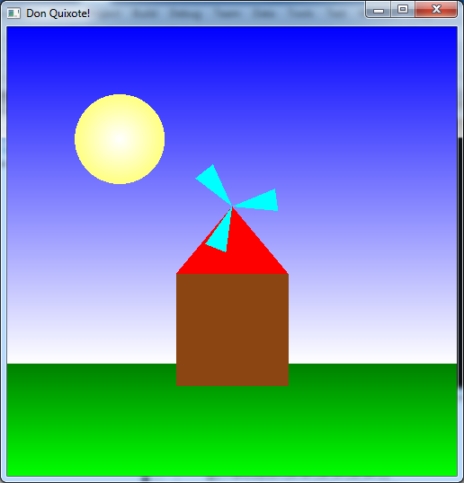

**Written Questions Due: Thursday, Sept 12th by 12:30/2:00 PM** (in class)

**Program Due: Thursday, Sept 12th by 11:59 PM** Late assignments will be penalized 20 points per day.

0\. Getting Started
==================

Download [CS370\_Assign01.zip](src/CS370_Assign01.zip), saving it into the **assignment** directory.

Double-click on **CS370\_Assign01.zip** and extract the contents of the archive into a subdirectory called **CS370\_Assign01**

Navigate into the **CS370\_Assign01** directory and double-click on **CS370\_Assign01.sln** (the file with the little Visual Studio icon on it).

If the source file is not already open in the main window, open the source file by expanding the *Source Files* item in the *Solution Explorer* window and double-clicking **DonQuixote.cpp**.

1\. Written Questions
====================

1.  What are the main advantages and main disadvantages to generating images using the graphics pipeline?
2.  Typical movies that use 35mm film have frames with a resolution of greater than 2000x3000 pixels. What implications would attempting to render similar resolutions on a computer display using computer generated graphics have? Consider both real-time rendering and pre-rendered animations.
3.  In order to "fill" a polygonal area, we must determine which pixels are inside and which are outside the polygon boundaries. Testing each point individually would be extremely inefficient. Think of a strategy that could be used to avoid point-by-point testing. Hint: Consider scaning via horizontal lines.
4.  Since *simple* polygons are extremely important for proper rendering, give a method to test whether or not a polygon is simple. Hint: Consider edge intersections.

2\. Programming assignment
=========================

Write a program that draws a simple 2D "windmill" scene using OpenGL. The scene should include:

-   A shaded blue sky from top to bottom
-   A shaded green lawn from bottom to top
-   A shaded yellow sun from center to edge
-   A windmill with brown walls, red roof, and cyan fan blades.
-   \<space\> should start/stop the windmill fan spinning
-   \<esc\> should quit the program

*Hints:*

> OpenGL renders scenes using a *Painter's Algorithm* (at least for now). In this type of algorithm, the object that is rendered *last* will appear on *top*. This can be useful for making complicated shapes by simply overlapping simple shapes rather than using a single polygon with many vertices.
>
> **GL\_POLYGON** is *not* the only type of object that can be rendered in OpenGL. Section 2.12 of *OpenGL: A Primer* discusses several other built-in objects that can be defined by a set of vertices.
>
> Use *global variables* to avoid *magic numbers* in the code, particularly for object geometries and colors.

Grading Criteria
================

**The program MUST compile to receive any credit** (so develop incrementally).

-   Initialization (main): 15 points
-   Shaded sky: 15 points
-   Shaded grass: 10 points
-   Shaded sun: 15 points
-   Windmill: 15 points
-   Instance objects: 10 points
-   Fan: 5 points
-   Animation (keyboard, idle callbacks): 5 points
-   Creativity: 10 points

*Be creative!* For example, have the \<space\> act like a "puff" of air that starts the fan spinning but then gradually slows down until another \<space\> is pressed. Another option would be to add a keypress that changes the scene from day to night with the sun changing to a moon.

Compiling and running the program
=================================

Once you have completed typing in the code, you can build and run the program in one of two ways:

> -   Click the small green arrow in the middle of the top toolbar
> -   Hit **F5** (or **Ctrl-F5**)

(On Linux/OSX: In a terminal window, navigate to the directory containing the source file and simply type **make**. To run the program type **./DonQuixote.exe**)

The output should look similar to below

> 

To quit the program simply close the window.

Submitting to Marmoset
======================

To submit your completed assignment, open a terminal window, navigate to the working directory and type:

    make submit

Then enter your Marmoset id and password. You should see a confirmation that the file was submitted successfully.

**You are responsible for making sure that your submission contains the correct file(s).**

