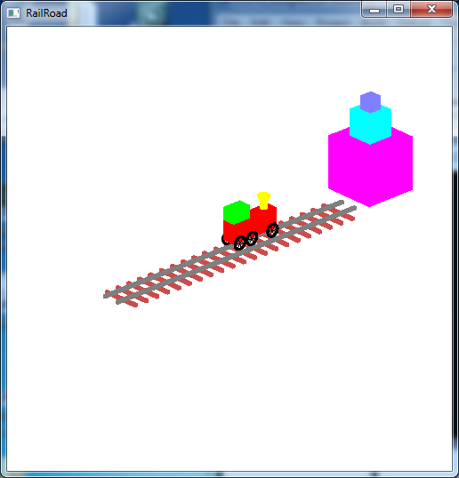

**Written Questions Due: Thursday, Sept 26th by 12:30/2:00 PM** (in class)

**Program Due:**

**Milestone 1: Friday, Sept 20th by 11:59 PM** 

**Milestone 2: Monday, Sept 30th by 11:59 PM** Late assignments will be penalized 20 points per day.

0\. Getting Started
===================

Download [CS370\_Assign02.zip](src/CS370_Assign02.zip), saving it into the **assignment** directory.

Double-click on **CS370\_Assign02.zip** and extract the contents of the archive into a subdirectory called **CS370\_Assign02**

Navigate into the **CS370\_Assign02** directory and double-click on **CS370\_Assign02.sln** (the file with the little Visual Studio icon with the 13 on it).

If the source file is not already open in the main window, open the source file by expanding the *Source Files* item in the *Solution Explorer* window and double-clicking **RollinTrain.cpp**.

1\. Written Questions
=====================

1.  Show that a rotation and a *uniform* scaling transformations are commutative, i.e. that they can be applied in either order. 

	> Hint: Given the *general* 4x4 matrices for each transformation
	>
    > 
	>
	> show that the appropriate matrix products commute, i.e. give the same result for *both* orderings.

2.  In class we have defined an instance transformation to be the product of a scaling, rotation, and translation. Can the same final effect be accomplished by multiplying the three matrices in a different order? Hint: In order to show that the product of all three transformations is the same regardless of order (i.e. is commutative) you would need to show it to be true for *all* possible combinations of *all* possible transformation matrices. However to contradict the hypothesis, simply give a *single* example that shows it to be false (which can be done with only two of the three transformations). **NOTE:** This problem does *not* show that a final transformation requires a *unique* set of basic transformations as there may be several ways to get the *same* final transformation from *different* combinations of basic ones.
3.  Typically when we draw 3D objects on paper (or the board) we draw the *x* and *y* axes at 90 degrees (*x* axis pointing right and *y* axis pointing up). We then represent the *z* axis (which would be coming out of the board) by a line at -135 degrees from the *x* axis (diagonally down towards the left). This type of projection is known as an *oblique* projection. Determine the projection matrix that would render the objects in this fashion. 

	> Hint: In order to achieve this projection, we need to find a *transformation matrix* that takes the standard axes and converts them as follows:
	>
    > 
    >
    > Use the above axis values to find the *rows* of a (homogeneous) transformation matrix by considering the matrix-vector products
    >
    > 

4.  Some of my research has been in the area of stereoscopic 3D images, which is now common in movies and TV. To create a stereoscopic 3D image, we simply render the scene from two different viewpoints (one to represent what the left eye would see and one to represent what the right eye would see). If the viewer is considered to be at the origin with an ocular spacing of Δ*x*, what are the appropriate **gluLookAt()** functions to produce a stereo image pair? Hint: We need to render the scene from two different camera locations (separated by *dx*). Consider two possible locations where these cameras can be pointed, i.e. the **at** vector, to produce a stereoscopic image.

**Extra credit** Quaternions are a better, but far less intuitive, way to represent rotations (particularly dynamically changing ones) that involves representing the rotations using complex numbers. Find quaternions for a 90 degree rotation about the *x* and *y* axes. What is the product of these two rotations as a quaternion?

2\. Programming assignment
==========================

Write a program that draws a 3D "train" scene using OpenGL. A sample executable is included in the skeleton file as either **RollinTrainSolWin.exe** (**RollingTrainSolWin10.exe**) or **RollinTrainSolMac.exe**. The scene should include:

-   A train with a body, engineer's compartment, smoke stack with funnel, six wheels spaced appropriately with spokes that rotate as the train moves.
-   A pair of tracks that have evenly spaced railroad ties below the tracks.
-   A stack of three blocks at the end of the tracks.
-   The key 'o' should select an orthographic "birds-eye" view above the scene that allows for the camera to be moved via spherical coordinates.
-   The keys 'w', 'a', 's', 'd' should rotate the camera along the azimuth and elevation angles.
-   The key 'p' should select a perspective "driver" view from the engineer's compartment that moves with the train to see the impending doom of the blocks approaching head on.
-   \<space\> should toggle the animation of the train going forward/backward down the track.
-   \<esc\> should quit the program.

*Hints:*

> Use regular OpenGL primatives (user defined vertices), glu quadrics, and/or glut objects to build the scene.
>
> Use instance objects and display lists where possible, e.g. tracks, blocks, etc. **MAKE SURE THE DISPLAY LIST SYMBOLIC CONSTANTS START AT 1**. Remember, however, that the objects in display lists must have *fixed* values. Hence if objects move relative to each other, they must be in different lists. Transformations can be applied to the entire display list when it is rendered, so consider the display lists as creating larger "instance" objects from the graphics primatives.
>
> Use *global variables* to avoid *magic numbers* in the code, particularly for object geometries and colors. Even better is to create symbolic constants with **\#define** statements within the header file **train.h**. The constants should be interrelated as much as possible so that objects that are referenced off each other can be adjusted with a single value. This adds a tremendous amount of flexibility when creating the scene as it becomes *much* easier to modify entire objects at once rather than needing to recalculate multiple dependent values. (After all, you *are* developing this scene *iteratively* aren't you?)
>
> An initial orthographic view from an *isometric* viewpoint, i.e. the camera positioned along a line going through (1,1,1) but far enough back to see the entire scene is provided. You will want to add spherical coordinate angles and adjust the camera parameters accordingly.
>
> You may want to consider having completely separate projection and camera setups for the different projection modes. A flag to toggle between the modes has been provided.

Grading Criteria
================

**The program MUST compile to receive any credit** (so develop incrementally).

**Milestone 1** - 45 points

-   Initialization (main): 10 points
-   Tracks: 15 points
-   Blocks: 10 points
-   Train body: 10 points

**Milestone 2** - 55 points

-   Complete train: 15 points
-   Train perspective: 10 points
-   Display lists: 5 points
-   Animated train: 5 points
-   Dynamic orthographic camera (3rd person): 5 points
-   Dynamic perspective camera (1st person): 5 points
-   Creativity: 10 points

*Be creative!* For example, enhance the geometry of the scene or with additional animations.

Compiling and running the program
=================================

Once you have completed typing in the code, you can build and run the program in one of two ways:

> -   Click the small green arrow in the middle of the top toolbar
> -   Hit **F5** (or **Ctrl-F5**)

(On Linux/OSX: In a terminal window, navigate to the directory containing the source file and simply type **make**. To run the program type **./RollinTrain.exe**)

The output should look similar to below

> 
>
> 

To quit the program simply close the window.

Submitting to Marmoset
======================

To submit your completed assignment, open a terminal window, navigate to the working directory and type:

    make submit_ms1
    
or

    make submit_ms2

Then enter your Marmoset id and password. You should see a confirmation that the file was submitted successfully.

**You are responsible for making sure that your submission contains the correct file(s).**

