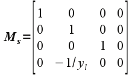
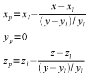
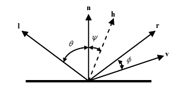
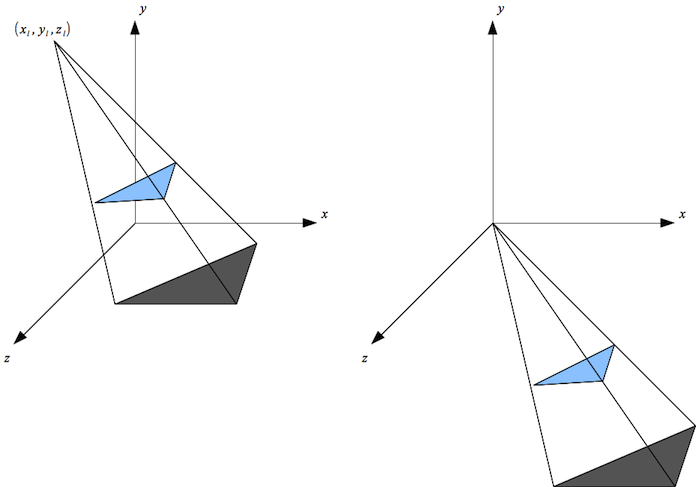
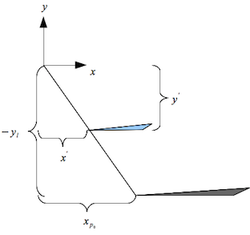
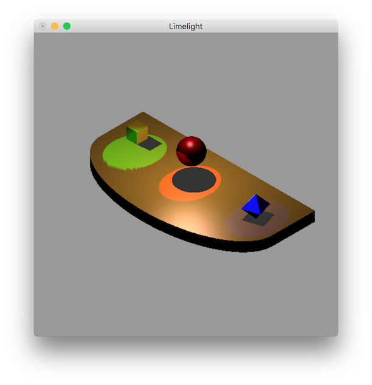

**Written Questions Due: Thursday, Oct 29th by 12:30/2:00 PM** (in class)

**Program Due:**

**Milestone 1: Thursday, Oct 17th by 11:59 PM** 

**Milestone 2: Wednesday, Oct 30th by 11:59 PM** Late assignments will be penalized 20 points per day.

0\. Getting Started
===================

Download [CS370\_Assign03.zip](src/CS370_Assign03.zip), saving it into the **assignment** directory.

Double-click on **CS370\_Assign03.zip** and extract the contents of the archive into a subdirectory called **CS370\_Assign03**

Navigate into the **CS370\_Assign03** directory and double-click on **CS370\_Assign03.sln** (the file with the little Visual Studio icon with the 13 on it).

If the header files are not already open in the main window, open the header files by expanding the *Header Files* item in the *Solution Explorer* window and double-clicking **lighting.h** and **materials.h**.

If the source file is not already open in the main window, open the source file by expanding the *Source Files* item in the *Solution Explorer* window and double-clicking **Limelight.cpp**.

1\. Written Questions
=====================

1.  Whenever large polygons are rendered with lighting in OpenGL, instead of having relatively uniform shading they are bright in one area and dimmer in others. Explain why this occurs and how this problem can be avoided. Furthermore, why are the light sources applied to *every* object instead of considering whether or not the light is blocked from one object to another, i.e. our lights do not cast *shadows*?
2.  For specular reflections, the equation in the Phong model involves the angle between the *reflection* vector and the *viewer* vector, i.e. **r** ⋅ **v**. To avoid this computation, if **v** is in the same plane as **l**, **n**, and **r** we can compute the *halfway vector* (the vector that is halfway between **l** and **v**, see hint below) as

    > **h** = (**l** + **v**)/(\|**l** + **v**\|)
    >
    > Show that the angle ψ between **n** and **h** is *half* the angle φ between **r** and **v**. In otherwords, show
    >
    > > 2 ψ = φ
    >
    > Note that this means that since we already have the vectors **n**, **l**, and **v** from the application, we can approximate the specular term without computing **r** but instead just compute **h** and find **n** ⋅ **h**.

3.  (10 points) Derive the shadow matrix given by

    > 
	>
	> and show how this matrix combined with the two light position translations produces the shadow coordinates
	> 
	> 

*Hints:*

2.  Recall that the angle of incidence (θ between **l** and **n**) equals the angle of reflection (θ between **n** and **r**) and the vector **h** is *halfway* between **l** and **v**.
	>
	> 
	>
3.  Recall that the shadow matrix is found by considering the light source to be translated to the *origin* by an amount (-*x*l, -*y*l, -*z*l) as shown in the figures below.
	>
	> 
	>
	> Therefore if we look down the z-axis for the translated polygon (right hand figure) we have the following
	>
	> 
	>
	> where *x*' = *x* - *x*l and *y*' = *y* - *y*l are the translated object coordinates, -*y*l is the translated position of the shadow (which originally was on the *x*-*z* plane), and *x*p0 is the translated shadow coordinate. Use similar triangles to determine the projection equations for *x*p0 and *z*p0. (Note that *y*p0 = -*y*l).
	>
	> Use these equations to find the shadow matrix by letting *x*s = *x*', *y*s = *y*', *z*s = *z*', and the translated *homogeneous* component of the shadow vertices *w*s = *y*' / (-*y*l).
	>
	> Then finally apply the translation back to the original position by adding (*x*l, *y*l, *z*l) to the projected shadow coordinates (and recalling that *x*s = *x* - *x*l, *y*s = *y* - *y*l, and *z*s = *z* - *z*l).

2\. Programming assignment
==========================

Write a program that draws a 3D stage scene with three "actors" and several lights using OpenGL. A sample executable is available in the skeleton zip file. The scene should include:

-   A stage which is a rectangular cube with an elliptical front. Recursively subdivide the rectangle top face for proper light effect. Create a display list for the entire stage (otherwise performance will *drastically* suffer).
-   Three "actors" on the stage consisting of a cube, sphere, and octahedron.
-   A point light source (**GL\_LIGHT0**) shining directly down on the stage is provided.
-   Three spotlights (one per "actor") shining on the stage. The lights should be at the back of the stage directly behind each actor and have different colors.
-   The spotlights should produce shadows for each "actor" that adjusts as the spotlights are pivoted.
-   The following keyboard behavior:

    > -   'WASD', 'TFGH', 'IJKL' should pivot each light source in the *x* and *z* directions
    > -   'V' should toggle the cube sliding forward/backwards
    > -   'B' should toggle the sphere bouncing up/down
    > -   'N' should toggle the octahedron spinning/stopped

-   All animations should be system *independent*, i.e. time-based.
-   \<esc\> should quit the program.

*Hints:*

> You may use GLUT objects for the various "actors", but the stage must be made manually (with recursive subdivision).
>
> Consider how to properly pan and tilt the light sources, in particular the position should remain fixed but the direction will need to be adjusted.
>
> Create different light sources. Utility functions are provide in **lighting.h** to set the different types of light sources.
>
> Create various interesting materials for the objects.
>
>
> **DEVELOP INCREMENTALLY**. For example, draw the geometry with solid colors, then attempt to add each spotlight individually. Once the lights are rendering properly, then work on adding shadows.

Grading Criteria
================

**The program MUST compile to receive any credit** (so develop incrementally).

**Milestone 1** - 50 points

-   Initialization (main): 5 points
-   Stage (recursive): 15 points
-   Cube object: 5 points
-   Sphere object: 5 points
-   Pyramid object: 5 points
-   Point light source: 10 points
-   Lighting shaders: 5 points

**Milestone 2** - 50 points

-   Stage edge: 5 points
-   Fixed spotlights: 15 points
-   Animated objects: 5 points
-   Adjustable spotlights: 5 points
-   Fixed shadows: 5 points
-   Moving shadows: 5 points
-   Creativity: 10 points

*Be creative!* For example, enhance the geometry of the scene, use additional animations, have the lights toggle on/off, allow the colors of the lights to change, and/or provide enhanced shader lighting. Remember that the program should still have reasonable performance on the lab machines.

Compiling and running the program
=================================

Once you have completed typing in the code, you can build and run the program in one of two ways:

> -   Click the small green arrow in the middle of the top toolbar
> -   Hit **F5** (or **Ctrl-F5**)

(On Linux/OSX: In a terminal window, navigate to the directory containing the source file and simply type **make**. To run the program type **./Limelight.exe**)

The output should look similar to below (note colors and shapes do not need to be *exactly* identical but should demonstrate an understanding of the concepts)

> 

To quit the program simply close the window.

Submitting to Marmoset
======================

To submit your completed assignment, open a terminal window, navigate to the working directory and type:

    make submit_ms1
    
or

    make submit_ms2

Then enter your Marmoset id and password. You should see a confirmation that the file was submitted successfully.

Login to Marmoset - [<https://cs.ycp.edu/marmoset>](https://cs.ycp.edu/marmoset/)

**You are responsible for making sure that your submission contains the correct file(s).**

