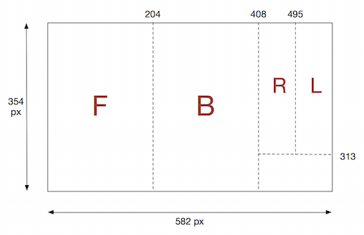
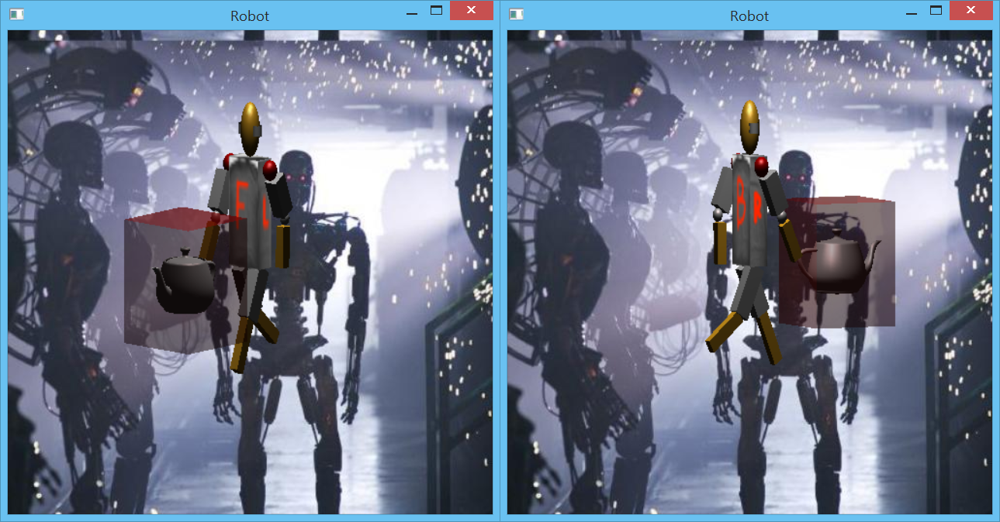

**Written Questions Due: Tuesday, Nov 19th by 12:30/2:00 PM** (in class)

**Program Due:**

**Milestone 1: Tuesday, Nov 12th by 11:59 PM** 

**Milestone 2: Wednesday, Nov 20th by 11:59 PM** Late assignments will be penalized 20 points per day.

0\. Getting Started
===================

Download [CS370\_Assign04.zip](src/CS370_Assign04.zip), saving it into the **assignment** directory.

Double-click on **CS370\_Assign04.zip** and extract the contents of the archive into a subdirectory called **CS370\_Assign04**

Navigate into the **CS370\_Assign04** directory and double-click on **CS370\_Assign04.sln** (the file with the little Visual Studio icon with the 13 on it).

If the header files are not already open in the main window, open the header files by expanding the *Header Files* item in the *Solution Explorer* window and double-clicking **lighting.h** and **materials.h**.

If the source file is not already open in the main window, open the source file by expanding the *Source Files* item in the *Solution Explorer* window and double-clicking **TeaMan.cpp**.

1\. Written Questions
=====================

1.  Using the example robot from [lab 16](../labs/lab16.html) suppose we know the *position* where one of the upper arms is starting and have a specific final *location* we want the arm to have. Give a method to create the path the robot should follow to get from the starting point to the end point.
2.  Our scene graph nodes and traversal algorithm (depth-first) is dependent on the matrix stack to render objects properly, i.e. such that the position of child objects is dependent on their parent node transformation matrices. Is it possible to design a scene graph data structure that is *independent* of traversal algorithm? What would be required from such a data structure?
3.  When would it be preferable to sort objects by depth and render in a front-to-back fashion? When would a back-to-front ordering be better?

*Hints:*

> 1.  This problem is known as *reverse kinematics* and is a key area of robotics research. Representing the individual transformations symbolically as **T**(*dx*, *dy*, *dz*), **R**(*ang*), and **S**(*sx*, *sy*, *sz*), first determine the *net* transformation matrix for the upper arm in terms of the base angle θ, lower arm angle φ, and upper arm angle ψ along with any translations for each part. Then let the initial base and joint angles be θi, φi, ψi and final base and joint angles be θf, φf, ψf. These angles would be found by *solving* the transformation matrix equations for the angles (which you may assume can be done to compute all these angles). Using these sets of angles describing the location of the two points, suggest an interpolation scheme to *smoothly* transition from one to the other.
> 2.  Consider what needs to be known prior to rendering each node. What would be necessary to avoid using **glPushMatrix()** and **glPopMatrix()** in the traversal routine (thus making it independent of the traversal algorithm)?
> 3.  Consider what effect rendering order has on object *clipping*, particularly when some of the objects are transparent.

2\. Programming assignment
==========================

Write a program that draws a 3D scene of a walking robot with articulated arms and legs along with a spinning teapot in a translucent box. A sample executable is included in the skeleton zip file as **TeaManSolWin.exe**, **TeaManSolMac.exe**, or **TeaManSolLinux.exe** (the Mac and Linux versions should be run from the command line). Mouse controls are provided that allow the scene to be rotated when holding down the left mouse button. The scene should include:

-   There should be a billboarded background image of your choosing (or you may use the included **robotfactory\_2.JPG** file).
-   A *scene graph* to render the robot, teapot, and box. Create materials to enhance the scene appearance.
-   The robot should consist of

    > -   Rectangular torso
    > -   Elliptical head
    > -   Cylindrical ears
    > -   Rectangular arms with two segments and "joints" for shoulders and elbows

-   Scale factors for all the robot parts are included in **robot.h**.
-   All the parts of the robot other than the torso should use materials and lighting.
-   The torso of the robot should be texture mapped using the **shirt\_z.png** texture. Note that the texture map contains labelled pieces for the front, back, left, and right faces of the cube (you may use any parts of the texture map for the top/bottom faces). The pixel locations for the divisions between the segments is shown below:

    > 

-   The box should be translucent such that the teapot can be seen inside it.
-   The robot should "walk" by moving arms in opposition to the legs. The steps should be time-based, i.e. should occur at a rate of *sps* (steps-per-second).
-   \<spacebar\> should toggle the teapot spinning at a *time-based* rotation speed (teapot\_rpm)
-   Rendering should occur at a **fixed** frame rate (i.e. at *fps* frames-per-second).
-   Use the part dimensions given in the file **robot.h** - **NO MAGIC NUMBERS**.
-   \<esc\> should quit the program.

*Hints:*

> The **node** structure contains fields to store a **MaterialType** for the node's material, a **GLuint** to store the texture id for the node, and a **GLuint** for the shader program identifier that should be used to render the node. Make sure to apply the material or texture on a *per node* basis in the *drawing* functions. The shader program will be set in the traversal routine prior to rendering the node.
>
> You might wish to draw a *diagram* of the scene graph prior to coding to get the child/sibling relationships correct.
>
> The "joints" can simply be included with the corresponding limb segments rather than using separate scene graph nodes for them. Be sure to align the center of the joints properly so it appears as though the limb segment is rotating about the joint.
>
> Define your scene such that the robot is walking *on* the *x-z* plane with the *y*-axis being the vertical dimension.
>
> Consider the necessary rendering order for the objects in the scene graph in order for transparency to work properly.
>
> You may use GLUT objects for a majority of the drawing **EXCEPT** the torso since it will be texture mapped. You should create a **cube\_tex[][2]** array containing the texture coordinates for each vertex of each face (note the same vertex will require different texture coordinates depending on which face it is being used to render). You may use the included **texturecube()** function but may need to adjust the indicies of the **cube\_tex[][]** arguments as well as complete the **texquad()** function to assign texture coordinates appropriately using the last four parameters.
>
> Be sure to enable alpha blending and set appropriate blend factors for alpha blending effects. You will need to create "translucent" materials with non-unity alpha values and render translucent objects in the proper order within the scene graph.
>
> You can use the provided default, basic lighting, and texture shaders but may wish to modify them for additional effects.

Grading Criteria
================

**The program MUST compile to receive any credit** (so develop incrementally).

**Milestone 1** - 40 points

-   Initialization (main): 10 points
-   Billboard image: 5 points
-   Robot body node: 10 points
-   Robot head node: 12 points
-   Node materials: 3 points

**Milestone 2** - 60 points

-   Robot limb nodes: 13 points
-   Box node: 4 points
-   Teapot node: 3 points
-   Texture mapping: 10 points
-   Translucent box: 5 points
-   Proper texture coordinates: 10 points
-   Robot animation: 8 points
-   Teapot animation: 2 points
-   Creativity: 5 points

*Be creative!* For example, enhance the geometry of the scene, use additional animations, and/or provide enhanced lighting. Remember that the program should still have reasonable performance on the lab machines.

Compiling and running the program
=================================

Once you have completed typing in the code, you can build and run the program in one of two ways:

> -   Click the small green arrow in the middle of the top toolbar
> -   Hit **F5** (or **Ctrl-F5**)

(On Linux/OSX: In a terminal window, navigate to the directory containing the source file and simply type **make**. To run the program type **./TeaMan.exe**)

The output should look similar to below (note colors and shapes do not need to be *exactly* identical but should demonstrate an understanding of the concepts)

> 

To quit the program simply close the window.

Submitting to Marmoset
======================

To submit your completed assignment, open a terminal window, navigate to the working directory and type:

    make submit_ms1
    
or

    make submit_ms2

Then enter your Marmoset id and password. You should see a confirmation that the file was submitted successfully.

**You are responsible for making sure that your submission contains the correct file(s).**

