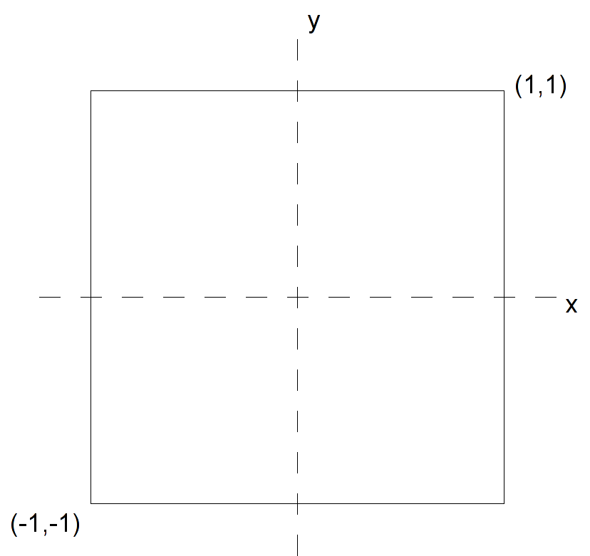
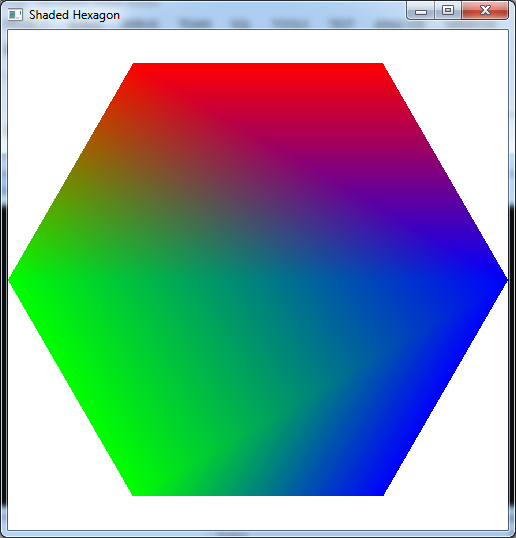

All graphics API's, including OpenGL, utilize standard hardware on all graphics cards known as the *graphics pipeline*. The version of the graphics chip (GPU) will determine which version of the API is supported in hardware, and in conjunction with the graphics driver, what functionality the programmer has access to. Hence in production graphics programs, it is generally a good idea to query the hardware and adjust the rendered objects appropriately to provide adequate framerates for the scene. We will forego this extra check step for this class in the interest of simplicity.

All graphics hardware works by taking a set of (3D) *vertices* that define the *geometry* of the objects in the scene and then performs the necessary operations to ultimately draw some version of the objects onto the (2D) screen. In this lab we will see how to transfer vertex coordinated from the application to the graphics card.

0\. Getting Started
===================

Download [CS370\_Lab02.zip](src/CS370_Lab02.zip), saving it into the **labs** directory.

Double-click on **CS370\_Lab02.zip** and extract the contents of the archive into a subdirectory called **CS370\_Lab02**

Navigate into the **CS370\_Lab02** directory and double-click on **CS370\_Lab02.sln** (the file with the little Visual Studio icon with the 12 on it).

If the source file is not already open in the main window, open the source file by expanding the *Source Files* item in the *Solution Explorer* window and double-clicking **shadedHexagon.cpp**.

1\. Defining Geometry through Vertices
======================================

All objects in OpenGL are created through a set of *polygons* that are defined by the coordinates of the *corner vertices*. The vertices are passed to the graphics pipeline from the application (i.e. into the vertex processor) using the command:

```cpp
glVertex*(arg-list);
```

where * is replaced by the appropriate *number* of coordinates and the *type* of values used for the coordinates. For example, several common vertex commands are:

-   glVertex2i(x,y) - which identifies a 2D coordinate of integers
-   glVertex3f(x,y,z) - which identifies a 3D coordinate of floats
-   glVertex3fv(\*p) - which identifies a 3D coordinate through a pointer to a three component float array

Coordinates are defined within a *world-coordinate system* which defaults to the origin (0,0) at the center of the screen, (1,1) the upper-right corner, and (-1,-1) the lower left corner as shown in the following figure:

> 

Any vertices with coordinates outside these extents is *clipped* from the final rendered image. Later we will learn how to set the world-coordinate extents to values of our choosing.

Before we can send vertices into the pipeline, we must tell OpenGL what type of *primative* the points will be defining. This is done using the command:

```cpp
glBegin(prim-type);
```

where *prim-type* is a predefined OpenGL constant, for example **GL\_LINES**, **GL\_TRIANGLES**, **GL\_POLYGON**, etc, that indicates the organization of the vertices. **NOTE:** The **glBegin()** statement must *end* with a semi-colon, i.e. it is *not* a block structure (even though we will typically indent the **glVertex()** statements for readability).

After we have defined all the vertices, we tell OpenGL that the primative is complete with the command:

```cpp
glEnd();
```

Hence a typical 2D polygonal primative defined by float variables would have the structure:

```cpp
glBegin(GL_POLYGON);
	glVertex2f(x1,y1);
	.
	.
	.
	glVertex2f(xn,yn);
glEnd();
```

**Tasks**

-   Add code to **render\_Scene()** after the **glColor3f()** statement to define 2D floating point vertices for a regular *hexagon* centered at the origin with each side of length 1. Note: Make sure to order the vertices such that they are *counterclockwise* as seen from the viewer, although you may start with any one you choose. OpenGL denotes this side of the polygon as the *front* side which will become important when we start adding lighting to the scene.

What happens if you define a vertex to have coordinates outside the world coordinate extents?

2\. Setting Colors
==================

In OpenGL colors are a *state* variable that is assigned on a *per vertex* basis using the command:

```cpp
glColor*([arg-list]);
```

where similar to vertex coordinates \* is replaced by the *number* of color components and the *type* of value used for each component. Usually we will be working in the standard RGB (red-green-blue) color space with floating point values between 0 and 1. In this color system (0,0,0) represents black and (1,1,1) represents white. Hence a typical color command will be:

```cpp
glColor3f(r,g,b);
```

Since color is a state variable, once a color is set it will be applied to *all* subsequent vertices that pass through the pipeline (even if they are in different primatives). Therefore it is typically a good idea to directly set the color at the start of each primative to insure it is correct. Furthermore, since color is a per vertex property, different colors can be set for different vertices *within* a given primative. OpenGL will then *interpolate* between the vertices giving a gradient fill effect.

**Tasks**

-   Add additional **glColor3f()** statements for each vertex to vary the colors on a per vertex basis. As a initial starting point, set the first two to red (i.e. (1.0f,0.0f,0.0f)), the next two to green (i.e. (0.0f,1.0f,0.0f)), and the last two to blue (i.e. (0.0f,0.0f,1.0f)). Then experiment with different color combinations.

What happens if you specify color components outside the range [0,1], i.e. negative values or values greater than one?

Compiling and running the program
=================================

Once you have completed typing in the code, you can build and run the program in one of two ways:

> -   Click the small green arrow in the middle of the top toolbar
> -   Hit **F5** (or **Ctrl-F5**)

(On Linux/OSX: In a terminal window, navigate to the directory containing the source file and simply type **make**. To run the program type **./shadedHexagon.exe**)

The output should look similar to below

> 

To quit the program simply close the window.

Next time we will see how to apply *transformations* to the vertices. This will eliminate the need to compute individual vertices for similar objects. Instead we can create a standard *instance* of an object and then translate, rotate, and scale it to the desired final result.

