Linear algebra, i.e. the manipulation of vectors and matrices, has a fundamental role in computer graphics. The graphics pipeline is optimized to perform certain linear algebra computations in a single (vector) operation. In particular, seemingly different quantities, e.g. vertices, colors, textures, etc., can all be represented in a similar manner and manipulated using identical linear algebra operations. While a thorough understanding of linear algebra is not necessary to program computer graphics, a working knowledge is essential if one wishes to develop a new graphics API and/or write custom shaders that require user defined computations. This lab will introduce linear algebra in a 2D context, however these concepts will easily generalize to 3D (and even 4D) in the near future.

0\. Getting Started
===================

Download [CS370\_Lab03.zip](src/CS370_Lab03.zip), saving it into the **labs** directory.

Double-click on **CS370\_Lab03.zip** and extract the contents of the archive into a subdirectory called **CS370\_Lab03**

Navigate into the **CS370\_Lab03** directory and double-click on **CS370\_Lab03.sln** (the file with the little Visual Studio icon with the 12 on it).

If the source file is not already open in the main window, open the source file by expanding the *Source Files* item in the *Solution Explorer* window and double-clicking **transformHexagon.cpp**.

1\. Basic Linear Algebra Terminology
====================================

The fundamental concepts of linear algebra consist of *vectors* and *matrices*. We can think of a vector as a *column* of values (known as *components* of the vector). Hence a point in 2D space (x,y) would be represented by the vector

> 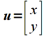

A *matrix* can be conceptualized as a *table* of values. Hence a 2x2 matrix (known as the *dimension* or *size* of the matrix where the first number represents the number of *rows* while the second number represents the number of *columns*) would be represented as

> 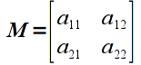

The *elements* of a matrix are typically indexed by row and column as shown above. Note that a vector is simply a special case of a matrix with a single column, i.e. an nx1 matrix. While technically a 1xn matrix, i.e. a single row, is often also referred to as a vector, we will reserve the term vector for a single column. Furthermore, matrices with the same number of rows as columns is known as a *square* matrix.

Vectors are typically represented programmatically as a 1D array while matrices are represented by a multi-dimensional array with corresponding element indexing.

2\. Vector/Matrix Operations
============================

**Addition**

Addition is done componentwise for vectors/matricies that have the *same* dimensions. Hence adding two vectors

> 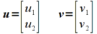

would give

> 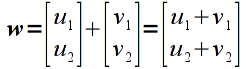

Similarly, adding matrices

> 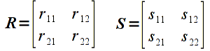

would give

> 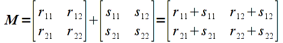

However the computation

> 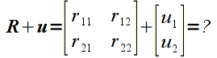

would be undefined since the two operands are of different sizes.

**Multiplication**

Multiplication is done for vectors/matrices that have matching *inner* dimensions, i.e. the number of *columns* of the first operand must be the same as the number of *rows* of the second operand. The resulting matrix will have a size corresponding to the *outer* dimensions, i.e. will have the same number of *rows* as the first operand and the same number of *columns* of the second operand. The elements of the resulting matrix are computed using the *sum-of-products* rule as shown below for a matrix multiplied by a vector (note a 2x2 matrix multiplied by a 2x1 vector results in a 2x1 vector, i.e. a vertex is *transformed* to a new vertex)

> 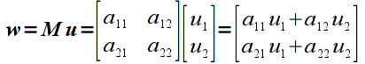

and a matrix multiplied by a matrix

> 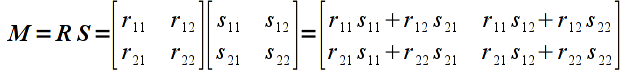

In general, for two matrices (including vectors) **R** ( *m* x *k* ) and **S** ( *k* x *n* ) the elements of the resulting product matrix **M** (of dimension *m* x *n* ) can be computed as

> 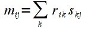

**Note:** Unlike regular arithmetic multiplication, matrix multiplication is **not** commutative, i.e. *order is important*. Hence if we multiply the same two matrices as above in the opposite order the result is

> 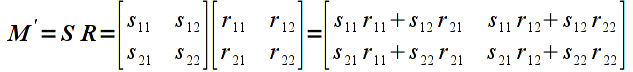

which in general will be different than the first product (there are certain special cases where they will be the same but we will assume that *order matters*). This property will become extremely important when we begin concatenating transformation matrices.

**Tasks**

-   For the six vertices from the last lab:

    > 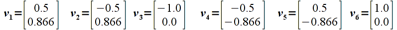

manually compute the new vertices that result from applying the following matrix transformation (i.e. perform matrix-vector multiplication for each vertex)

> 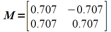

-   Add code to **render\_scene()** to draw two polygons, one red using the original vertices and one green with the transformed ones. What is the difference between the two polygons?

-   Computing transformations by hand is cumbersome to say the least. I've included a function called **Trans2D()** that takes a transformation matrix as a 2D float array, a vector as a 1D float array, and an output vector as a 1D float array that will contain the transformed vector. Use this function along with the provided global variables to compute transformed vertices. Display the polygons with these two sets of vertices (note you can use the **glVertex2fv()** form to use an array as a vertex). Hint: Perform all the transformations **before** rendering the polygon with **glBegin()**/**glEnd()**.
-   Experiment with different values of the matrix elements to see the resulting transformed polygons.

Compiling and running the program
=================================

Once you have completed typing in the code, you can build and run the program in one of two ways:

> -   Click the small green arrow in the middle of the top toolbar
> -   Hit **F5** (or **Ctrl-F5**)

(On Linux/OSX: In a terminal window, navigate to the directory containing the source file and simply type **make**. To run the program type **./transformHexagon.exe**)

The output should look similar to below

> 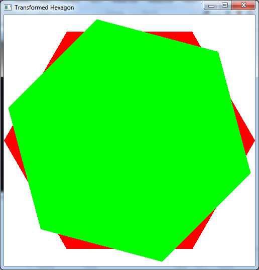

To quit the program simply close the window.

While we can always transform the vertices manually in our application, OpenGL provides various functions to apply transformations (MUCH more efficiently) within the graphics pipeline. Next time we will see how to take advantage of the capabilities provided by the graphics hardware to perform certain common transformations.

