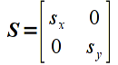
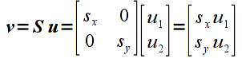
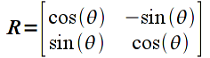
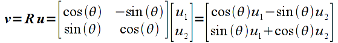
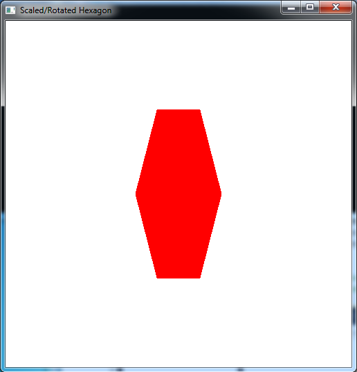
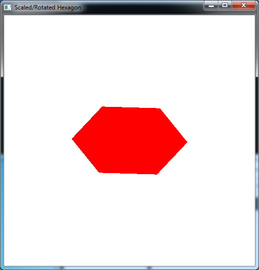

Last lab we learned a few basic mathematical operations involving vectors and matrices. The field of linear algebra deals with *linear* (also known as *affine*) transformations. An *affine* transformation is one that is *line preserving* which means that in order to transform all the (infinitely many) points along a line, one need only tranform the end points (and the rest will lie on the line segment between the transformed end points). Hence by extension of this principle to polygons, a polygon will likewise be transformed to another polygon although possibly with modified angles. This means that we only need to define the *vertices* for all of our objects (that are constructed from polygons containing the vertices). One limitation of standard graphics hardware is that it can only apply (very efficiently) affine transformations, hence we cannot *morph* one shape into another, e.g. a line into a circle. To accomplish these types of *non-linear* effects, we will either have to perform the transformation within our application or take advantage of the programmable shaders available in newer hardware.

All affine transformations can be represented by a matrix of constant values (i.e. it does not vary from vertex to vertex) and hence applying any affine transformation is simply done through matrix multiplication. However, it is tedious and inefficient to do these multiplications in our application when the graphics hardware has been optimized to perform matrix multiplication (of correctly sized matrices and vectors) in a single operation. To this ends, OpenGL has built-in functions for applying several standard transformations (translation, rotation, and scalings) along with a general one for applying any user-defined matrix. By *concatenating* transformations together, i.e. applying several transformations at the same time, additional effects can be achieved. However as noted in the previous lab, since matrix multiplication is not generally commutative, the **order** of application of the intermediate transformations is important. Once we begin to discuss 3D objects, we will extend this concept to develop *instance* transformations which we will apply to *template* objects on an individual basis.

0\. Getting Started
===================

Download [CS370\_Lab04.zip](src/CS370_Lab04.zip), saving it into the **labs** directory.

Double-click on **CS370\_Lab04.zip** and extract the contents of the archive into a subdirectory called **CS370\_Lab04**

Navigate into the **CS370\_Lab04** directory and double-click on **CS370\_Lab04.sln** (the file with the little Visual Studio icon with the 12 on it).

If the source file is not already open in the main window, open the source file by expanding the *Source Files* item in the *Solution Explorer* window and double-clicking **rsHexagon.cpp**.

1\. Scaling Transformations
===========================

The simplest transformations to apply are *scaling* transformations which simply multiply each component of a vector by a given amount known as the *scale factor*. If the scale factor is the same for all components, then the transformation is called a *uniform* or *isotropic* scaling (i.e. identical distortion in all directions), otherwise it is a *nonuniform* or *anisotropic* scaling (different distortions for different directions). If the scale factors are negative, the image is also *mirrored* about that axis. Mathematically, we can represent a 2D scaling with a *scaling matrix* transformation given by

> 

where *sx* is the scale factor in the x direction and *sy* is the scale factor in the y direction. Applying this transformation to a vector *u* gives

> 

which we can clearly see scales each component of the vector by the corresponding scale factor.

Rather than have to create the transformation matrix and apply it manually in the application to each vertex, OpenGL has a build-in function for scaling

```cpp
glScalef(sx,sy,sz);
```

Since we are currently working in 2D, simply set sz=1. *NOTE:* The scaling is applied *relative to the origin*, thus if the object is not centered about the origin, the scaling will also *translate* the center of the object by a corresponding amount. Also, the transformation (i.e. **glScalef()** command) must be executed *prior* to passing the vertices into the graphics pipeline (and *cannot* occur within a **glBegin()**/**glEnd()**, i.e. it must be applied to *all* vertices of a particular object).

**Tasks**

-   For the six vertices given at the beginning of the code, compute the *scaled* **v[]** vertices **by hand** and render this scaled hexagon in the **render\_scene()** routine in green using scale factors of 0.5 in the *x* direction and 0.75 in the *y* direction.
-   Add code to **render\_scene()** to scale the *original* **u[]** vertices hexagon by 0.75 in the *x* direction and 0.5 in the *y* direction (remember to set the scaling in the *z* direction to 1) using the build-in **glScalef()** function. Render this scaled hexagon in red.

How do the two hexagons compare?

2\. Rotation Transformations
============================

The next common type of transformation we wish to apply is a *rotation* about a given axis (which in 2D will simply be the *z-axis* which is perpendicular to the screen). Rotation angles are defined *counterclockwise* with respect to the origin (i.e. follow the *right-hand rule*). The rotation matrix for an angle θ is given by

> 

Applying this transformation to a vector **u** gives

> 

which is not so obvious that the correct rotation is obtained.

The OpenGL build-in function for rotation is

```cpp
    glRotatef(theta,dx,dy,dz);
```

where *theta* is the angle of (counterclockwise) rotation *in degrees* and *dx,dy,dz* is a vector for the *axis of rotation*. Since we are currently working in 2D, simply set dx=0, dy=0, dz=1 (i.e. rotation about the *z-axis*). *NOTE:* Again, rotation is applied *relative to the origin*, thus if the object is not centered about the origin, the rotation will also *translate* the center of the object by a corresponding amount. Also, the transformation (i.e. **glRotatef()** command) must be executed *prior* to passing the vertices into the graphics pipeline (and *cannot* occur within a **glBegin()**/**glEnd()**, i.e. it must be applied to *all* vertices of a particular object).

**Tasks**

-   For the scaled **v[]** vertices computed in the first part of the previous section, compute new **v[]** vertices that are rotated by 60 degrees. Replace the computed scaled ones with these new ones in the **render\_scene()** routine (you may wish to copy the original scaled ones and simply comment them out). Hint: Notice the symmetry between the first three vertices and last three vertices.
-   Add code to **render\_scene()** to rotate the automatically scaled **u[]** vertex hexagon from the second part of the previous section by 60 degrees. To accomplish this, simply add a **glRotatef()** command *before* the **glScalef()** command. What happens if you switch the order of the **glRotatef()** and **glScalef()** commands? Do you think you can *always* switch rotation and scaling transformations, i.e. are rotation and scaling commutative? How would you show this mathematically?
-   Offset the original vertices by adding 0.1 to both the *x* and *y* coordinates of each **u[]** vertex. Apply the same scaling and rotation (simply using the built-in transformation functions) individually and in combination. Is the final rendered object what you expected? Why or why not?

**NOTE:** OpenGL performs transformation concatenation by *right multiplication* of the corresponding transformation matrices. Hence from a programming standpoint, the transformation that is specified *first* is the one applied *last* and vice-versa. This will become important in the context of instance transformations.

Compiling and running the program
=================================

Once you have completed typing in the code, you can build and run the program in one of two ways:

> -   Click the small green arrow in the middle of the top toolbar
> -   Hit **F5** (or **Ctrl-F5**)

(On Linux/OSX: In a terminal window, navigate to the directory containing the source file and simply type **make**. To run the program type **./rsHexagon.exe**)

The output should look similar to below

> 
>
> 

To quit the program simply close the window.

Scaling and rotation are two of the standard built-in transformations that we can use, but unfortunately they only work for objects *centered* about the origin. Next time we will learn how to apply translations to reposition our objects as well as see how to apply a general transformation matrix to our objects.

