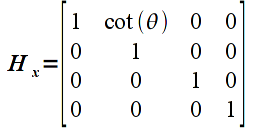

Last lab we learned the matrix representation and OpenGL functions for performing scaling and rotation. However, these transformations are performed relative to the *origin* of the world coordinate system. Hence unless the object's *center* is at the world origin, the transformations usually do not produce the desired results. Unless we are developing a CAD or 3D modelling application where there is only one object located at the origin, most scenes will have multiple objects at different locations in the scene. However, usually it is easier to define the geometry of the object (i.e. its vertices) relative to the origin and then simply *translate* it to the appropriate location in space.

Conceptually, translation is simply a matter of *adding* the desired offsets to the components of each vertex. Unfortunately the graphics pipeline is optimized to perform *multiplication* and hence would require additional circuitry to implement addition in order to perform translations. This problem is overcome by the use of *homogeneous coordinates* which extends each vertex by an additional component and then using extended transformation matrices. Luckily this extension still preserves the scaling and rotation operations we saw last time as well as providing additional benefits we will discuss later (for example alpha blending).

0\. Getting Started
===================

Download [CS370\_Lab05.zip](src/CS370_Lab05.zip), saving it into the **labs** directory.

Double-click on **CS370\_Lab05.zip** and extract the contents of the archive into a subdirectory called **CS370\_Lab05**

Navigate into the **CS370\_Lab05** directory and double-click on **CS370\_Lab05.sln** (the file with the little Visual Studio icon with the 12 on it).

If the source file is not already open in the main window, open the source file by expanding the *Source Files* item in the *Solution Explorer* window and double-clicking **tigHexagon.cpp**.

1\. Translation Transformations
===============================

Mathematically, translation is achieved by simply adding a fixed offset to each component of a vector (note: again this transformation must be applied on a *per object* basis thus translating an entire object by a given amount). Hence we can write this operation using vector notation (for a 2D vector) as

> 

where *dx* is the offset in the *x* direction and *dy* is the offset in the *y* direction.

However, since the graphics pipeline is only designed to perform matrix *multiplication*, translation would either need to be done within the application or additional hardware would be needed on the graphics card to perform translations. Recall that matrix multiplication is a *sum-of-products* and hence we can perform vector addition through a matrix multiplication using *homogeneous coordinates*. We simply extend each vector by an additional component which is set to the value 1, and then the transformation matrices that require addition use values in the *last column* that multiply this extended component. In OpenGL, *all* vectors and matrices are represented internally in homogeneous coordinates so from the application programmer's standpoint it is transparent. Thus in 2D (which means 3D homogeneous coordinates), the translation transformation matrix is given by

> 

which when multiplied by a 2D vector (which is 3D in homogeneous coordinates), gives

> 

that is clearly identical to the vector addition above in *homogeneous coordinates*.

Rather than have to create the transformation matrix and apply it manually in the application to each vertex, OpenGL has a build-in function for translation

```cpp
glTranslatef(dx,dy,dz);
```

Since we are currently working in 2D, simply set **dz=0**. *NOTE:* Unlike the previous two transformations which were *relative to the origin*, translation is only an offset thus can be applied to objects in any position regardless of their relative position to the origin. Also the translations are *relative* to the *current* position of the object and is **not** an absolute positioning. However just like the other transformations, the **glTranslatef()** command must be executed *prior* to passing the vertices into the graphics pipeline (and *cannot* occur within a **glBegin()**/**glEnd()**, i.e. it must be applied to *all* vertices of a particular object).

**Tasks**

-   Add code to **render\_scene()** to render a red hexagon given by the **v** vertices at the top of the code (note this object is *not* centered at the origin).
-   Add code to **render\_scene()** to render another green hexagon using the **v** vertices that is translated by 0.75 in the *x* direction and -0.5 in the *y* direction (remember to translate by 0 in the *z* direction) using the build-in **glTranslatef()** function.

2\. Instance Transformations
============================

Often times we will wish to have similar objects with different scalings and rotations that are positioned throughout the scene. One very convienient way to accomplish this effect is to create a *template* object that is centered at the origin with "unit" size. Then for each instance of the object we wish to create, we simply scale, rotate, and translate the object into its proper size, orientation, and location in the scene. Recall that transformations are applied using *right multiplication*, thus the proper mathematical order is

> 

To accomplish this *programmatically*, the *last* transformation to be applied must be the *first* one to be passed to the graphics pipeline. Thus the code for the above sequence of transformations would be

```cpp
glLoadIdentity();
glTranslatef(dx,dy,0);
glRotatef(theta,0,0,1);
glScalef(sx,sy,1);

glBegin(GL_POLYGON);
	glVertex2f(...);
        .
        .
        .
glEnd();
```

Take note of the additional OpenGL command **glLoadIdentity()** at the beginning of the code fragment. Since transformations (like colors) are a state variable, they will be applied to *all subsequent* vertices (not just the next object). Thus to *reset* the transformation matrix for each object, use **glLoadIdentity()** prior to calling the transformation functions for each object. Later we will learn how to take advantage of the persistent nature of the transformation matrix, but for now just reset it before rendering each object.

**NOTE:** Make sure you observe the order of the transformations since in general they will *not* commute, i.e. a different order will produce a different net transformation.

As a followup to instance transformations, to apply a scaling and/or rotation to an object in an arbitrary location (x,y,z), simply *translate it to the origin* (translate by (-x,-y,-z)), apply the desired scalings and rotations, then *translate back to the original location* (translate by (x,y,z)). The code for this sequence of transformations for a 2D object would be

```cpp
glLoadIdentity();
glTranslate(x,y,0);
glRotatef(theta,0,0,1);
glScale(dx,dy,1);
glTranslate(-x,-y,0);

glBegin(GL_POLYGON);
	glVertex2f(...);
        .
        .
        .
glEnd();
```

**Tasks**

-   Compute a set of *unit* hexagon **u** vertices such that the hexagon is circumscribed by the unit circle (note this object also has unit length sides). Create a list at the top of the code for these vertices.

    > 

-   Add code to **render\_scene()** (after the code added for the tasks from section 1) to render this *instance* object in blue with the same size, orientation, and location as the original red hexagon. Hint: The center of the red hexagon is at (-0.5,0.5) and the rotation is 60 degrees. What are the scale factors? (Do not forget the **glLoadIdentity()** command just prior to rendering this object. What happens if you forget, or comment out, this command? Why does the object appear as it does?)

3\. General Transformations
===========================

While a majority of our geometry will be accomplished via instance objects and appropriate scaling, rotation, and translations, there are many other *affine* transformations that cannot be created through a combination of these three basic ones, e.g. shearing and shadows. Furthermore, we may not wish to incur the performance penalty caused by repeated multiplication of the intermediate transformation matrices (since it will occur *every* time each object is rendered). Thus if we have a particular 4x4 matrix (remember they must be in homogeneous coordinate space) that we want to use as the entire transformation for an object, we can use the OpenGL command

```cpp
glLoadMatrixf(*M);
```

where **M** is a 16 element 1D array of floats (in *column major* order) that represents our transformation matrix.

Alternatively, if we wish to multiply our own transformation matrix by the current transformation matrix (i.e. to apply to an already scaled, rotated, and/or translated object) we can use the OpenGL command

```cpp
glMultMatrixf(*M)
```

where again **M** is a 16 element 1D array of floats (in *column major* order) that represents our additional transformation matrix.

**Tasks**

-   Create an arbitrary **M** matrix (as a list of 16 values) at the top of the code and apply it to any/all of the previously rendered hexagons. One interesting matrix is given by

    > 

which is known as a *shear* transformation in the *x* direction by an angle θ.

Compiling and running the program
=================================

Once you have completed typing in the code, you can build and run the program in one of two ways:

> -   Click the small green arrow in the middle of the top toolbar
> -   Hit **F5** (or **Ctrl-F5**)

(On Linux/OSX: In a terminal window, navigate to the directory containing the source file and simply type **make**. To run the program type **./tigHexagon.exe**)

The output should look similar to below

> 
>
> 

To quit the program simply close the window.

At this point we have completed an overview of creating the *geometry* of our objects by defining vertices and applying transformations. However currently we can only create *static* (2D) scenes. Next lab will see how to accomplish *animation* and also introduce some basic user interaction functionality available through GLUT to handle mouse and keyboard input.

