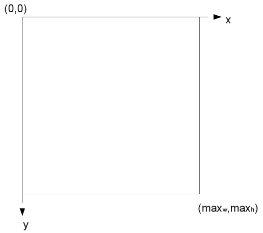
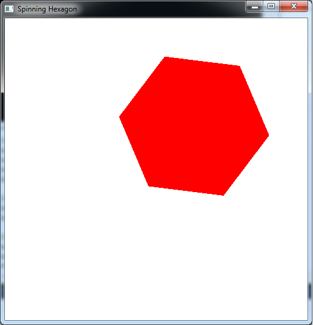

Last lab we finished the basic transformations in 2D (which extend directly to 3D). At this point, however, we can only create *static* scenes. A more useful system would allow for the user to interact with the graphics (through the keyboard and/or mouse) to modify the scene. Also the capability to dynamically change the scene without user interaction, i.e. animation, would further enhance the appearance of our programs. Together these two features give us the ability to write simple games that we will later be able to render in 3D with more sophisticated effects.

Both user interaction and animation utilize the *event driven* nature of the operating system. Fortunately, GLUT has taken care of wrapping this functionality into callback routines that are relatively easy to implement. However, if more complicated user input behavior is needed, one would need to resort to using the various OS commands for handling keyboard and mouse event messages (beyond the scope of this course). One of the advantages of DirectX is that Microsoft directly provides this functionality at the expense of cross platform compatibility, particularly when using C\#.

Once one has processed the input event, all that is needed is to issue a message to have the system redraw the scene, i.e. force the **display()** callback to be executed. Since we cannot have return values, nor can we add additional reference parameters to the callback prototypes, we must use *global variables* to store values we wish to update in these routines. Rather than continually modify vertex coordinates, it is usually better to create an instance object (refer to [lab05](lab05.html) and then simply store global scale factors, rotation angles, and/or translation values. Whenever a callback modifies any of these values, the scene can be redrawn using the updated values in the instance transformations within the **display()** callback.

0\. Getting Started
===================

Download [CS370\_Lab06.zip](src/CS370_Lab06.zip), saving it into the **labs** directory.

Double-click on **CS370\_Lab06.zip** and extract the contents of the archive into a subdirectory called **CS370\_Lab06**

Navigate into the **CS370\_Lab06** directory and double-click on **CS370\_Lab06.sln** (the file with the little Visual Studio icon with the 12 on it).

If the source file is not already open in the main window, open the source file by expanding the *Source Files* item in the *Solution Explorer* window and double-clicking **keyMouseSpinningHexagon.cpp**.

1\. Keyboard Input
==================

Keyboard input is handled via the *keyboard callback*. This function is registered similarly to the display callback (usually in **main()** but always before **glutMainLoop()** is called) using

```cpp
glutKeyboardFunc(key_func);
```

where *key\_func* is the name of the keyboard callback routine. The prototype for the callback routine is

```cpp
void key_func(unsigned char key, int x, int y); 
```

where *key* contains the ASCII code of the pressed key and *x*, *y* are the *screen coordinates* of the mouse cursor when the key was pressed. Since the OS has no knowledge of the objects being drawn, all cursor positions are determined by the *pixel* location on the actual screen, hence the name *screen coordinates*. These coordinates **always** have the origin at the *upper-left* corner with *x* increasing to the *right* and *y* increasing *down*.

> 

While there is an obvious relationship between screen coordinates and world coordinates in 2D, in 3D that relationship becomes ambiguous. Hence using screen coordinates, i.e. user input, to *select* a particular object requires a special mode known as *picking mode* (see sections 3.8 of *Interactive Computer Graphics* and section 3.13 of *OpenGL: A Primer*).

In order to trigger an event to have the scene redrawn (via the **display()** callback) the command

```cpp
glutPostRedisplay();
```

should be issued at the end of the keyboard callback (otherwise the updated scene will not be rendered). NOTE: This command posts a redraw message to the event queue and hence execution of the program may continue until this message is handled by the OS.

**Tasks**

-   Register the keyboard callback function **keyfunc** in **main()** (add it below the display callback registration).
-   Add decision logic in **keyfunc()** such that '\<' (or ',') will shrink the object, i.e. *decrease* the **scale** variable by **dscale**. NOTE: You may wish to enforce a lower bound on the scale factor (what happens if you don't?)
-   Add decision logic in **keyfunc()** such that '\>' (or '.') will enlarge the object, i.e. *increase* the **scale** variable by **dscale**. NOTE: You may wish to enforce an upper bound on the scale factor (what happens if you don't?)
-   Add decision logic to allow the ESC key to exit the program. Since the GLUT event handler is an infinite loop, simply use the command

```cpp
exit(0);
```

to terminate the program. NOTE: To use the ESC key in the keyboard callback, simply use the ASCII code 27 for the key value. \* Force the screen to be redrawn by issuing the **glutPostRedisplay()** command at the end of the routine (what happens if you do not add this line?)

There is another callback available to handle *special keys*, such as the arrow and function keys, which is registered using

```cpp
glutSpecialFunc(spec_func);
```

where *spec\_func* is the name of the special key callback routine. It has the same prototype structure as the standard keyboard callback routine with the *key* value containing GLUT constants for the special keys, e.g. **GLUT\_KEY\_UP** (up arrow), **GLUT\_KEY\_RIGHT** (right arrow), etc. We can also use the function

```cpp
glutGetModifiers()  
```

within a keyboard or mouse callback to detect if a *modifier key*, e.g. CTRL (**GLUT\_ACTIVE\_CTRL**), ALT (**GLUT\_ACTIVE\_ALT**), Shift (**GLUT\_ACTIVE\_SHIFT**), is simultaneously being pressed.

2\. Mouse Input
===============

Mouse input is handled by *two* mouse callbacks, the *mouse clicked callback* and the *mouse motion callback*. The mouse clicked callback is called when a mouse button is *pressed or released* and is registered via

```cpp
glutMouseFunc(mouse_func);
```

where *mouse\_func* is the name of the mouse clicked callback routine. The prototype for the callback routine is

```cpp
void mouse_func(int button, int state, int x, int y);
```

where *button* is which button was pressed/released (using the GLUT symbolic constants **GLUT\_LEFT\_BUTTON**, **GLUT\_RIGHT\_BUTTON**, **GLUT\_MIDDLE\_BUTTON**), *state* contains a value representing the click state of the button (using the GLUT symbolic constants **GLUT\_UP**, **GLUT\_DOWN**), and *x*, *y* are the *screen coordinates* of the mouse cursor when the button event occured. The various **GLUT\_** symbolic constants can be used in the decision logic within the mouse clicked callback to perform the appropriate actions.

The mouse motion callback is called whenever the mouse is moved *while a button is held down* (i.e. following a **GLUT\_DOWN** mouse clicked callback event). This callback is registered using

```cpp
glutMotionFunc(move_func);
```

where *move\_func* is the name of the mouse motion callback routine. The prototype for this callback routine is

```cpp
void move_func(int x, int y);
```

where *x*, *y* are the *new* mouse cursor position when the callback event was triggered. This event will be triggered based on system dependent changes in mouse position. Furthermore since the prior mouse position is not preserved, global variables can be used to store previous and/or initial mouse positions (and are typically initialized in the mouse clicked callback). The change in position can then be computed in the callback using the global positions and the new location (possibly updating the global variables with the new positions for future motion events). Remember that the position changes are in screen coordinates which may need to be converted to equivalent world coordinates for use with the objects.

Again a **glutPostRedisplay()** should be issued at the end of the mouse motion callback in order to refresh the screen with the updated scene.

**Tasks**

-   Register the mouse callback functions **mousefunc** (mouse clicked routine) and **movefunc** (mouse motion function) in **main()** (add it below the display callback registration).
-   Create two global variables named **start\_x** and **start\_y** at the top of the code. Note: they should be type **GLint**.
-   Add code to **mousefunc()** to store the current mouse position in the global variables defined above whenever the *left* mouse button is *clicked*, i.e. pressed *down*.
-   Add code to **movefunc()** to compute **dx** and **dy** as the *change* in mouse position. Use the current cursor position provided by the parameters for the function along with the global variables set in the **mousefunc()** routine. Note: the *y* axis in screen coordinates increases *downward*.
-   Add code to **movefunc()** to modify the current hexagon position (given by the global variables **hex\_x** and **hex\_y**) by scaling the changes computed in the last step by **dt** (to roughly give a one-to-one correspondance between screen coordinates and world coordinates). You may wish to limit the hexagon position (in world coordinates) such that it remains on the screen.
-   Add code to *update* **start\_x** and **start\_y** to the current *x* and *y* positions - this is necessary for proper future mouse movement.
-   Force the screen to be redrawn by issuing the **glutPostRedisplay()** command at the end of the routine (what happens if you do not add this line?)

3\. Animation
=============

One other time when we may wish to alter the state of the system is when *nothing else* is happening, i.e. when the system is *idle*. An idle event is triggered at system dependent intervals whenever no other events are pending for the system. These events are handled by the *idle callback* which is registered using

```cpp
glutIdleFunc(idle_func);
```

where *idle\_func* is the name of the idle callback routine. The prototype for this callback routine is

```cpp
void idle_func();
```

i.e. it takes no parameters. Thus a typical action is to update object global variables within the idle callback and then issue **glutPostRedisplay()**.

**Tasks**

-   Add a global flag (type **GLint**) named **anim** and set its default value to 0 (false).
-   Add code to **idlefunc()** to update the rotation angle **theta** by an amount **dtheta** *only* if the **anim** flag is set (has a value 1 or **true**). You will want to keep the value of **theta** in the range 0 -\> 360 (remember how angles wrap around).
-   Force the screen to be redrawn by issuing the **glutPostRedisplay()** command *only* when the **anim** flag is set. Why do we not want to simply put it at the very end of the routine outside the logic?
-   Add code to **keyfunc()** to *toggle* the **anim** variable via \<space\>. Do we need to worry about redrawing the screen here?

Compiling and running the program
=================================

Once you have completed typing in the code, you can build and run the program in one of two ways:

> -   Click the small green arrow in the middle of the top toolbar
> -   Hit **F5** (or **Ctrl-F5**)

(On Linux/OSX: In a terminal window, navigate to the directory containing the source file and simply type **make**. To run the program type **./keyMouseSpinningHexagon.exe**)

The output should look similar to below

> 

To quit the program simply close the window.

We now have completed our introductory study of 2D geometry and added the capability to interact and animate our scenes. As we now transition into the realm of 3D scenes, we will need to add more advanced effects such as lighting and texture mapping to improve the visual appearance of our scenes. We also are no longer confined to a *flat* surface, but since the rendered scene is displayed on a *flat surface* we need to investigate how to *project* our 3D world onto a 2D screen.

The provided source code also contains programmable shaders that replicate the default pipeline behavior for geometry. If you look at the files basicvert.vs (the vertex shader) and basicfrag.fs (the fragment shader) you can clearly see how each vertex is transformed by the modelview matrix and the color provided by the application is set. Later we will add code to these shaders to accomplish effects such as lighting and texture mapping.

