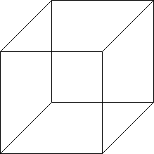
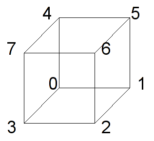
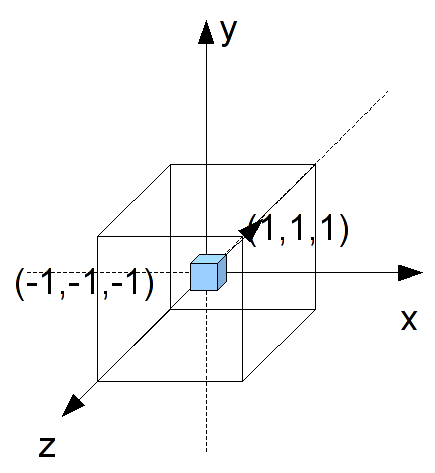
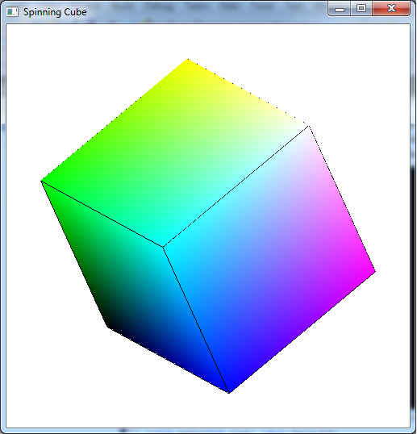

We are now ready to begin rendering 3D scenes. Unlike 2D, which has a direct correlation between world coordinates and screen coordinates, we must *project* our 3D world onto a 2D screen. The quality of our scenes, however, will depend on preserving some degree of *depth* of the objects within the world. We can accomplish this through a variety of visual cues such as occlusion (objects being partially blocked by other objects), lighting (object surfaces displaying color gradients), and perspective (the closer the object is, the larger it appears).

The simplest type of projection is known as *orthographic*, often used in engineering drawings. In this projection mode, the camera is assumed to be at an infinite distance, i.e. at +∞ looking in the -*z* direction. Thus *all* rays become parallel and objects will have the *same* height as they are in the world with parallel lines remaining parallel. For example, a cube drawn in orthographic projection would appear as (is the cube slanting downward to the left or upward to the right?)

> 

0\. Getting Started
===================

Download [CS370\_Lab07.zip](src/CS370_Lab07.zip), saving it into the **labs** directory.

Double-click on **CS370\_Lab07.zip** and extract the contents of the archive into a subdirectory called **CS370\_Lab07**

Navigate into the **CS370\_Lab07** directory and double-click on **CS370\_Lab07.sln** (the file with the little Visual Studio icon with the 12 on it).

If the source file is not already open in the main window, open the source file by expanding the *Source Files* item in the *Solution Explorer* window and double-clicking **spinningCube.cpp**.

1\. 3D Geometry and the Depth Buffer
====================================

We define object geometry in 3D in the same manner as in 2D only now with each vertex having 3 components - (x,y,z). We then pass the 3D vertices into the graphics pipeline using the command

```cpp
glVertex3f(x,y,z);
```

or

```cpp
glVertex3fv(*p);
```

As a natural extension of our 2D world coordinate extents, in 3D space the extents of the rendered scene are [-1,1] for all three axes (we will change these extents later in this lab).

Unlike in 2D where objects were rendered via a *Painter's algorithm*, i.e. the last object rendered is the one that appears, in 3D we typically want the *closest* object to be the one that appears. Fortunately, OpenGL provides a way of automatically performing this occusion behavior (also known as *hidden surface removal* since those *surfaces* that are *hidden* behind other ones are *removed*) through the use of the *depth buffer*. This buffer keeps track of the depth of the closest object for each rendered pixel. As subsequent objects are rendered, only those whos pixels have a depth less than the current closest one stored in the buffer are rendered (subsequently also updating the depth buffer accordingly). To use the depth buffer, we must tell GLUT to allocate memory for the depth buffer and enable the depth test (which in subsequent labs we will temporarily disable for effects like transparency). To allocate memory, we simply need to add another flag when we initialize the window. For example

```cpp
glutInitDisplayMode(GLUT_DOUBLE | GLUT_RGB | GLUT_DEPTH);
```

Then to enable the depth test we issue the command (usually in **main()** with the other initializations)

```cpp
glEnable(GL_DEPTH_TEST);
```

We must also clear the depth buffer every time we render the scene by adding the appropriate flag to the **glClear()** command at the beginning of the **display()** function

```cpp
glClear(GL_COLOR_BUFFER_BIT | GL_DEPTH_BUFFER_BIT);
```

Finally, when we create 3D geometry, we must be careful to order our vertices properly. Each polygon we create will have a *front face* and a *back face* which is defined by the right-hand rule. If we curl the fingers of our right hand to follow the vertex order, our right thumb will point in the direction of the *outward normal* (i.e. the *front face*). Furthermore, we can control the rendering of the front and back faces separately such that when we are "outside" the object we see the front faces but when we go "inside" our objects we see the back faces.

**Tasks**

-   Define the global variable **cube[][]** with the corners of the cube at the unit vertices, i.e. (± 1, ± 1, ± 1). Note: there are eight vertices that can be defined in the order given in the following picture

    > 

-   Add code to **main()** to *allocate* the depth buffer in the **glutInitDisplayMode()** command, i.e. add the **GLUT\_DEPTH** flag.
-   Add code to **main()** to *enable* the depth buffer via the **GL\_DEPTH\_TEST** flag.
-   Add code to **display()** to clear the depth buffer via the **GL\_DEPTH\_BUFFER\_BIT** flag. What happens if you forget to do this?
-   Add code to **render\_scene()** to draw the cube by calling **colorcube()**.
-   Add code to **colorcube()** to render the six faces of the cube by passing the proper vertices and colors to the provided **quad()** routine (which simply renders a four sided polygon and outlines the border). Note: make sure *each* face is drawn in a counter-clockwise fashion when *looking at* that face head on, i.e. correctly define the *front* face vertex order.

At this point if you compile and run the program you will only see a colored screen as we are looking right at one of the faces.

2\. Orthographic Projection and the Reshape Callback
====================================================

Often it is convienient to define the geometry of the objects in our world without having to scale everything to fit within the default extents of [-1,1]. This will usually produce a visually poor scene (or nothing rendered at all). Thus we want to be able to adjust the *viewing volume*, i.e. the extents of our rendered world, so that the objects appear and fill the screen as we wish. For *orthographic projection*, the viewing volume will be a rectangular parallelapiped (rectangular "cube") such that the camera is looking *down* the *z* axis in the negative direction.

> 

To change the extents, we will modify the *projection matrix* which we must first select using the command

```cpp
glMatrixMode(GL_PROJECTION);
```

We then set the extents of our viewing volume using the command

```cpp
glOrtho(GLdouble left, GLdouble right, GLdouble bottom, GLdouble top, GLdouble near, GLdouble far);
```

where *left* and *right* are the *x* extents, *bottom* and *top* are the *y* extents, and *near* and *far* are the *z* extents. These values are measured *from the camera* whose default position is the *origin* (thus for now these values are the world extents).

Finally after setting the new extents we normally want to switch back to the *model-view matrix* (which is where the object transformations will be performed) using

```cpp
glMatrixMode(GL_MODELVIEW);
```

The usual place to modify the projection matrix, i.e. set the viewing volume, is in the *display callback*. 

**Reshape Callback**

However whenever the window is resized by the user, we may want to adjust the viewing volume extents to match the new aspect ratio of the window. The **reshape callback** is called whenever the window is resized (including when it is first created) and is registered similarly to the other callbacks with

```cpp
glutReshapeFunc(reshape);
```

The reshape function has the prototype

```cpp
void reshape(int w, int h);
```

where *w* is the new width of the window (in pixels) and *h* is the new height of the window (in pixels). If we store this information globally, we can use it in the **display()** callback to adjust the viewing volume proportionately.

```cpp
void reshape(int w, int h)
{
	// Set new screen extents
	glViewport(0,0,w,h);

	// Store new extents 
	ww = w;
	hh = h;
}
```

By default, the viewing volume extents will remain fixed relative to the screen aspect ratio which will result in our objects becoming distorted when the window is resized, known as *isotropic scaling*. However using the stored window size information, we may wish to adjust our viewing volume extents via the **glOrtho()** command to the smaller dimension but maintain the original aspect ratio, known as *anisotropic scaling* i.e. each axis scales differently. We accomplish anisotropic scaling by multiplying the appropriate dimension by the *ratio* of the larger dimension to the smaller (thus "stretching" the world in the larger dimension such that the object appears with the original proportions). Sample code for anisotropically "scaled" [-1,1] extents would be

```cpp
	// Select projection matrix
	glMatrixMode(GL_PROJECTION);
	glLoadIdentity();

	// Adjust viewing volume (orthographic)
	GLfloat xratio = 1.0f;
	GLfloat yratio = 1.0f;
	// If taller than wide adjust y
	if(ww <= hh)
	{
		yratio = (GLfloat) hh/ (GLfloat) ww;
	}
	// If wider than tall adjust x
	else if (hh <= ww)
	{
		xratio = (GLfloat) ww/ (GLfloat) hh;
	}
	glOrtho(-1.0f*xratio,1.0f*xratio,-1.0f*yratio,1.0f*yratio,-1.0f,1.0f);
```

**Tasks**

-   Register the reshape callback function **reshape** in **main()**.
-   Add code to **reshape()** to store the new screen extents in the global variables **ww** and **hh**. 
-   Add code to **display()** to perform anisotropic scaling, i.e. preserving the original aspect ratio of the objects, for "scaled" world extents [-2.0,2.0] for all three axis. Note you should now see the cube rendered in the center of the screen. What happens if you replace the **glOrtho()** commands with ones that have fixed extents (i.e. without the **ratio** multiplication factors) and then resize the window?
-   Add code to **render\_scene()** to rotate the cube about the (1.0,1.0,1.0) axis by an angle **theta**.

As in the previous lab, spacebar will toggle the animation.

Compiling and running the program
=================================

Once you have completed typing in the code, you can build and run the program in one of two ways:

> -   Click the small green arrow in the middle of the top toolbar
> -   Hit **F5** (or **Ctrl-F5**)

(On Linux/OSX: In a terminal window, navigate to the directory containing the source file and simply type **make**. To run the program type **./spinningCube.exe**)

The output should look similar to below

> 

To quit the program simply close the window.

At this point we are now able to render 3D geometry and adjust the world extents to only render the portions of the world that we desire. Furthermore, all the 2D transformations that we learned in previous labs directly apply to 3D geometry. In particular, instance transformations are a valuable technique for creating complicated scenes using simple template objects defined about the origin. In the next lab we will extend our camera model to provide *perspective* views which when done properly appear more like a real picture (but when done wrong can be a total disaster).

