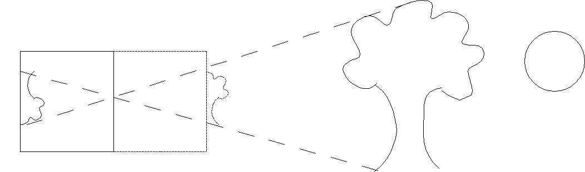
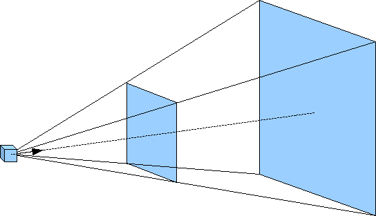
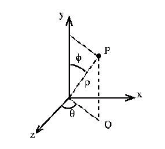
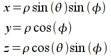
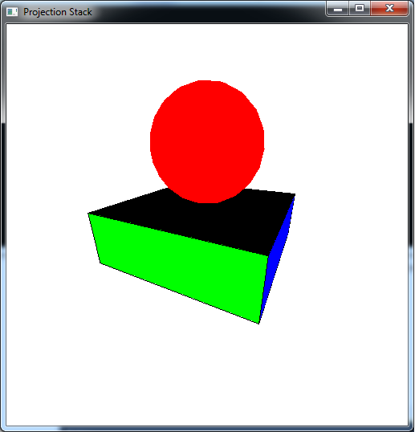

Orthogonal projection is typically used when the camera is at a *fixed location* and the objects are manipulated through transformations. By duality, however, (or Einstein relativity) it does not matter whether the camera is fixed and the objects move or the objects are fixed and the camera moves (and frequently the objects and camera will both move). Particularly with perspective projection, the camera location will play an important role since the viewing volume will be defined *relative* to the camera's location and orientation. Fortunately, OpenGL allows us to define the objects in world coordinates and then simply place the camera at the desired location without worrying about all the underlying projection transformations.

We can think of the process of projection as taking a "picture" of the world from a particular location using a *camera*. The particular camera model we will use is the simplified *pinhole* camera where the aperature is a single pinhole. Light *rays* are drawn from every point in the world, through the pinhole, and onto the *projection plane* (i.e. film). This particular method clearly will have the closest objects along each ray being the ones appearing in the final scene.

> 

Since this model produces inverted images, we will assume that the projection plane is loacated an equal distance *in front* of the camera such that our images are right-side up.

Since we will now start rendering scenes with many objects (particularly based on the same instance object), performance in terms of rendering efficiency can become an issue. In particular, for complex geometry with a large number of vertices, the overhead incurred via the **glVertex3f()** function calls incurs a substantial performance penalty. We can mitigate this problem by loading the vertices onto the graphics card and then simply telling the card to render the objects (rather than repeatedly pushing all the data down the pipeline). The disadvantage to this approach is that once the vertices are on the graphics card, they cannot be modified by the application (other than by modelview transformations).

0\. Getting Started
===================

Download [CS370\_Lab08.zip](src/CS370_Lab08.zip), saving it into the **labs** directory.

Double-click on **CS370\_Lab08.zip** and extract the contents of the archive into a subdirectory called **CS370\_Lab08**

Navigate into the **CS370\_Lab08** directory and double-click on **CS370\_Lab08.sln** (the file with the little Visual Studio icon with the 12 on it).

If the source file is not already open in the main window, open the source file by expanding the *Source Files* item in the *Solution Explorer* window and double-clicking **perspectiveCubes.cpp**.

1\. Perspective Projection
==========================

Unlike orthogonal projection where parallel lines remain parallel and the size of an object is independent of its location relative to the camera, perspective projection is more akin to actual scenes. For example, two parallel railroad tracks *appear* to converge to a point in the distance and as objects move away from the observer, i.e. the camera, they get smaller in size. For this projection mode, rather than the viewing volume being a parallelapiped, it has a shape known as a *frustum*. This frustum can be visualized as a pyramid with its point at the camera but starting a small distance from the camera (the *near clipping plane*) and extending a further distance outward (the *far clipping plane*) as shown below.

> 

For this projection mode, the projection plane (i.e. camera film) is the near clipping plane. The frustum is defined by modifying the *projection matrix* via the command

```cpp
glFrustum(GLfloat left, GLfloat right, GLfloat bottom, GLfloat top, GLfloat near, GLfloat far);
```

where again *left* and *right* are the *x* extents of the near clipping plane, *bottom* and *top* are the *y* extents of the near clipping plane, and *near* and *far* are the *z* extents in world coordinate units of the near and far clipping planes respectively. These values, however, are measured *from the camera* whose default position is the *origin* looking back down the *z* axis. However since the camera now is *within* the scene, *near* **must** be positive and *far* \> *near* (*be careful* not to make *near* too small). Also depending on the location and orientation of the camera, these values typically do not refer to world coordinate extents, but to extents *relative* to the camera.

**Tasks**

-   Add code to **display()** to set a perspective projection (via **glFrustum()**) with extents (-1,1,-1,1,1,8).

2\. Camera Position
===================

The default camera position is at the origin pointed in the *-z* direction. We can, however, change this position and orientation with the command

```cpp
gluLookAt(eyex, eyey, eyez, atx, aty, atz, upx, upy, upz);
```

where *eyex*, *eyey*, and *eyez* are the world coordinates of the camera; *atx*, *aty*, *atz* are the world coordinates where the camera is pointing; and *upx*, *upy*, *upz* define a vector indicating which direction is up for the camera (since otherwise the camera could have any orientation about the axis defined by *eye* and *at*). Since this command essentially creates an initial global transformation, it should be issued *prior to any* other modelview transformations (otherwise the camera location and orientation will be concatenated with any preceeding transformations). Note: Usually this command will be placed in **display()** and be the *first* modelview transformation since it applies to *all* objects.

**Tasks**

-   Add code to **display()** to set the camera vectors via the **gluLookAt()** command. Use the global arrays **eye[]**, **at[]**, and **up[]** along with the symbolic constants **X**, **Y**, and **Z** given at the top of the code. NOTE: Make sure to do this *after* the modelview matrix is intialized to the identity matrix but *before* **render_scene()** is called (such that *all* objects will be in the frame of reference of the camera).

3\. Display Lists
=================

Depending on our requirements, one way to improve performance is through the use of *display lists*. If the geometry of our object(s) is *fixed* (for example with instance objects) we can *compile* the geometry into a display list and store it *on the graphics card*. Then when we wish to use the object(s), we simply tell the graphics card to render the desired list (thus avoiding passing *any* geometry from the application to the pipeline). However since the object(s) is compiled, once created it cannot be modified (unless it is subsequently recompiled). The display lists may contain multiple objects, even using different instance transformations for each object, as long as the local transformations are *static*, i.e. we cannot modify any internal transformation parameters after the list is compiled.

In order to use display lists, we must perform three tasks. First we will *define* a symbolic constant to identify the list. Second we will *create* the display list using the standard geometry commands (including transformations) that we have previously learned. Usually this is done when we initialize GLUT, i.e. we *do not* want to do this in the **display()** callback (which would recreate the display lists every time the scene is rendered). Then finally we will *execute* the list within **render\_scene()** whenever we wish to render the objects.

*Defining a symbolic constant*

To identify each list, we want to define a *unique* unsigned integer via a **\#define** statement (i.e. symbolic constant) at the top of the program. This will provide a convenient way of distinguishing our lists while making our code more readable.

*Creating a display list*

To create a display list (usually in a separate initialization function) we use a structure similar to:

```cpp
glNewList(listname, GL_COMPILE);
	// Save the current state
	glPushAttrib(GL_CURRENT_BIT);

	// Insert graphics code here

	// Restore the previous state
	glPopAttrib();
glEndList();
```

where *listname* is the symbolic constant for the list and **GL\_COMPILE** tells OpenGL to compile the list (and load it onto the graphics card). Between the **glNewList()** and **glEndList()** commands, typically the first and last commands are **glPushAttrib(GL\_CURRENT\_BIT)** and **glPopAttrib()** to save and restore all state information prior to rendering the list (so that any transformations within the list do not affect subsequent rendered objects). Any valid geometry commands including **glBegin()**, **glEnd()**, **glVertex\*()**, and any transformations can be used to create the list. NOTE: Variables may be used within the geometry commands, however only their current values will be used to create the list and hence any subsequent modification of the variables (e.g. in the **idle()** callback) will *not* affect the list object (unless the object is subsequently recompiled by calling the list creation function).

Since the lists can consume memory on the graphics card (which may be needed for other things like texture maps and shader programs), when a list is no longer needed it can be deleted using the command:

```cpp
glDeleteLists(listname, 1);
```

where *listname* is the name of the list to delete and 1 specifies to delete a single list.

*Executing a display list*

At any point in **render\_scene()** that we wish to render the objects from a display list, we can use the command

```cpp
glCallList(listname);
```

where *listname* is the name of the list we wish to render. NOTE: The objects will be subject to any transformations currently in the modelview transformation matrix.

**Tasks**

-   Add code to **main()** to call **create\_lists()** to execute the display list creation function. NOTE: This is done *before* the graphics loop is entered since it should be done only once.
-   Add code to **create\_lists()** to build the display list **CUBE** by calling the function **colorcube()** within the list creation structure given in this section. NOTE: Remember to store and retrieve the current state when creating the list.

See section 3.12.1 of *OpenGL: A Primer* for information on manipulating multiple display lists using a single command.

4\. Rendering Multiple Objects
==============================

We have already discussed in previous labs how to reset the modelview matrix using **glLoadIdentity()**. However often we wish to maintain a global transformation, e.g. one produced by positioning the camera, for *all* objects in the scene while still allowing for local transformations on a per object basis. Fortunately OpenGL provides a *matrix stack* that can be used to *push* and *pop* the current modelview matrix as needed. This is done with the commands

```cpp
// Push the current transformation matrix onto the stack
glPushMatrix();

// Perform any additional local transformations
// and render the object

// Restore the prior transformation matrix
glPopMatrix();
```

**glPushMatrix()** places a *copy* of the current modelview matrix onto the stack prior to any additional local transformations. Once the object is complete, rather than needing to *undo* the transformations, **glPopMatrix()** simply sets the modelview matrix to the one at the top of the stack, i.e. the one prior to the recent local transformations. Later we will see how to use the *stack* to store multiple modelview transformation matrices in order to render a scene using a *scene graph*.

**Tasks**

-   Add code to **render\_scene()** to render a *scaled* (by (1.5,0.5,1.5)) cube using the **CUBE** display list. NOTE: Be sure to save and restore the modelview matrix when rendering this object.
-   GLUT (and GLU) provide functions to draw many common geometric shapes such as cubes, spheres, disks, etc. - see sections 4.3 and 4.7 of *OpenGL: A Primer* for more details. Add code to **render\_scene()** to render a red sphere using **glutSolidSphere()** of radius 1 with 20 slices and 20 stacks. Translate the sphere up by 1.5 such that it sits on top of the base drawn in the previous step. NOTE: Be sure to save and restore the modelview matrix when rendering this object.

5\. Spherical Coordinates
=========================

Often times when we wish to move the camera through a scene, simply adjusting the (x,y,z) components in Cartesian coordinates is awkward for the user. Instead it is more natural if the camera is moved in *spherical coordinates* which consist of an *azimuth* angle (rotation about the *y* axis), an *elevation* angle (rotation down from the *y* axis), and a *radius* (distance from the origin), see the diagram below

> 

With this coordinate system, the user appears to rotate *around* the object (azimuth), "over/under" the object (elevation), and "towards/away from" the object (radius). However, since OpenGL strictly uses Cartesian coordinates (i.e. (x,y,z)) the conversion from spherical to Cartesian coordinates is given by

> 

**Tasks**

-   Add code to **keyfunc()** to allow 'a' and 'd' to adjust the **azimuth** by adding/subtracting **daz**. NOTE: The azimuth angle should be bounded in the range [0,360] via wrapping.
-   Add code to **keyfunc()** to allow 'w' and 's' to adjust the **elevation** by adding/subtracting **del**. NOTE: The elevation angle should be bounded in the range [0,180] via clamping.
-   Add code to **keyfunc()** to allow 'x' and 'z' to adjust the **radius** by adding/subtracting **dr**. NOTE: The radius should not be allowed to go below **min\_radius**.
-   Add code to **keyfunc()** to compute the Cartesian coordinates for **eye[]** from **azimuth**, **elevation**, and **radius**. NOTE: You will need to convert the angles from degrees to radians in the math functions **sin()** and **cos()** using the symbolic constant **DEG2RAD**.

Compiling and running the program
=================================

Once you have completed typing in the code, you can build and run the program in one of two ways:

> -   Click the small green arrow in the middle of the top toolbar
> -   Hit **F5** (or **Ctrl-F5**)

(On Linux/OSX: In a terminal window, navigate to the directory containing the source file and simply type **make**. To run the program type **./perspectiveCubes.exe**)

The output should look similar to below

> 

To quit the program simply close the window.

Now that we have completed 3D geometry along with the two basic projection modes, we are ready to begin embellishing our scenes by adding effects such as lighting and texture mapping.

