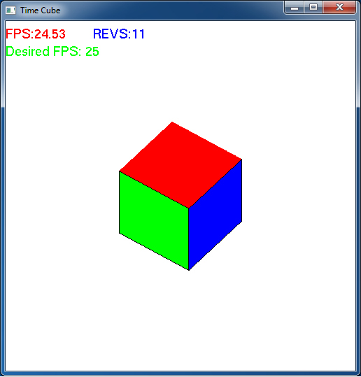

Ultimately we would like our animations to be system *independent* (assuming the user's system has sufficient graphics capabilities) by rendering based on *time*, e.g. at a fixed frame rate. Fortunately OpenGL provides a timer callback for time-based events, or alternatively we can use the idle callback with a time check, to do time-based rendering.

0\. Getting Started
===================

Download [CS370\_Lab09.zip](src/CS370_Lab09.zip), saving it into the **labs** directory.

Double-click on **CS370\_Lab09.zip** and extract the contents of the archive into a subdirectory called **CS370\_Lab09**

Navigate into the **CS370\_Lab09** directory and double-click on **CS370\_Lab09.sln** (the file with the little Visual Studio icon with the 12 on it).

If the source file is not already open in the main window, open the source file by expanding the *Source Files* item in the *Solution Explorer* window and double-clicking **timeCube.cpp**.

1\. Time-based Rendering I - Timer Callback
===========================================

One method of accomplishing time-based rendering is to use the GLUT timer callback instead of the idle callback. This callback is registered like the others using:

```cpp
glutTimerFunc(delay, mytimer, v);
```

where *delay* is the time (in milliseconds) to wait before entering the timer callback, *mytimer* is the name of the timer callback function, and *v* is an *int* value that will be passed to the parameter of the call when the timer expires. The timer callback has the prototype:

```cpp
static void mytimer(int v);
```

The timer is a *one-shot* event, i.e. only triggers once. Therefore to produce a recurring timer event, simply issue the same registration call as initially but at the end of the timer callback itself. Thus a typical timer callback has the form

```cpp
static void mytimer(int v)
{
	// Timer code

	glutPostRedisplay();
	glutTimerFunc(delay, mytimer, v);
}
```

with possibly a different *delay* from the original timer. The *v* parameter is often used as a flag to start/stop the timer events as desired, e.g. based on user input.

**Tasks**

-   Add code to **main()** to register a timer callback named **mytimer()** with a delay of **(1000/fps)** - which is the amount of time in milliseconds between rendering for a desired frame rate of **fps** (currently set at 30 frames per second). Simply set the third parameter to **1** as we will not be using it in this program.
-   Add code to **mytimer()** to update the angle **theta** appropriately to achieve a cube rotation speed of **rpm** based on the elapsed time interval **(1.0/fps)** seconds. NOTE: Do not forget to convert between *rpm* and *deg/sec* using the provided symbolic constant **DEG\_PER\_SEC**. Also make sure to add a check to limit the angle in the range [0,360].
-   Add code to **mytimer()** to create (i.e. reregister) a new timer with the same values as above.

2\. Time-based Rendering II - Idle Callback
===========================================

While the GLUT timer callback is a relatively easy way to produce time-based rendering, the timer is not very accurate as it only guarantees that the timer callback will not execute until *at least* *delay* milliseconds has elapsed (frequently being significantly longer than that time interval). An alternative way that is more reliable is to use the idle callback (which is essentially *as fast as possible*), retrieve an elapsed clock time, and only update the global variables (along with refreshing the screen) when a desired amount of time has passed. The function to get the elapsed clock time is:

```cpp
time = glutGet(GLUT_ELAPSED_TIME);
```

where *time* is an **unsigned int** variable that will contain the elapsed time (in milliseconds) *since* **glutInit()** *was called*, i.e. since GLUT was *initialized* in **main()**. By using two variables to store the current and previous time, the difference can be compared to a desired interval to determine when to perform an update. This difference can also be used to perform an *accurate* update of the object states.

**Tasks**

-   Add code to **idlefunc()** to store the current elapsed time in **time**.
-   Add code to **idlefunc()** to check if the difference between **time** and **lasttime** is greater than the desired time interval **(1000.0/fps)** milliseconds. When the interval has elapsed:

    > -   Add code to **idlefunc()** to update the angle appropriately to achieve a rotation speed of **rpm** based on the *actual elapsed time interval*. NOTE: Do not forget to convert between *rpm* and *deg/sec* using the provided symbolic constant **DEG\_PER\_SEC**. Also make sure to add a check to limit the angle in the range [0,360].
    > -   Add code to **idlefunc()** to update **lasttime** to **time** (essentially resetting the timer).
    > -   Add code to **idlefunc()** to redraw the screen via **glutPostRedisplay()**.

-   Add code to **main()** to register the idle callback **idlefunc()**. NOTE: Make sure to comment out the timer callback registration such that only one type of timing is active at a time.

3\. OpenGL Fonts
================

Adding text to a scene is a nice way of providing the user with various bits of information. It is performed as a *raster operation* (similar to billboarding and texture mapping) within the fragment processor. We first must specify *where* the character is to be drawn *in world-coordinates* using:

```cpp
glRasterPos2f(x,y);
```

where *x* and *y* are the world-coordinates based on the current projection matrix. Usually it is recommended to set the projection matrix using **gluOrtho2D()** prior to rendering fonts. Fortunately when a character is rendered, the raster position is updated to where the next character should begin - thus rendering a string is simply a matter of setting the *initial* raster position of the first character.

Rendering a (raster) character using GLUT is done with:

```cpp
glutBitmapCharacter(font, ch);
```

where *font* is the name of the font to use (e.g. **GLUT\_BITMAP\_HELVETICA\_18**) and *ch* is the *character* to draw. NOTE: OpenGL does not render *strings*, but rather must render character by character. However, a simple loop can be used to render a string at a desired location

```cpp
glRasterPos2f(x,y);
for (int i=0; i<strlen(str); i++)
{
	glutBitmapCharacter(font, str[i]);
}
```

NOTE: You will need to include \<string.h\> to use the string functions in C. A nice way of creating formatted strings is using **sprintf()** which works similarly to **printf()** except that it places the formatted string into a character array.

**Tasks**

-   Add code to **draw\_text()** to make two strings, **fpsStr** and **des\_fpsStr** (using **sprintf()**), that contain appropriate text for those quantities. NOTE: The actual fps is given by the formula **frame\*(1000.0/(time-fpstime))**
-   Add code to **draw\_text()** to set the raster position to (-1.0,0.9) (upper left hand corner) and draw text for the string **fpsStr[]** in 18 point Helvetica (**GLUT\_BITMAP\_HELVETICA\_18**).
-   Add code to **draw\_text()** to set an appropriate raster position (underneath the previous string) and draw text for the string **des\_fpsStr[]** in 18 point Helvetica (**GLUT\_BITMAP\_HELVETICA\_18**).

NOTE: Observe that around the text drawing code in **draw\_text()** the current projection and modelview matrices are stored using **glPushMatrix()**, reset to an appropriate 2D projection for rendering the text, and then restored to the original matrices using **glPopMatrix()** once the text has been drawn. Also since the text is drawn using a color, lighting must be disabled/enabled around the text drawing as well.

The '+' and '-' keys increase/decrease the desired fps. Observe the discrepancy between the actual and desired frame rates for the two timing methods. In either case, the rotation speed of the cube should roughly remain constant.

Compiling and running the program
=================================

Once you have completed typing in the code, you can build and run the program in one of two ways:

> -   Click the small green arrow in the middle of the top toolbar
> -   Hit **F5** (or **Ctrl-F5**)

(On Linux/OSX: In a terminal window, navigate to the directory containing the source file and simply type **make**. To run the program type **./timeCube.exe**)

The output should look similar to below

> 

To quit the program simply close the window.

