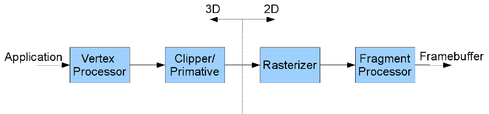

All vertices passed into the graphics card are processed by a multi-stage *graphics pipeline*. The graphics pipeline is optimized to process *graphics* (as opposed to a more general purpose computing pipeline such as on the CPU) which provides a great deal of efficiency and program simplicity at the expense of a limited number of operations. As a graphics programmer, it will be your task to utilize the pipeline to do as much work as possible on the graphics card rather than on the CPU. This pipeline consists of four primary *stages* as shown in the figure below:

> 

-   **Vertex Processor** (programmable) - performs coordinate transformations (and relative camera position) and assigns vertex colors
-   **Clipping and Primative Assembler** - creates primatives from vertices and adjusts primatives for only those which *may* appear in the final rendered scene (*clipping* the rest)
-   **Rasterization** - converts 3D primatives into *potential* 2D pixel objects known as *fragments*
-   **Fragment Processor** (programmable) - determines which pixels appear in the final scene (i.e. are written to the framebuffer) and applies pixel level effects such as bump mapping, texture mapping, blending, etc.

In modern hardware, the vertex and fragment prcessors are now *programmable* via *shaders* to allow the programmer to modify the default processing behavior of these stages. Thus it is important to understand which operations are performed at each stage so that one can properly modify this behavior if desired to produce more advanced effects.

Modern graphics hardware supports programmable *vertex* and/or *fragment* (*pixel*) shaders (with current hardware also including programmable *geometry* shaders) and the most recent graphics API's (e.g. DirectX 11 and OpenGL 4.3) work *exclusively* via shaders. Shaders provide the functionality to produce many additional effects that are not possible with the default (fixed) pipeline capabilities. In particular, we can perform non-linear transformations in the vertex processor (i.e. *morphing*) and adjust the vertex normals based on a *normal map* applied in both the vertex and fragment processors to use a slightly modified lighting model (i.e. *bump mapping*). Most of the advanced rendering techniques involve writing *shaders* (i.e. graphics card programs) to manipulate the vertices in a particular fashion or modify the pixel colors on a per fragment basis. There are numerous shader languages available including GLSL for OpenGL, HLSL for DirectX, Cg for nVidia hardware, etc. and are typically similar to C/Java syntax. We will focus on GLSL using the [GLEW library](http://glew.sourceforge.net/) (which exposes the GLSL functionality in the older OpenGL version included with Windows). In this lab we will see how to load shaders from files and *use* them from within our programs.

0\. Getting Started
===================

Download [CS370\_Lab10.zip](src/CS370_Lab10.zip), saving it into the **labs** directory.

Double-click on **CS370\_Lab10.zip** and extract the contents of the archive into a subdirectory called **CS370\_Lab10**

Navigate into the **CS370\_Lab10** directory and double-click on **CS370\_Lab10.sln** (the file with the little Visual Studio icon with the 12 on it).

If the header file is not already open in the main window, open the header file by expanding the *Header Files* item in the *Solution Explorer* window and double-clicking **shaderutils.h**.

If the source file is not already open in the main window, open the source file by expanding the *Source Files* item in the *Solution Explorer* window and double-clicking **basicGLSL.cpp**.

1\. Loading Shaders
===================

Shaders, like other source code files, are simply text files. In order to use them, we need to first load them into a character array (basically a large string) which will then be compiled, linked, and eventually run on the graphics card. To simplify loading a shader from a file, the included header file **shaderutils.h** contains a utility function:

```cpp
readShaderSource(filename, &shaderSrc);
```

where *filename* is the file name of the shader (for both vertex and/or fragment shaders) and *shaderSrc* is a **GLchar*** that will be dynamically allocated to store the shader text.

**Tasks**

-   Add code to **load\_shaders()** in **shaderutils.h** to load both the vertex shader (**vertexFile**) and fragment shader (**fragmentFile**) from the source files and store them into the character buffers **vertexSrc** and **fragmentSrc**.

2\. Creating Shader Programs
============================

Once the shader source text has been loaded into a text buffer, we must then *create*, *compile*, *link*, and *use* (i.e. select) a shader program. GLEW provides an efficient way of detecting which capabilities the graphics hardware supports as well as exposing the necessary functions for manipulating shaders. Before attempting to use shader programs, it is important to *check* that the graphics card actually *supports* programmable shaders, e.g. many laptop integrated graphics do not, (otherwise the program will meet a very unfortunate demise). We can query the graphics system capabilities of the hardware using

```cpp
glewIsSupported("property");
```

where *property* is the property we wish to check, e.g. **GL\_ARB\_vertex\_shader**, **GL\_ARB\_fragment\_shader**, etc. NOTE: The *property* **MUST** be *enclosed in quotes*. The query function will return 1 (true) if the system supports the programmable shader and 0 (false) otherwise. Typically if a programmable shader is not available, the program should terminate gracefully or use the default pipeline with simpler effects.

*Creating Shader Programs*

Once the system has been determined to support programmable shaders, we need to create **GLuint** *shader objects* which will be used to identify the shader within the application. This is done with the command

```cpp
shaderObj = glCreateShader(type);
```

where *shaderObj* is a **GLuint** index for the shader and *type* is the type of shader we wish to create - **GL\_VERTEX\_SHADER** or **GL\_FRAGMENT\_SHADER**. We must then *associate* a shader object (identifier) with the appropriate shader source buffer using

```cpp
glShaderSource(shaderObj, num_buff, (const GLchar**) &shaderSrc, NULL);
```

where *shaderObj* is the identifier previously created, *num\_buff* is the number of buffers to obtain the source from (typically 1), and *shaderSrc* is the text buffer from the previous section that contains the shader source code (NOTE: It must be *cast* as a **constant GLchar**** double pointer and then passed by reference). The fourth parameter indicates that the buffer is *null terminated*. At this point we are ready to begin compiling the shaders.

*Compiling Shader Programs*

Just like standard C++ programs, shaders must be *compiled* into executable code. This is done with the command

```cpp
glCompileShader(shaderObj);
```

where *shaderObj* is the shader object (identifier). It is **EXTREMELY IMPORTANT** to check that the compilation was successful before attempting to use the shader. This can be done using

```cpp
glGetShaderiv(shaderObj, GL_COMPILE_STATUS, &flag);
```

where *shaderObj* is the shader object and *flag* is a **GLint** that will contain the compile status (**GL\_TRUE** if successful and **GL\_FALSE** otherwise). Note that both vertex and fragment shaders are compiled in the same fashion but for the appropriate processor based on how the object was created. Included in **shaderutils.h** is a function named **printOGLShaderLog()** which can print out some error information should the compilation of either shader fail.

*Linking Shader Programs*

Again like standard C++ programs, shaders must be *linked* into a program that is then loaded onto the pipeline processors. Just like with shader objects, we must first create a **GLuint** *program object* using the command

```cpp
progObj = glCreateProgram();
```

where *progObj* is a **GLuint** index for the program. Next the desired shaders must be *attached* to the program using

```cpp
glAttachShader(progObj, shaderObj);
```

where *progObj* is the program object created above and *shaderObj* is the shader object to attach. Typically each shader program will consist of one vertex shader and one fragment shader. Finally we are ready to link the shaders into the program using

```cpp
glLinkProgram(progObj);
```

where *progObj* is the program object. Again it is **EXTREMELY IMPORTANT** to check that the linking was also successful using

```cpp
glGetProgramiv(progObj, GL_LINK_STATUS, &flag);
```

where *progObj* is the program object and *flag* is a **GLint** that will contain the link status (**GL\_TRUE** if successful and **GL\_FALSE** otherwise). The function **printOGLProgramLog()** in **shaderutils.h** can output error information if the linking fails. At this point we now have a shader program that is ready to be loaded onto the programmable processors on the graphics card.

**Tasks**

-   Add code to **main()** to call **glewInit()** to initialize the GLEW library. NOTE: This must be done **AFTER** creating the window using GLUT.
-   Add code to **load\_shaders()** in **shaderutils.h** to *create* a vertex shader (**GL\_VERTEX\_SHADER**) object **vertexObj** and fragment shader (**GL\_FRAGMENT\_SHADER**) object **fragObj**.
-   Add code to **load\_shaders()** in **shaderutils.h** to *associate* both shader source buffers with the respective shader objects. Remember to cast the source buffer as a **(const GLchar\*\*)**.
-   Add code to **load\_shaders()** in **shaderutils.h** to *compile* the vertex shader. Make sure the compilation succeeded, otherwise exit the program (and optionally print out debug information).
-   Add code to **load\_shaders()** in **shaderutils.h** to *compile* the fragment shader. Make sure the compilation succeeded, otherwise exit the program (and optionally print out debug information).
-   Add code to **load\_shaders()** in **shaderutils.h** to *create* the program object **shaderProg**.
-   Add code to **load\_shaders()** in **shaderutils.h** to *attach* both shader objects to the program object.
-   Add code to **load\_shaders()** in **shaderutils.h** to *link* the program. Make sure the link succeeded, otherwise exit the program (and optionally print out debug information).

NOTE: The above initialization code can be used as boilerplate code for any program utilizing programmable shaders loaded from source files. The shader source files can subsequently be modified *without* requiring recompilation of the application.

3\. Using Shader Programs
=========================

The final step after linking a shader program is to *use* the program, i.e. load and execute it on the programmable processors. This is done with

```cpp
glUseProgram(progObj);
```

where *progObj* is the program object. This command may be issued anywhere that a new shader program should be used (often for efficiency it is desirable to only do this to *change* the current shader program and not continually reload the same shader program repeatedly). At this point all subsequent quantities (vertices, colors, textures, etc.) will be passed through the pipeline and manipulated with the new shaders.

**Tasks**

-   Add code to **main()** to select the program object **shaderProg**.

NOTE: To revert the system back to the default vertex and fragment behavior, simply use the command **glUseProgram(0);**. This is useful when we only want our shader to be used for certain objects.

Compiling and running the program
=================================

Once you have completed typing in the code, you can build and run the program in one of two ways:

> -   Click the small green arrow in the middle of the top toolbar
> -   Hit **F5** (or **Ctrl-F5**)

(On Linux/OSX: In a terminal window, navigate to the directory containing the source file and simply type **make**. To run the program type **./basicGLSL.exe**)

The output should look similar to below

> 

To quit the program simply close the window.

The provided shaders **basicvert.vs** and **basicfrag.fs** only provide the most basic of functionality. Unfortunately *if* you use shaders at all, you *must* program *all* functionality into the shaders, i.e. using shaders completely deactivates all default behavior including lighting and texture mapping. Thus it is absolutely essential to begin exploring how to *write* shaders that at least replicate the default behavior (and eventually can be used to extend it).

