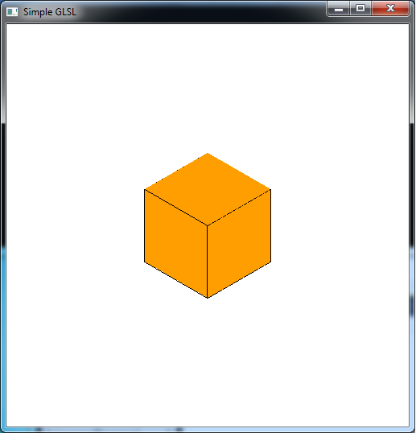

In the last lab we saw how to *use* programmable shaders written in GLSL. Hence if we are able to get shader source code, we could implement them within our standard OpenGL code using the **load\_shaders()** routine from that lab. The true power of modern graphics hardware, however, is unlocked by being able to *write* our own programmable shaders to produce any effect we desired. There are many different shader languages including GLSL, HLSL, cG, etc. We will be focusing on GLSL which is the shader language for OpenGL. Even though the command set for shaders is very limited compared to C, the structure of a shader program is very similar, e.g. semi-colon terminated statements. However, writing shaders can be *substantially* more difficult to do primarily because the programs are *very* particular about syntax and because there is not a good *debugging* mechanism available to help correct non-functional shader programs (since they are only executed once they have been compiled and loaded onto the graphics card). A few debugging tools are available, such as [glslDevil](http://glsl-debugger.github.io) and *OpenGL Shader Builder* (for Apple Developers) but it is still a challenging task to write sophisticated shaders. The primary drawback to using programmable shaders is that if you use them, you must program *every* feature you want implemented, e.g. lighting, blending, etc. Hence it is *essential* to understand all the concepts we have discussed, i.e. the *mathematical implementation*, in order to program it in your shaders.

0\. Getting Started
===================

Download [CS370\_Lab11.zip](src/CS370_Lab11.zip), saving it into the **labs** directory.

Double-click on **CS370\_Lab11.zip** and extract the contents of the archive into a subdirectory called **CS370\_Lab11**

Navigate into the **CS370\_Lab11** directory and double-click on **CS370\_Lab11.sln** (the file with the little Visual Studio icon with the 12 on it).

If the source file is not already open in the main window, open the source files by expanding the *Source Files* item in the *Solution Explorer* window and double-clicking **simpleGLSL.cpp**, **simplevert.vs**, and **simplefrag.fs**.

1\. Built-in Shader Data Types
==============================

When we write shaders we can use many of the data types we are familiar with in C/Java such as **bool**, **int**, **float** (but no **double**) along with identical single dimensional array and structure notation. However since the pipeline primarily performs *matrix/vector* operations, there are several built-in data types for vectors and matrices. Vector types have the form

    [i,b]vec{2,3,4}

where *[i,b]* is an optional indicator of **integer** / **boolean** data type (the default is **float**) and *{2,3,4}* represents the number of components in the vector. For example

```cpp
vec4 col;
```

would define a variable named **col** that is a 4x1 **float** vector. Matrix types (which are always square) have a similar form

    mat{2,3,4}

where *{2,3,4}* represents the number of rows and columns in the matrix. NOTE: Matrices *can only be* **float**'s and are stored column-wise (like user defined transformation matrices).

Since the variables within the shaders often refer to common graphics quantities, e.g. vertices, colors, etc., in addition to standard integer indices we can refer to the elements of a **vec**? variable using the *structure fields* - **{x,y,z,w}** (vertex coordinates), **{r,g,b,a}** (color channels), or **{s,t,p,q}** (texture coordinates). For example, **col[2]**, **col.z**, **col.b**, and **col.p** all refer to the same value (*regardless* of what the vector quantity actually represents). We can also use any combination of these fields, known as *swizzling*, to refer to parts of a vector that we wish to manipulate, i.e. **col.rb** would refer to only the red (first) and blue (third) components. Furthermore, since the graphics pipeline supports vector operations (on variables with *compatible* dimensions), the standard arithmetic operators can also be used on vector/matrix quantities as a whole (rather than having to perform operations element by element).

**Tasks**

-   Add code to **simplevert.vs** in **main()** to define four **float** variables (note use four separate statements) called **red**, **green**, **blue**, and **scale**.
-   Add code to **simplevert.vs** in **main()** to define a **vec3** variable called **my\_scale**.
-   Add code to **simplevert.vs** in **main()** to define a **vec4** variable called **my\_color**.

2\. Shader Variable Qualifiers
==============================

Since we cannot pass arguments to the shaders, there are several *qualifiers* for *global* shader variables (i.e. ones declared outside **main()** in the *shader* source file). The shader global variables are then given values by the *application* and/or *transferred* between the vertex and fragment shaders. The four qualifiers are:

-   **const** - indicates that a variable is constant to avoid inadvertently changing it within a shader.
-   **attribute** - indicates that a variable is passed *from the application*, but that it will change at most *once per vertex*, i.e. a quantity the application will assign on a per vertex basis. Thus an attribute variable can be *modified* from vertex to vertex within the same primative.
-   **uniform** - indicates that a variable is passed *from the appliction*, but that it will **not** change for an *entire primative, i.e. cannot be modified within a glBegin()/glEnd()* construct. Thus a uniform variable is *fixed* from vertex to vertex within the same primative.
-   **varying** - indicates that a variable is passed *from a vertex shader to a fragment shader*. Thus it will be *interpolated across* the corresponding fragment based on the current shading model.

**Tasks**

-   Add code to **simplevert.vs** *before* **main()** to define a **uniform float** variable called **time** (which we will later associate in the application).
-   Add code to **simplevert.vs** *before* **main()** to define a **varying vec4** variable called **color\_out** (which will be passed to the fragment shader).
-   Add code to **simplefrag.fs** *before* **main()** to define a corresponding **varying vec4** variable called **color\_out** (which will be received from the vertex shader).
-   Add code to **simplevert.vs** in **main()** to use the **time** variable to perform the following scalar computations (NOTE: the shader language supports many common math functions - see the *Quick Reference* handout):

	```cpp
    scale = 1.0 + 0.5*sin(time);
    red = 1.0 + 0.5*sin(time);
    green = 1.0 + 0.5*cos(time);
    blue = 1.0 + 0.5*sin(time)*cos(time);
	```
	
-   Add code to **simplevert.vs** in **main()** to set every component of **my\_scale** to **scale**. NOTE: You can set each component individually via array notation, **or** in a single step by creating a **vec3(scale, scale, scale)** object.
-   Add code to **simplevert.vs** in **main()** to set the components of **my\_color** to **red**, **green**, **blue**, and **1.0** (since it is an RGBA color). NOTE: You can set each component individually via field notation **.r**, **.g**, **.b** or in one step by creating a **vec4(red,green,blue,1.0)** object.

3\. Shader Variables and Shader Arithmetic
==========================================

In addition to values passed to the shaders from the application (either **attribute** or **uniform**) through variables, GLSL provides many predefined variables that represent OpenGL values set in the application by OpenGL functions (see the Quick Reference handout). Some of the common ones from the application used in the vertex shader are

-   **gl\_Vertex** - the **vec4** current *vertex coordinate* values (set via **glVertex3f()**)
-   **gl\_Color** - the **vec4** current *vertex color* values (set via **glColor3f()**)
-   **gl\_ProjectionMatrix** - the **mat4** of the current *projection matrix* (set via **glOrtho()** or **glFrustum()**)
-   **gl\_ModelViewMatrix** - the **mat4** of the current *modelview matrix* (set via the various transformation functions)
-   **gl\_ModelViewProjectionMatrix** - the **mat4** of the current *product* of the projection and modelview matrices (essentially the *total* coordinate transformation applied per vertex)

Some common variables passed from the vertex shader to the fragment shader are

-   **gl\_Position** - the *clipped* vertex positions output from the vertex shader (based on applying shader transformations)
-   **gl\_FrontColor** - the *final* vertex color output from the vertex shader (based on modifying the shader colors possibly including lighting)

Finally the necessary variable in the fragment shader is

-   **gl\_FragColor** - the *final fragment* color output from the fragment shader and displayed in the framebuffer

Hence to use shaders properly, the vertex shader will use **gl\_Vertex**, **gl\_Color**, and (usually) **gl\_ModelViewProjectionMatrix** to compute **gl\_Position** and **gl\_FrontColor**. Then the fragment shader may use **gl\_FrontColor** to compute (or simply set) **gl\_FragColor** which is the final color for the fragment in the framebuffer. There are many other variables for effects like lighting/materials, normals, texture mapping, and other useful matrices (e.g. inverse matrices, eye coordinate matrices, etc.) We will use many of these other variables to perform bump mapping in a later lab.

**Tasks**

-   Add code to **simplevert.vs** in **main()** to perform the following computations:

    > -   Compute **gl\_Position** as the product of **gl\_ModelViewProjectionMatrix** and **gl\_Vertex**. Note this duplicates the *default pipeline* behavior.
    > -   Modify **gl\_Position** by multiplying the x,y,z components (use **.xyz**) by **my\_scale**.
    > -   Compute **color\_out** by multiplying **gl\_Color** by **my\_color**. Note this value will be passed to the fragment shader.

-   Add code to **simplefrag.fs** in **main()** to set **gl\_FragColor** to **color\_out**. Note this value comes from the vertex shader.

4\. Associating Application Values
==================================

At this point we have created both a vertex and fragment shader program. From the last lab we also have boiler plate code (**load\_shaders()**) that will load, compile, and link these shaders into a shader program. However now that we have defined a **uniform** variable in the vertex shader which is passed *from the application*, we need to *associate* a variable in our application with the variable in the shader. First we must associate an *application parameter* which identifies the desired shader variable using

```cpp
param = glGetUniformLocation(progObj, "var");
```

where *param* is a **GLint** that identifies the shader variable (similar to a pointer), *progObj* is the shader program object (see [lab10](lab10.html)), and *var* is the variable name *in the shader source file* we wish to associate (note the name is enclosed in double quotes). A similar function - **glGetAttribLocation( )** - exists for associating **attribute** shader variables. Whenever we wish to set the value of the shader variable, we simply call

```cpp
glUniform[1,2,3]f(param, val);
```

where *param* is the identifier from above, *[1,2,3]* selects the number of values passed, and *val* is the value (either a literal, application variable, or expression) to be assigned to the associated shader variable. Again there is an equivalent **glVertexAttrib?f( )** function to set **attribute** shader variables (usually per vertex). Just like many other OpenGL functions (e.g. **glVertex3?( )**), there are different forms of these commands based on the type and number of components for the respective shader variables. Finally we can also pass a uniform matrix with the command

```cpp
glUniformMatrix{2,3,4}f(param, num, trans, *val);
```

where *param* is the identifier, *num* is the number of values to change, *trans* is a boolean specifying whether or not to use the transpose, and *val* is a pointer to an array containing the values to set (recall that *all* shader matrices are **float**).

NOTE: One of the above functions **must** be called **every** time the shader variable needs to be updated, i.e. simply changing the application variable will have no effect if the attachment function is not subsequently called.

**Tasks**

-   Add code to **SimpleGLSL.cpp** to create two *global variables* - a **GLuint** called **timeParam** and a **GLfloat** called **app\_time**.
-   Add code to **main( )** to *associate* **timeParam** with the **uniform** shader variable **time** (note this is a *scalar*, i.e. 1D).
-   Add code to **render\_Scene( )** to set the **timeParam** associated shader variable to **app\_time**.

Compiling and running the program
=================================

Once you have completed typing in the code, you can build and run the program in one of two ways:

> -   Click the small green arrow in the middle of the top toolbar
> -   Hit **F5** (or **Ctrl-F5**)

(On Linux/OSX: In a terminal window, navigate to the directory containing the source file and simply type **make**. To run the program type **./simpleGLSL.exe**)

The output should look similar to below

> 

To quit the program simply close the window.

A complete reference for GLSL is *OpenGL Shading Language* by Randi Rost (a.k.a. the "Orange Book"). The reference handout along with other resources can be found at [<http://www.opengl.org/documentation/glsl/>](http://www.opengl.org/documentation/glsl/).

Throughout the rest of the semester, we will be implementing our effects, e.g. lighting, texture mapping, etc., in the shaders rather than using the default pipeline behavior. Initially we will simply duplicate the default pipeline behavior, but you will be able to then modify this behavior to create new effects.

