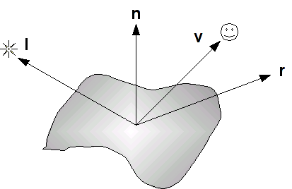
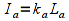
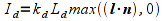
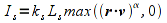
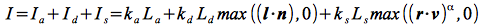
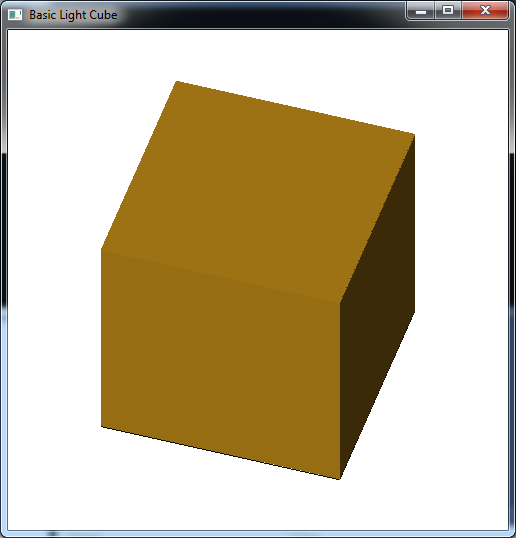

Now that we have completed creating 3D geometry, we would like to enhance our scenes through the application of shadowing caused by lighting. To do this we will use a simple (but somewhat unrealistic) lighting model known as the *Phong model*. This model consists of defining four *material* properties, three corresponding *light source* properties, and some additional geometry parameters controlling the interaction of the two. Unfortunately because the pipeline contains *no global information*, i.e. once an object is passed through the pipeline any world information regarding it is lost, we are only able to apply lighting on a per object basis. While this provides for some lighting effects, the pipeline is not able to handle *reflections* amongst objects. Thus a *shiny* object will not (for now) appear to be reflecting any other objects in the scene.

0\. Getting Started
===================

Download [CS370\_Lab12.zip](src/CS370_Lab12.zip), saving it into the **labs** directory.

Double-click on **CS370\_Lab12.zip** and extract the contents of the archive into a subdirectory called **CS370\_Lab12**

Navigate into the **CS370\_Lab12** directory and double-click on **CS370\_Lab12.sln** (the file with the little Visual Studio icon with the 12 on it).

If the source file is not already open in the main window, open the source file by expanding the *Source Files* item in the *Solution Explorer* window and double-clicking **basicLightCube.cpp**.

If the header files are not already open in the main window, open the header file by expanding the *Header Files* item in the *Solution Explorer* window and double-click **materials.h** and **lighting.h**.

If the shader files are not already open in the main window, open the shader files by expanding the *Resource Files* item in the *Solution Explorer* window and double-click **lightvert.vs** and **lightfrag.fs**.

1\. Materials
=============

The basic model we will be using for lighting is known as the *Phong model*. In this model, every surface has a particular *material* associated with it. This material is defined by four properties

-   Ambient - overall background illumination
-   Diffuse - scattered light based on the "smoothness" of the surface
-   Specular - highlights based on the "shininess" of the surface
-   Shininess - the degree of concentration of the specular highlights

Each of the first three properties is defined by a four element array with one component of each array per color channel. These values indicate the *percent* of the incident light channel that is *reflected*, hence the higher the value the more the object will appear to have that color. The last property, shininess, is simply a floating point (GLfloat) value. Typically we will create a structure in a header file (**materials.h**) to define a particular material as follows

```cpp
struct MaterialType {
	GLfloat ambient[4];
	GLfloat diffuse[4];
	GLfloat specular[4];
	GLfloat shininess;
};
```

We then add materials (also typically in **materials.h**) by defining new instances of this structure, for example

```cpp
MaterialType brass = {
	{0.33,0.22,0.03,1.0},
	{0.78,0.57,0.11,1.0},
	{0.99,0.91,0.81,1.0},
	27.8};
```

Rather than set a color for an object, we instead *apply* a material on a per surface (polygon) basis (again materials are state variables that once set are applied to all subsequent polygons until it is changed) using

```cpp
glMaterialfv(face,property,values); 
```

for the arrays where *face* is the face we are setting (**GL\_FRONT**, **GL\_BACK**, or **GL\_FRONT\_AND\_BACK**), *property* is the property we are setting (**GL\_AMBIENT**, **GL\_DIFFUSE**, or **GL\_SPECULAR**), and *values* is the appropriate field from the material structure we wish to use.

We set the shininess value using the similar command

```cpp
glMaterialf(face, property, value);
```

where *face* is the same as above, *property* is **GL\_SHININESS**, and *value* is the shininess field from the material structure.

Rather than continually setting all the properties individually each time we wish to select a material, we will instead use a setter function that I've included in **materials.h**

```cpp
void set_material(GLenum face, MaterialType *material);
```

which takes as arguments the *face* that we want to set the material for (identical constants as above) and a **MaterialType** structure *by reference* (i.e. you will need the **&**) to set.

Note that these material properties are passed to the shader through the uniform variable **gl\_FrontMaterial** for **GL\_FRONT** surfaces and **gl\_BackMaterial** for **GL\_BACK** surfaces. Both of these shader variables are of type **gl\_MaterialParameters** (refer to the GLSL Quick Reference).

**Tasks**

-   Add code to **materials.h** to create a material called **brass** using the property values given above.
-   Add code to **render\_Scene()** to set the front and back face with the material **brass** using the **set\_material()** function. NOTE: Remember to pass a structure *by reference* you need to use the argument **&brass**.

2\. Light Sources
=================

Similar to materials, each light source is defined by three properties - *ambient* (background), *diffuse* (scattered), and *specular* (focused). Again, each of these properties is specified using a (4 component) RGBA color array. The RGB channels describe the intensity for each color channel of the light source, e.g. (1,1,1) would produce white light. For now we will again simply set the alpha channel to 1.

Just as with setting materials, to simplify working with light sources I've provided another structure called **LightType** that encapsulates these three properties as such:

```cpp
struct LightType {
	GLfloat ambient[4];
	GLfloat diffuse[4];
	GLfloat specular[4];
};
```

For example, we can create a **white\_light** that has no ambient but full diffusive and specular components using the following declaration

```cpp
LightType white_light = {
	{0.0,0.0,0.0,1.0},
	{1.0,1.0,1.0,1.0},
	{1.0,1.0,1.0,1.0}};
```

OpenGL provides for at least *eight* light sources enumerated by symbolic constants **GL\_LIGHT0**, **GL\_LIGHT1**, etc. We then specify the properties of the lights we wish to use with the command

```cpp
glLightfv(source, property, *values);
```

where *light* is the light source symbolic constant (**GL\_LIGHT0**, etc.), *property* is the property to set (either **GL\_AMBIENT**, **GL\_DIFFUSE**, or **GL\_SPECULAR**), and *values* is the appropriate field from the **LightType** structure. Rather than set each property separately, I've provided a setter function in *lighting.h* that will set all three properties based on a passed structure

```cpp
void set_light(GLenum source, LightType *light);
```

which takes as arguments the *source* that we want to set and a **LightType** structure *by reference*.

Note that these light source properties are passed to the shader through the uniform array **gl\_LightSource[ ]**. Each element of this array is of type **gl\_LightSourceParameters** (refer to the GLSL Quick Reference).

**Tasks**

-   Add code to **lighting.h** to create a material called **white\_light** using the property values given above.
-   Add code to **render\_Scene( )** to set **GL\_LIGHT0** to **white\_light** using the **set\_light( )** function. NOTE: Remember to pass a structure *by reference* you need to use the argument **&white\_light**.

To turn light sources on/off we will need to pass an array of *boolean* flags to the shader.

3\. Surface Normals
===================

The Phong model computes the contribution of each lighting component (on a per channel basis) based on the relationship between four vectors as shown below

> 

where the four vectors are as follows:

-   **l** is a vector in the direction of the *light source*
-   **n** is the outward *surface normal*
-   **v** is a vector in the direction of the *viewer* (i.e. camera)
-   **r** is a vector in the direction of the *reflected* light (i.e. at the same angle with respect to the normal as the incident light)

These vectors determine the final intensity of the diffusive and specular lighting components that are applied to the surface.

*Ambient Reflection*

The ambient reflection component is independent of the normals and can be thought of as an overall uniform illumination of the surface. Thus it is simply the product of the incident intensity with the material's ambient array components

> 

where *k*<sub>a</sub> is the material ambient component (per color channel), *L*<sub>a</sub> is the incident ambient light intensity, and *I*<sub>a</sub> is the final ambient light intensity per color channel.

*Diffuse Reflection*

The diffuse reflection component is based on *Lambert's law* which states that the more directly the light shines on the surface, the brighter it will appear. Mathematically this is computed using the *dot product* between **l** (the light direction) and **n** (the surface normal). When these two vectors are *parallel* (light shining directly onto surface), the dot product is one and hence there is maximal diffusive illumination. When the two vectors are *perpendicular* (light shining across surface), the dot product is zero and hence there is no diffusive illumination. Hence the formula based on the material's diffusive array components is

> 

where *k*<sub>d</sub> is the material diffusive component (per color channel), *L*<sub>d</sub> is the incident diffusive light intensity, (**l** ⋅ **n**) is the Lambert factor (clipped to a minimum value of 0), and *I*<sub>d</sub> is the final diffusive light intensity. This formula can also be extended to account for the *attenuation* due to distance the object is from the light source.

*Specular Reflection*

The specular reflection component is used to create highlights on an object (particular for shiny materials). These reflections will be greatest when the reflected light (which depends on the surface normal and the direction of the light source) is in the direction of the viewer. Mathematically this is computed using the *dot product* between **r** (the reflected light direction) and **v** (the viewer direction). When these two vectors are *parallel* (viewer looking directly at reflection), the dot product is one and hence there is maximal specular illumination. When the two vectors are *perpendicular* (viewer looking across reflection), the dot product is zero and hence there is no specular illumination. The shininess property determines how *focused* the highlight is, a high shininess coefficient creates a small bright spot whereas a low shininess coefficient creates a broader less bright spot. The formula based on the material's specular array components is

> 

where *k*<sub>s</sub> is the specular component (per color channel), *L*<sub>s</sub> is the incident specular light intensity, (**r** ⋅ **v**) is the specular factor (clipped to a minimum value of 0), α is the shininess exponent for the material, and *L*<sub>s</sub> is the final specular light intensity. An attenuation factor can also be applied to this component to account for the distance between the object and the light source.

*Phong model*

The final intensity of each color channel is then simply the sum of the three reflection components as given by (not including attenuation)

> 

Since both the diffusive and (indirectly) specular components depend on the orientation of the surface with respect to the light source, to use lighting we must associate a *normal* with each vertex in our geometry (since OpenGL works with vertices rather than normals). The normal is assigned using the command

```cpp
glNormal3f(nx,ny,nz);
```

or

```cpp
glNormal3fv(*n);
```

where (*nx*, *ny*, *nz*) are the components of the normal vector or *n* is a three element array containing the components.

Note that the normal is passed to the shader through the **vec3** variable **gl\_Normal** (refer to the GLSL Quick Reference).

One issue we must be careful of is that all the vectors used in the Phong model are *unit vectors*, i.e. have unit length. Rather than doing this in the application, we can do this in the shader using the **normalize( )** function (refer to the GLSL Quick Reference).

If our polygon is (relatively) flat, then we can simply assign one normal to all the vertices used to define each surface to produce *surface normal lighting*.

**Tasks**

-   Add code to define the global surface normals **normals[ ][3]**. Make sure they point *perpendicular* to the face and are ordered in the array to correspond to the following faces: top, bottom, left, right, front, back.
-   Add code to **nquad( )** to set the normal on a *per face basis*, i.e. prior to rendering the polygon, using the parameter **n**.

4\. Shader Lighting
===================

We will implement the lighting calculations in the vertex shader using the shader variables **gl\_FrontMaterial**, **gl\_LightSource[0]**, and **gl\_Normal**. The basic light source we will create will be a *directional light* which produces parallel light rays from an infinite source, e.g. the sun.

First we will write a function that computes the vector dot products using the **dot( )** shader function and then multiply it by the light source parameters to get the attenuation of each color channel from the light source. Then in the main shader function we will compute the color by using the material properties.

**Tasks**

-   Add code to **lightvert.vs** in the **DirectionalLight( )** function to compute the diffuse dot product **nDotVP** as the **max( )** of 0.0 and the **dot()** of **normal** (the normal vector parameter) and the **normalize()** **gl\_LightSource[i].position** as a **vec3**.

	```cpp
    nDotVP = max(0.0,dot(normal,normalize(vec3(gl_LightSource[i].position))));
	```
	
-   Add code to **lightvert.vs** in the **DirectionalLight()** function to compute the specular dot product **nDotHV** as the **max()** of 0.0 and the **dot()** of **normal** (the normal vector parameter) and the **normalize()** **gl\_LightSource[i].halfVector** as a **vec3**. (see problem 3 of the assignment for a discussion of the half vector).

	```cpp
    nDotHV = max(0.0,dot(normal,normalize(vec3(gl_LightSource[i].halfVector))));
    ```

-   Add code to **lightvert.vs** in the **DirectionalLight()** function to compute the shininess factor **pf** as 0.0 if **nDotVP** is 0.0 (i.e. light is perpendicular to the surface) or **pow()** of **nDotHV** and **gl\_FrontMaterial.shininess** otherwise.

	```cpp
    pf = pow(nDotHV,gl_FrontMaterial.shininess);
    ```

-   Add code to **lightvert.vs** in the **DirectionalLight()** function to accumulate the **ambient** with **gl\_LightSource[i].ambient**, **diffuse** with the product of **gl\_LightSource[i].diffuse** and **nDotVP**, and **specular** with **gl\_LightSource[i].specular** and **pf**.

	```cpp
    ambient += gl_LightSource[i].ambient;
    diffuse += gl_LightSource[i].diffuse * nDotVP;
    specular += gl_LightSource[i].specular * pf;
    ```

-   Add code to **lightvert.vs** in the **main()** function to compute **normal** as the **normalize()** of the product of **gl\_NormalMatrix** and **gl\_Normal**.
-   Add code to **lightvert.vs** in the **main()** function to compute **gl\_FrontColor** as the sum of all the lighting terms multiplied by the corresponding material properties.

	```cpp
    gl_FrontColor = amb * gl_FrontMaterial.ambient + diff * gl_FrontMaterial.diffuse + spec * gl_FrontMaterial.specular;
    ```

Compiling and running the program
=================================

Once you have completed typing in the code, you can build and run the program in one of two ways:

> -   Click the small green arrow in the middle of the top toolbar
> -   Hit **F5** (or **Ctrl-F5**)

(On Linux/OSX: In a terminal window, navigate to the directory containing the source file and simply type **make**. To run the program type **./basicLightCube.exe**)

The output should look similar to below

> 

To quit the program simply close the window.

One thing that is apparent from surface normal lighting is the drastic transition of the light effect at edges where the normal is drastically different for multiple adjacent faces. Likewise any large surfaces will have uniform lighting (or awkward lighting based on the tesselation of the surface). Next lab we will see how to generate additional geometry to achieve a more realistic lighting effect. Additionally, we will investigate the other part of effective lighting which is defining other types of *light sources*.

