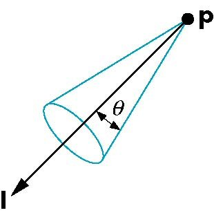
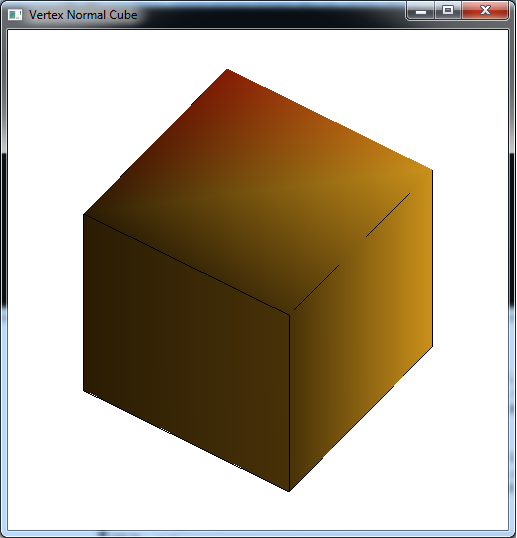

In the last lab we introduced basic lighting by creating materials and defining surface normals for our objects using a simple directional light. The light source we created was a single directional light source which was assumed to be at an infinite distance will all light rays parallel and thus striking the object at the same angle, e.g. the sun. While this produced a shading effect as the various faces of the cube rotated into and away from the light source, the effect was not very realistic (particularly considering we had created somewhat reflective materials). To extend the lighting effects, we will now consider how to create different light sources, position them within the scene, and tweak the normals *per vertex*.

0\. Getting Started
===================

Download [CS370\_Lab13.zip](src/CS370_Lab13.zip), saving it into the **labs** directory.

Double-click on **CS370\_Lab13.zip** and extract the contents of the archive into a subdirectory called **CS370\_Lab13**

Navigate into the **CS370\_Lab13** directory and double-click on **CS370\_Lab13.sln** (the file with the little Visual Studio icon with the 12 on it).

If the source file is not already open in the main window, open the source file by expanding the *Source Files* item in the *Solution Explorer* window and double-clicking **vertexNormalCube.cpp**.

If the header file is not already open in the main window, open the header file by expanding the *Header Files* item in the *Solution Explorer* window and double-clicking **lighting.h**.

If the shader files are not already open in the main window, open the shader files by expanding the *Resource Files* item in the *Solution Explorer* window and double-click **lightvert.vs** and **lightfrag.fs**.

1\. Point Light Sources
=======================

Another type of light source that we may wish to add to our scenes is a *point light source*, e.g. light bulb. This is a *local* light source, i.e. it has a *position* in world coordinates, that radiates light *omnidirectionally*, i.e. equally in all directions. Thus in addition to specifying the color channels for the ambient, diffuse, and specular components, we also will specify a *position* of the light source (note that this position is represented as a *four* element array with the last element 1.0). Additionally, we can also incorporate *attenuation* for these light sources such that the further away from the light source an object is, the dimmer the light will be on that object.

We then set the location property for a point light with the command

```cpp
glLightfv(source, GL_POSITION, *pos);
```

where *source* is the light source symbolic constant (**GL\_LIGHT0**, etc.) and *pos* is the array containing the position (*x*, *y*, *z*, 1.0). In *lighting.h* is a utility function that will set all the parameters for a point light

```cpp
void set_PointLight(GLenum source, LightType *light, GLfloat *position);
```

which takes as arguments the *source* that we want to set, a **LightType** structure *by reference* for the color channels, and a *position* array for the location of the light source. (Note there is also a function named **set\_PointLightAttenuated( )** that takes additional attenuation parameters to create an attenuated point light source.)

**Tasks**

-   Define the global variable **light0\_pos[ ]** to the position (4,0,0,1), i.e. a *point* light located on the x-axis.
-   Add code to **render\_Scene( )** to set **GL\_LIGHT0** as a point light at **light0\_pos[ ]**.

2\. Spot Light Sources
======================

Spotlights are similar to point lights in that they have a position in the scene, but instead of being omnidirectional they are *unidirectional*, i.e. they only shine in one direction. Furthermore, their illumination is limited to a cone eminating from the source as shown in the figure below

> 

Thus to create a spotlight we need to specify the position of the light, the direction in which the light is pointing, and how wide the cone of illumination is. We set the position parameter similarly to point lights, and set the direction parameter using the command

```cpp
glLightfv(source, GL_SPOT_DIRECTION, *dir);
```

where *source* is the source and *dir* is a 3 element array containing a *vector direction* (**NOT** a "look at" point).

The width of the cone is specified by a *cutoff* angle that is set by the command

```cpp
glLightf(source, GL_SPOT_CUTOFF, angle);
```

where *source* is the source and *angle* is the angle of the light *cone* projecting from the light's position in the light's direction.

Finally we can control how the light intensity varies across the cone so that objects near the axis of the cone appear to be illuminated more brightly than objects near the edge of the cone using an *attenuation exponent* (which is computed similarly to the shininess coefficient for materials). The default value for the exponent is 0 which produces uniform illumination throughout the illumination area. Positive values will produce brighter illumination at the center (directly in front of the light) and weaker illumination towards the boundary of the light cone. NOTE: Be careful when making very focused spotlights (e.g. a "laser pointer") as the geometry of the scene may not have sufficient detail to render the point effect. Also remember that if your light (or material) has no specular components, the spotlight may have little to no effect. The spotlight exponent is set using the command

```cpp
glLightf(source, GL_SPOT_EXPONENT, exp);
```

where *source* is the source and *exp* is the spotlight attenuation exponent.

In *lighting.h* is a utility function that will set all the parameters for a spot light

```cpp
void set_SpotLight(GLenum source, LightType *light, GLfloat *position
               	   GLfloat *dir, GLfloat cutoff, GLfloat exp);
```

which takes as arguments the *source* that we want to set, a **LightType** structure *by reference* for the color channels, a *position* array for the location of the spotlight, a *dir* array for the direction the spotlight is pointing, a *cutoff* angle for the cutoff angle, and an *exp* for the attenuation exponent. (Note there is also a function named **set\_SpotLightAttenuated( )** that takes additional attenuation parameters to create an attenuated spotlight source.)

**Tasks**

-   Add code to **lighting.h** to create a **LightType** called **red\_light** using the following properties

    > -   Ambient - (0.1,0.1,0.1,1.0)
    > -   Diffusive - (1.0,0.0,0.0,1.0)
    > -   Specular - (1.0,0.8,0.8,1.0)

-   Define global variables **light1\_pos[ ]**, **light1\_dir[ ]**, **light1\_cutoff**, and **light1\_exp** to (-0.5,3,-0.5,1), (0,-1,0), 90, 0 to create a *spotlight* with a 90 degree uniform illumination cone located on the *y* axis pointing in the *-y* direction.
-   Add code to **render\_Scene( )** to make **GL\_LIGHT1** a **red\_light** spotlight source using the four variables defined in the previous step.

3\. Vertex Normals
==================

In the last lab we defined the normals for an entire *surface*, i.e. the normals for each vertex defining a surface were identical. This produces a uniform lighting effect across the surface and is useful for small surfaces where the variation of the surface orientation with respect to the light is negligible. However, for larger surfaces or ones with significant contour, having a continuously varying normal across the surface produces a more realistic effect. This is accomplished by setting different normals *per vertex* that the graphics pipeline will interpolate across the surface. Thus just like when different colors are set per vertex (which is essentially what varying the normal does) the resulting effect will be a gradient shading of the surface depending on which vertex normals are pointing more directly at the light source.

**Tasks**

-   Define the global variable **vnormals[ ][3]** such that the components are the same as the corresponding vertex coordinates. Essentially we are defining an "average" normal based on the intersecting faces and as such this is **NOT** a general procedure. NOTE: These normals are *not unit normals*, however our shader takes care of normalization.
-   Add code to **vquad( )** to pass the appropriate normal into the pipeline (using **glNormal3fv( )**) *prior* to passing each vertex (since the normal is set for subsequent vertices).

4\. Shader Light Sources
========================

Much of the computations for point and spot light sources is similar to directional lighting, except now we will need to *compute* the **l** vector as the difference between the light source position and the vertex (giving a vector pointing from the vertex to the light source). Also for spotlights, we will need to determine if the vertex is inside the cone of illumination for the spotlight and apply any attenuation depending on where in the cone the vertex falls. Note that we will assume the viewer is far away and thus can set a default **eye** vector. For more accurate lighting effects, we can compute the **eye** position (known as a *local viewer*).

**Tasks**

-   Add code to **lightvert.vs** in **main( )** to transform the vertex position to eye coordinates **ecPosition** by multiplying by just **gl\_ModelViewMatrix** and normalizing by the homogeneous coordinate.

	```cpp
    // Transform vertex to eye coordinates
	ecPosition = gl_ModelViewMatrix * gl_Vertex;
    ecPosition3 = (vec3(ecPosition)) / ecPosition.w;
    ```

-   Add code to **lightvert.vs** in the **PointLight( )** function to compute the light direction vector **VP**, the magnitude of **VP** (for attenuation computations), and then normalize **VP**.
	
	```cpp
    // Compute vector from surface to light position
    VP = vec3(gl_LightSource[i].position) - ecPosition3;
    
    // Compute distance between surface and light position
    d = length(VP);
	
    // Normalize the vector from surface to light position
    VP = normalize(VP);
    ```

-   Add code to **lightvert.vs** in the **SpotLight( )** function to again compute the light direction vector **VP** similarly to the point light function

	```cpp
    // Compute vector from surface to light position
    VP = vec3(gl_LightSource[i].position) - ecPosition3;
    
    // Compute distance between surface and light position
    d = length(VP);
    
    // Normalize the vector from surface to light position
    VP = normalize(VP);
    ```

-   Add code to **lightvert.vs** in the **SpotLight( )** function to compute the dot product **spotDot** between the light vector and the spotlight direction and then check if it is within the cutoff angle of the spotlight. If so, apply the spotlight attenuation exponent.

	```cpp
    // Check if point on surface is inside cone of illumination
    spotDot = dot(-VP,normalize(gl_LightSource[i].spotDirection));
    
    if (spotDot < gl_LightSource[i].spotCosCutoff)
    	spotAttenuation = 0.0; // not in spotlight cone
    else
    	spotAttenuation = pow(spotDot, gl_LightSource[i].spotExponent); // attenuate in cone
    	
    // Combine the spotlight and distance attenuation
    attenuation *= spotAttenuation;
	```
	
Compiling and running the program
=================================

Once you have completed typing in the code, you can build and run the program in one of two ways:

> -   Click the small green arrow in the middle of the top toolbar
> -   Hit **F5** (or **Ctrl-F5**)

(On Linux/OSX: In a terminal window, navigate to the directory containing the source file and simply type **make**. To run the program type **./vertexNormalCube.exe**)

The output should look similar to below

> 

To quit the program simply close the window.

While using vertex normals and additional light source effects improves the scene, it still does not appear quite realistic. This is most evident by what appears to be "bursting" of the light along the diagonals of the cube faces. This is an artifact of the *large, flat* surface being coarsely tesselated and thus having minimal geometry for the lighting effect. Unfortunately the only way to improve this situation is by adding additional geometry primarily to the *flat* surfaces (and accepting the resulting performance penalty that will be incurred). Rather than adding additional vertices manually, next time we will see how to automate the geometry generation through *recursive subdivision* which will dramatically improve the lighting effects (particularly for spotlights).

