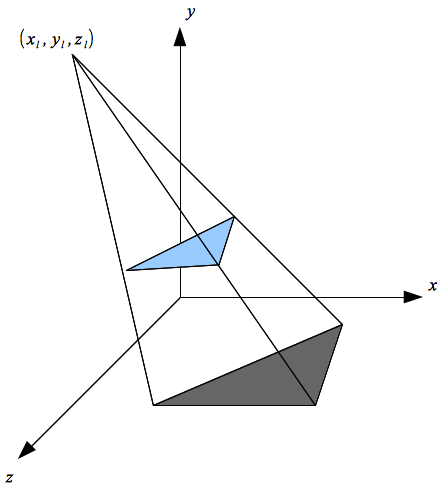

So far our light sources have provided illumination and highlights to the objects in the scene. For additional lighting effect, we would like the light sources to cast *shadows* (further enhancing the user perception of the light position). Since the pipeline does not allow for global effects directly, producing shadows is a *multipass* technique, i.e. we must render the scene *twice*. Shadow mapping involves creating a *shadow projection matrix* which will essentially render all the objects (in the second pass) *onto a surface* based on the position of the light source. By setting the color for the projected objects to a shade of grey, the shadows will appear to have been created by the objects.

0\. Getting Started
===================

Download [CS370\_Lab15.zip](src/CS370_Lab15.zip), saving it into the **labs** directory.

Double-click on **CS370\_Lab15.zip** and extract the contents of the archive into a subdirectory called **CS370\_Lab15**

Navigate into the **CS370\_Lab15** directory and double-click on **CS370\_Lab15.sln** (the file with the little Visual Studio icon with the 12 on it).

If the source file is not already open in the main window, open the source file by expanding the *Source Files* item in the *Solution Explorer* window and double-clicking **simpleShadow.cpp**.

1\. The Shadow Matrix
=====================

For the creation of basic shadows, we will assume that the light source is at a position (*x*<sub>L</sub>, *y*<sub>L</sub>, *z*<sub>L</sub>) and that the shadow is being cast on the *x-z plane* (i.e. *y*=0). This would be similar to the shadows created on the ground by the sun. Hence we will extend projector rays from the light source through the objects and determine where these rays intersect the *x-z* plane (see figure below)

> 

thus creating a *shadow polygon* for each object. If we translate the light source to the origin,

> 

the shadow matrix will be given by

> 

In OpenGL, (unfortunately) matrices are stored in 1D arrays that are *column-major*, i.e. the indices go down the columns.

**Tasks**

-   Add code to **main( )** to initialize *all* the values of the shadow matrix as shown above. Hint: It may be easier to write a small loop to initialize all the values to zero and then individually change the non-zero entries. Be careful with the indicies, remember they go *down* the columns.

2\. Rendering the Shadows
=========================

To render the shadows using the shadow matrix, we will need to perform three steps to create the appropriate model-view matrix:

-   translate the light source to the origin
-   apply the shadow matrix and render the scene (second pass)
-   translate the light source back to its original position thus positioning the shadow polygons on the *x-z* plane

We already know how to perform translations using **glTranslatef()**. If we have a(ny) matrix stored in a 16 element 1D-*array* which is *column-major*, we can multiply this matrix into the current matrix (either projection or model-view) using:

```cpp
glMultMatrixf(m);
```

where *m* is the array for the matrix. Therefore, after applying this matrix along with the translations, a point (x,y,z) will be transformed to

> 

which is the *projection* for any point onto the *x-z* plane.

By selecting an appropriate grey color, rendering the scene with this model-view transformation will produce "flat" shadow polygons on the *x-z* plane. Since we are rendering the same objects, just with a different transformation, we can simply add a **shadow** flag to our **render\_scene( )** which selects the appropriate color to draw the object with.

**NOTE:** Since this is just a different *projection* of the object, we will use the same local transformation and object rendering as for the initial object. Also since the shadow is drawn using just a *color*, we need to use the basic shader rather than the lighting shader.

**Tasks**

-   Add code to **render\_scene( )** to set the material to **brass** for the icosohedron and **red\_plastic** for the cube when the **shadow** flag is **false**.
-   Add code to **render\_scene( )** to *translate* the scene by **-light0\_pos[ ]**, multiply the shadow matrix into the model-view matrix, and translate back by **light0\_pos[ ]** when the **shadow** flag is **true**. NOTE: Don't forget the *proper order* - transformations that are applied *first* are programmed *last*.
-   Add code to **render\_scene( )** to change the color to **shadow\_color[ ]** when the **shadow** flag is **true**. NOTE: Since lighting is being used, we need to use the default shader program to render the shadows.

WASD will move the light in the x/z directions. Note how the shadows change as the light is moved (since yl remains constant the shadow matrix does not change). The left and right mouse button will rotate the objects, again note how the shadows change accordingly.

Compiling and running the program
=================================

Once you have completed typing in the code, you can build and run the program in one of two ways:

> -   Click the small green arrow in the middle of the top toolbar
> -   Hit **F5** (or **Ctrl-F5**)

(On Linux/OSX: In a terminal window, navigate to the directory containing the source file and simply type **make**. To run the program type **./simpleShadow.exe**)

The output should look similar to below

> 

To quit the program simply close the window.

While creating shadows using this technique is rather simple, there are two significant limitations. The first is that the shadows are only created on the *x-z* plane. If our "ground" is a plane with different orientation/location, this technique does not directly apply but can be extended to compute a correct shadow matrix for other planar surfaces. One other issue with this projection technique is that shadows will also be created for objects *under* the *x-z* plane. Usually this is dealt with by simply disallowing objects to go "underground".

A more significant limitation is that shadows *only appear* on the ground and not on any intermediate objects. This problem can be resolved (with much, much, much more complexity) using a sophisticated texture mapping technique. Basically the technique involves a multipass rendering scheme that keeps track of the *nearest* object to a light source and creates a shadow texture map that is applied to all other objects further away. More details and sample code can be found at:

[<http://www.paulsprojects.net/opengl/shadowmap/shadowmap.html>](http://www.paulsprojects.net/opengl/shadowmap/shadowmap.html)

and

[<http://www.paulsprojects.net/tutorials/smt/smt.html>](http://www.paulsprojects.net/tutorials/smt/smt.html)

