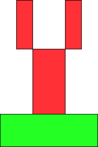
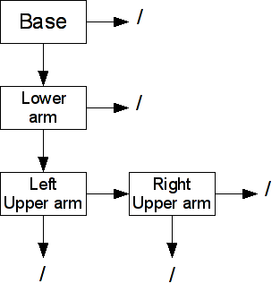
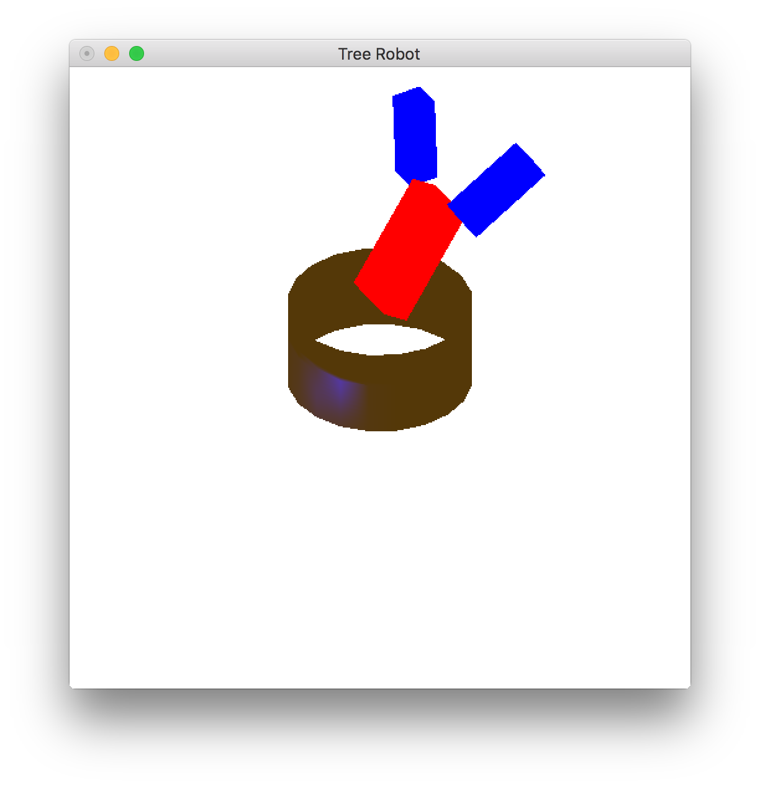

Now that we have completed our study of geometry and lighting, both which utilize the vertex processor, we will explore a nice way to *organize* the objects into our scene, particularly those that have a direct relationship to each other. For example, the position of your hand is related to the position of your arm which is related to the position of your body. Thus rather than having to continually recompute the *absolute* position of each part, we would like to create a mechanism for simply keeping track of the *relative* positioning of each part with respect to the other parts. Therefore, when one part moves, e.g. your body, those parts connected to it will automatically move with it. We could do this using **glPushMatrix( )** and **glPopMatrix( )** calls, but a more systematic way is by constructing a tree structure known as a *scene graph*. In the scene graph, every object will become a *node* which will contain the local transformations for that particular object as well as the necessary rendering routine. The tree then provides a convenient mechanism for *preserving* the transformations from level to level, hence objects that are related will have the same transformations applied to them *automatically*. Once the tree has been constructed, rendering the scene is simply a matter of *traversing* the tree using a *depth first* approach (actually any part of the tree can likewise be rendered by starting at the desired node). Also note that in this lab we will employ multiple shaders such that some objects can be illuminated by lighting while others can simply use set colors.

0\. Getting Started
===================

Download [CS370\_Lab16.zip](src/CS370_Lab16.zip), saving it into the **labs** directory.

Double-click on **CS370\_Lab16.zip** and extract the contents of the archive into a subdirectory called **CS370\_Lab16**

Navigate into the **CS370\_Lab16** directory and double-click on **CS370\_Lab16.sln** (the file with the little Visual Studio icon with the 12 on it).

If the source file is not already open in the main window, open the source file by expanding the *Source Files* item in the *Solution Explorer* window and double-clicking **treeRobot.cpp**.

1\. Scene Graph Nodes
=====================

For the tree structure we will be using, each node will contain fields as shown below:

```cpp
struct treenode {
	MaterialType material;
	GLfloat color[4];
	GLuint texture;
	void (*f)();
	GLfloat m[16];
	treenode *sibling;
	treenode *child;
	GLuint shaderProg;
};
```

where *material* is the material structure (if the object uses lighting), *color* (if the object uses direct color), *texture* is the texture map index (if the object uses textures), *f* is a *pointer to a function* for rendering the object, *m[ ]* is a local transformation matrix array, *sibling* is a pointer to a *single* sibling node of the tree, *child* is a pointer to a *single* child node of the tree, and *shaderProg* is the shader program to use to render the object. Thus children will be objects connected to the current one while siblings are ones connected to the same parent as the current object. For efficient rendering, we will *pre-compute* the entire local transformation and store it into the *m[ ]* matrix within the node structure. Additional fields can be added to the structure to further expand the capabilities of the scene graph.

For this lab we will be constructing a simple robot with a circular base, a single lower arm, and two upper arms.

> 

The scene graph is given pictorially as

> 

Note: Whenever a node does not have a child or sibling, its corresponding field should be set to **NULL**. A more general technique would be to *dynamically allocate* nodes as needed, i.e. similar to maintaining a linked-list, when the number of objects in the scene is variable (e.g. projectiles). This paradigm also fits nicely within an object oriented framework and is fundamental for graphic API's such as Java3D.

So for example the base node (assuming it is called **base** with draw function **draw\_base( )** and the lower arm node named **lower\_arm**) would be created as follows (note the *pointer* to a function is simply the function's name and we use the **update\_base( )** function to set the **m** field)

```cpp
base.material = brass;          	// Set material
base.f = draw_base;         		// Set drawing function
base.sibling = NULL;            	// Set sibling node
base.child = &lower_arm;        	// Set child node
base.shaderProg = lightShaderProg;  // Set shader program (for lighting)
update_base();              		// Set initial transformation matrix
```

**Tasks**

-   Add code to **build\_scene\_graph( )** to initialize the fields of the four nodes (except for the matrix which will be handled in the next section).

    > -   **Base** - Make the material **brass**, use the **draw\_base( )** function, and set the shader program to **lightShaderProg** (since this object will use lighting).
    > -   **Lower Arm** - Set the color to (1.0f,0.0f,0.0f,1.0f), use the **draw\_lower\_arm( )** function, and set the shader program to **defaultShaderProg** (since this object will not use lighting).
    > -   **Upper Arms** - Do not set a color, use the **draw\_upper\_arm( )** function for both, and set the shader program to **defaultShaderProg** for both (again they will not use lighting).
    >
    > Set empty node pointers to **NULL** and remember to use **&** to set the *address* of a connecting node to the pointer.

NOTE: Notice that in the draw functions for each piece, the transformations are only to create the *shape* of the object and locate the *center* of it appropriately with respect to the *world origin*, i.e. the lower arm is drawn so its base is on the *x-z* plane, etc. The actual *absolute* position will be determined by the transformations in the scene graph nodes. Hence objects that have the same shape and color, e.g. the left and right upper arms, can be *drawn* with the same rendering routine.

2\. Local Transformation Update Functions
=========================================

Once we have created the tree structure by setting the various node fields, we need to compute the local transformation matrices for each piece to locate it *relative* to its *parent*. Fortunately we can use OpenGL to do this computation by applying the individual translation, rotation, and scalings as we have done before, but now we will retrieve and *store* the *net* matrix into the *m[]* array within the node. We can retrieve the current modelview matrix using the command

```cpp
glGetFloatv(GL_MODELVIEW_MATRIX, m);
```

where *m* is the *pointer* to the array we wish to store the matrix values into. Hence typically we will issue a **glLoadIdentity()** first, then apply our desired local transformations, and then get the resulting transformation matrix using **glGetFloatv( )**.

NOTE: DO NOT forget to call the update function whenever the local transformation matrices change, e.g. during animation.

**Tasks**

-   Add code to the four update routines **update\_base( )**, **update\_lower\_arm( )**, **update\_left\_upper\_arm( )**, and **update\_right\_upper\_arm( )** to apply appropriate *local* transformations to position each part *relative* to its parent object. Note each function uses **glPushMatrix( )** and **glPopMatrix()** along with **gl\_LoadIdentity( )** to preserve the current modelview matrix yet absolutely position each object relative to its parent, i.e. creating a *local* transformation. In particular:

    > -   Base - rotate by angle **theta** about the *y*-axis.
    > -   Lower arm - translate up by **BASE\_HEIGHT** (to position it on top of the base) then rotate by angle **phi** about the *x*-axis.
    > -   Left upper arm - translate up by **LOWER\_HEIGHT** (to position it on top of the lower arm) and over in *x* by **-(LOWER\_WIDTH + UPPER\_WIDTH)/2.0** (to position it on the left side of the lower arm) then rotate by angle **left\_psi** about the *x*-axis.
    > -   Right upper arm - translate up by **LOWER\_HEIGHT** (to position it on top of the lower arm) and over in *x* by **(LOWER\_WIDTH + UPPER\_WIDTH)/2.0** (to position it on the right side of the lower arm) then rotate by angle **right\_psi** about the *x*-axis.

-   Add code to each of the four update routines to retrieve the local transformation matrix (just before the **glPopMatrix( )**) using **glGetFloatv( )** and store the matrix into the appropriate node's matrix field.
-   Add code to **build\_scene\_graph( )** to call the respective update functions for each node (otherwise they will not be initialized properly).
-   Add code to **keyfunc( )** to call the respective update functions whenever a transformation variable is changed. NOTE: This step is extremely important if you wish any user input to affect the scene. Likewise if animation was being used, the update functions would also need to be called for any objects that moved on each update (but not for any that have not changed their *relative* position).

3\. Rendering the Scene Graph
=============================

Finally we can render the scene by simply *traversing* the tree in a *depth-first* fashion starting at a *root node*. One traversal routine **traverse( )** is given by

```cpp
void traverse(treenode *node)
{
	// Stop when at bottom of branch
	if (node == NULL) 
	{
		return;
	}

	// Apply local transformation and render
	glPushMatrix();
	glMultMatrixf(node->m);
	glUseProgram(node->shaderProg);
	node->f();

	// Recurse vertically if possible (depth-first)
	if (node->child != NULL)
	{
		traverse(node->child);
	}

	// Remove local transformation and recurse horizontal
	glPopMatrix();
	if (node->sibling != NULL)
	{
		traverse(node->sibling);
	}
}
```

Note that we take advantage of the matrix stack via **glPushMatrix( )** and **glPopMatrix( )** throughout the traversal to augment as we proceed down the tree and resetting it when we move across the tree. We also activate the appropriate shader program prior to rendering each node (which also means that in the drawing function we will need to set any necessary shader variables).

**Tasks**

-   Add the above code to the **traverse( )** function.
-   Add a call to **traverse( )** in **render\_scene( )** to render the scene. Make sure to pass the *address* of the root node, which in this case is **base\_node** (i.e. you will need the **&** since it is a structure).

Compiling and running the program
=================================

Once you have completed typing in the code, you can build and run the program in one of two ways:

> -   Click the small green arrow in the middle of the top toolbar
> -   Hit **F5** (or **Ctrl-F5**)

(On Linux/OSX: In a terminal window, navigate to the directory containing the source file and simply type **make**. To run the program type **./treeRobot.exe**)

The output should look similar to below

> 

To quit the program simply close the window.

Scene graphs provide a convenient framework for organizing the geometry of our scenes. However, to further enhance the visual effect we need to move to the fragment (or pixel) shader in order to manipulate the final colors. In this stage of the pipeline, we can create transparency effects through alpha blending and apply images to our scenes through billboarding and texture mapping.

