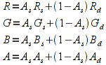
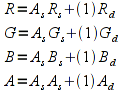
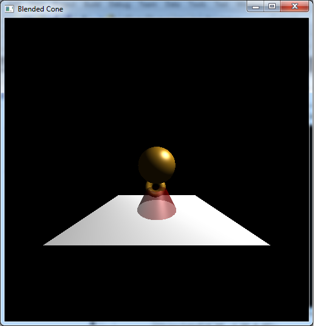

We are now ready to begin exploring the various effects that can be applied in the *fragment shader* (also known as the *pixel shader*). In this stage of the pipeline, all the original geometry information is lost and effects are only performed on a per pixel basis. None the less, there is still a significant amount of scene enhancement that can be accomplished in this stage. The first effect we will explore in this lab is *alpha blending*. This effect combines the pixel colors currently in the framebuffer with those from the object being currently rendered to produce the appearance of *translucency/transparency*, i.e. objects can be seen *through* other objects.

Up to this point, we have only been using the first three components when applying colors - the R, G, and B channels. However, all colors in OpenGL are treated as 32-bit values with the last byte representing the *alpha* (or A) channel. This channel represents the *opacity* (or equivalently *transparency*) of the color. So far all of our alpha channels have been set to 1, meaning that all our objects are *opaque*, i.e. solid. An alpha channel of 0 would represent a completely transparent object (such as glass). By using values between 0 and 1, we get translucent objects where the final color of the pixel is a *blend* of the colors of both objects with the amount of blending determined by various parameters in the application.

0\. Getting Started
===================

Download [CS370\_Lab17.zip](src/CS370_Lab17.zip), saving it into the **labs** directory.

Double-click on **CS370\_Lab17.zip** and extract the contents of the archive into a subdirectory called **CS370\_Lab17**

Navigate into the **CS370\_Lab17** directory and double-click on **CS370\_Lab17.sln** (the file with the little Visual Studio icon with the 12 on it).

If the source file is not already open in the main window, open the source file by expanding the *Source Files* item in the *Solution Explorer* window and double-clicking **blendedCone.cpp**.

If the header file is not already open in the main window, open the header file by expanding the *Header Files* item in the *Solution Explorer* window and double-clicking **materials.cpp**.

1\. Alpha Channel
=================

One common place to set the alpha channel is when creating a material (i.e. in **materials.h**). Thus we can make a translucent object by simply adjusting the alpha channel for the three lighting components.

**Tasks**

-   Add code to **materials.h** to create a new material named **red\_acrylic** that uses the same properties as **red\_plastic** but has alpha components (fourth value in each array) set to 0.5.

2\. Alpha Blending
==================

In order to use *alpha blending* we simply enable it (usually in the initializations) using:

```cpp
glEnable(GL_BLEND);
```

Once blending is enabled, we must then specify *how* we wish OpenGL to combine the colors by setting a *blending function* for both the *source* (the pixel from the object being rendered) and the *destination* (the current pixel in the framebuffer). The blending function is a linear function with the proportion for each part set using:

```cpp
glBlendFunc(src_val, dest_val);
```

where *src\_val*, and *dest\_val* are the factors used in the blending function. Two common *src\_val*/*dest\_val* pairs are (**GL\_SRC\_ALPHA**, **GL\_ONE\_MINUS\_SRC\_ALPHA**) and (**GL\_SRC\_ALPHA**, **GL\_ONE**).

**GL\_SRC\_ALPHA/GL\_ONE\_MINUS\_SRC\_ALPHA**

For source and destination colors given by (Rs,Gs,Bs,As) and (Rd,Gd,Bd,Ad), these blending factors combine the colors as follows

> 

These factors guarantee that the color channels *remain bounded* within the range [0.0,1.0] and hence will appear more or less correct. However, the problem is that to use these factors properly, *rendering order is important*. In particular, objects *must* be rendered from *back-to-front* (i.e. using a painter's algorithm) to produce the proper final color. This is typically not difficult for static scenes, but for ones where the object positions are changing either relative to each other or relative to the camera, maintaing proper rendering order can be tricky.

**GL\_SRC\_ALPHA/GL\_ONE**

For source and destination colors given by (Rs,Gs,Bs,As) and (Rd,Gd,Bd,Ad), these blending factors combine the colors as follows

> 

These factors guarantee that the same color is rendered *regardless of order* and hence is much better for dynamic scenes. However, since the final color is simply the total sum of all the object colors, the final color may saturate in one or several of the color channels, i.e. be greater than one and hence be clipped to 1.0 when rendered. Thus the final color may not be the expected color (or may simply be white if all the color channels saturate).

**Tasks**

-   Add code to **main( )** to enable alpha blending.
-   Add code to **main( )** to set the blending factors to **GL\_SRC\_ALPHA** and **GL\_ONE\_MINUS\_SRC\_ALPHA**.

3\. Quadric Objects
===================

Creating even simple geometries by hand is usually a tedious process. Fortunately the OpenGL utility library (**glu**, which is available on most systems) provides a mechanism called *quadrics* for creating many common geometric objects, e.g. spheres, cylinders/cones, disks, etc. In order to use quadrics, we must first declare a pointer to a **GLUQuadricObj** variable as:

```cpp
GLUquadricObj *quadric;
```

where *quadric* is the variable name of the quadric. Note: We only need to define one pointer (but may wish to use several for readability or to set different rendering properties) which can then be used to create multiple (different) quadric objects.

Next we need to initialize the generic quadric object using the call:

```cpp
quadric = gluNewQuadric();
```

where *quadric* is the variable declared previously.

We can then set various properties of the quadric that affect how they will be rendered. For example, we can set that the object be rendered as either solid, wireframe, etc. using:

```cpp
gluQuadricDrawStyle(quadric,draw_mode);
```

where *quadric* is the quadric variable and *draw\_mode* is one of the symbolic constants **GLU\_POINT**, **GLU\_LINE**, **GLU\_FILL**, or **GLU\_SILHOUETTE**.

Furthermore if we are using lighting, we can specify how normals should be generated for the quadric using:

```cpp
gluQuadricNormals(quadric,norm_mode);
```

where *quadric* is the quadric variable and *norm\_mode* is one of the symbolic constants **GLU\_SMOOTH**, **GLU\_FLAT**, or **GLU\_NONE**.

Finally when we wish to render the quadric (in **render\_scene( )** or a display list) we simply call the appropriate quadric function **gluSphere( )**, **gluCylinder( )**, etc. with appropriate arguments - see section 4.7.1 of *OpenGL: A Primer* for more details.

NOTE: Later we will see how texture coordinates can also be automatically generated for quadric objects.

**Tasks**

-   Add a global variable named **quadric** of type **GLUquadricObj**.
-   Add code to **main( )** to initialize **quadric**.
-   Add code to **main( )** to set the quadric draw style to **GLU\_FILL** and the normals to **GLU\_SMOOTH**.
-   Add code to **render\_scene( )** to render a **brass** sphere using the **quadric** object with radius 1.0 and 90 slices and stacks. Translate the sphere by **sphere\_pos[ ]**.
-   Add code to **render\_scene( )** to render a **red\_acrylic** cylinder using the **quadric** object with base radius 1.0, top radius 0.5, height 1.0, and 90 slices and stacks. Rotate it by -90 degrees about the *x*-axis (so that it is upright) and translate it by -2 units in *y* so that it sits on top of the table. NOTE: Make sure it is the last object rendered.
-   Add code to **idlefunc( )** to make the sphere "bounce" by changing the *y* value of **sphere\_pos[]** by **SPHERE\_STEP**. Change the direction via **sphere\_dir** whenever the sphere reaches **SPHERE\_MAX** or **SPHERE\_MIN**.

4\. GLUT Objects
================

Like quadrics, GLUT also provides many common objects such as spheres, cones, torii, various polyhedra, and the famous Utah Teapot. These objects are easier to create than quadrics but do not have as much flexibility in their final rendered appearance. Also since GLUT is a separate package that is usually **not** installed on most systems, using them will make the program far less portable. To create a GLUT object, simply call the desired function, e.g. **glutSolidSphere( )**, **glutSolidTeapot( )**, etc. with appropriate parameters - see section 4.7.2 of *OpenGL: A Primer* for more details.

**Tasks**

-   Add code to **render\_scene( )** to render a **brass** torus using a GLUT object of inner radius 0.25, outer radius of 0.5, and 20 sides and slices. Translate the torus by **torus\_pos[ ]** and rotate it by **torus\_theta** about the *y*-axis. NOTE: Make sure to render the torus *before* the translucent cylinder.
-   Add code to **idle\_func( )** to make the torus "roll" by changing the value of **torus\_theta** by **TORUS\_STEP**. NOTE: Make sure to keep the value in the range [0.0,360.0].

5\. Depth Test and Alpha Blending
=================================

Normally we simply enable the depth test in order to perform hidden surface removal such that the closest object is the one that appears in the final scene. However since alpha blending occurs in the *fragment processor* if the depth test is enabled when translucent objects are rendered, they may be clipped before reaching the fragment processor. Hence whenever a translucent object is rendered, the depth test must be temporarily disabled using:

```cpp
glDepthMask(GL_FALSE);
```

After rendering the translucent object, the depth test should be re-enabled to allow proper rendering of subsequent opaque objects. This is simply done using

```cpp
glDepthMask(GL_TRUE);
```

**Tasks**

-   Add code to **render\_scene( )** to disable/re-enable the depth test for the **red-acrylic** cylinder. What happens if you do not disable this or forget to re-enable it?

Compiling and running the program
=================================

Once you have completed typing in the code, you can build and run the program in one of two ways:

> -   Click the small green arrow in the middle of the top toolbar
> -   Hit **F5** (or **Ctrl-F5**)

(On Linux/OSX: In a terminal window, navigate to the directory containing the source file and simply type **make**. To run the program type **./blendedCone.exe**)

The output should look similar to below

> 

To quit the program simply close the window.

You should experiment with different blending factors for both the source and destination to see what effects they produce. Also you can try out different rendering properties for the quadrics to see what they do. Even though alpha blending occurs in the fragment processor, it is still using pixels generated by the pipeline, i.e. that were produced by object geometry.

