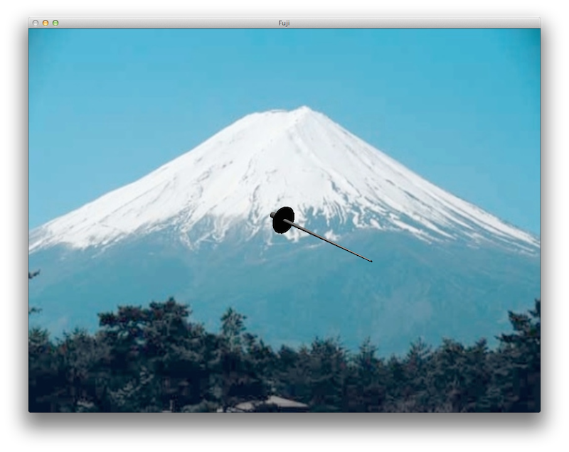

Since the human visual system can only discriminate depth to about 200 yards, objects beyond that distance appear *flat*. Thus many times in graphics applications we would like to be able to use an image as the background for the window, e.g. a distant outdoor scene, which is known as *billboarding*. Unfortunately OpenGL (and even GLUT) does not provide any mechanism for *loading* images (which is also a problem for using textures). Thus we will use a third party library known as SOIL ([Simple OpenGL Image Library](http://www.lonesock.net/soil.html)) to load images from files (see [Resources](../resources.html) for installation instructions). OpenGL can then simply draw the pixels of the image directly into the framebuffer.

0\. Getting Started
===================

Download [CS370\_Lab18.zip](src/CS370_Lab18.zip), saving it into the **labs** directory.

Double-click on **CS370\_Lab18.zip** and extract the contents of the archive into a subdirectory called **CS370\_Lab18**

Navigate into the **CS370\_Lab18** directory and double-click on **CS370\_Lab18.sln** (the file with the little Visual Studio icon with the 12 on it).

If the source file is not already open in the main window, open the source file by expanding the *Source Files* item in the *Solution Explorer* window and double-clicking **FujiSan.cpp**.

1\. Loading Images
==================

In order to import an image using SOIL, which will be stored in an array of **unsigned char**, we can use the command:

```cpp
image = SOIL_load_image(filename, &width, &height, &channels, force_channels);
```

where *image* is a *pointer* to an array of **unsigned char**, *filename* is a string containing the name of the image file, *width* and *height* are *int*'s that are returned by the function containing the respective sizes of the image, *channels* is an *int* that is returned by the function that contains the number of color channels for the image, and *force\_channels* is a flag telling SOIL the color type of the image being loaded (usually set to **SOIL\_LOAD\_AUTO**).

**Tasks**

-   Add a global variable called **img** of type **unsigned char***.
-   Add global variables **width**, **height**, and **channels** of type **GLint** and set the initial values of **width** and **height** to 500.
-   Add code to **load\_image( )** to load the image *Mt-Fuji.jpg* using **SOIL\_LOAD\_AUTO**.
-   Add code to **main( )** to call **load\_image( )** *prior* to **glutInitWindowSize( )**. Change the arguments in **glutInitWindowSize( )** to **width** and **height** - thus making the display window the same size as the background image.

2\. Drawing Images
==================

Once the image is loaded, we can *draw* it on the framebuffer using:

```cpp
glDrawPixels(width,height,format,type,*image);
```

where *width* and *height* are the size of the image, *format* is the color format of the image pixels (usually **GL\_RGB**), *type* is the data type (usually **GL\_UNSIGNED\_BYTE**), and *image* is a pointer to the image array. NOTE: The load function will properly store the data for rendering.

Two important things that need to be considered when rendering an image are blending and hidden surface removal. Since we typically do not want transparency when rendering the background image, we need to *disable* blending (via **glDisable(GL\_BLEND);** and **glEnable(GL\_BLEND);** around the background drawing code. Also since we usually want our image to be a *background*, we need to make the depth buffer *read-only* (similarly to transparency using **glDepthMask(GL\_FALSE);** and **glDepthMask(GL\_TRUE);** around the background drawing code), otherwise the image will set a depth z=0 for all the pixels thereby clipping any objects with negative *z* values.

Most of the time we will want to draw the background *before* we render any objects. Therefore we need to set a 2D orthographic projection using **gluOrtho2D( )** and an identity modelview matrix for the background and then *reset* whatever 3D projection mode we are using (similar to when we wished to switch projection modes). One other major issue with many drawing formats (including .bmp and .jpg) is that the pixels are stored from top to bottom yet OpenGL renders them from bottom to top (remember OpenGL world-coordinates). Hence many images will be upside-down when displayed directly from the file. A simple option to correct this is to use an image utility program (such as Paint or Gimp) to create a new vertically mirrored version of the image. A better way is to do it programmatically with the function:

```cpp
glPixelZoom(sx,sy);
```

where *sx* and *sy* are scale factors (similar to scaling transformations). By setting sx=1 and sy=-1, the image will be inverted in the vertical direction. Unfortunately as with normal vertex scaling, the problem with this technique is that the image will then be displayed below the screen (at negative *y* values). Hence we need to adjust where the image is displayed using the *raster* position (similar to fonts).

Finally, since typically it would be nice to scale the *extents* of the window to match the background image size, we can load the image *before* creating the window (in **main( )**) and then use the **width** and **height** returned by SOIL to create the window (unfortunately if the user drags a corner to resize the window, it will take additional code in the resize callback to keep the image filling the background).

**Tasks**

-   Add code to **draw\_background( )** to set a 2D orthographic projection matrix with extents (0.0,1.0,0.0,1.0), i.e. with the origin in the lower right-hand corner.
-   Add code to **draw\_background( )** to set the modelview matrix to the identity.
-   Add code to **draw\_background( )** to draw the image passed via the **image** parameter. Remember to set the raster position (using **glRasterPos2f( )**) to (0.0,1.0) and *invert* the image using **glPixelZoom( )**.
-   Add code to **draw\_background( )** to reset the pixel zoom *after* you have drawn the image back to (1.0,1.0).
-   Add code to **draw\_background( )** to disable/enable blending, and make the depth buffer readonly around the background image drawing code.
-   Add code to **display( )** to draw the image using the **draw\_background()** function.

Compiling and running the program
=================================

Once you have completed typing in the code, you can build and run the program in one of two ways:

> -   Click the small green arrow in the middle of the top toolbar
> -   Hit **F5** (or **Ctrl-F5**)

(On Linux/OSX: In a terminal window, navigate to the directory containing the source file and simply type **make**. To run the program type **./FujiSan.exe**)

The output should look similar to below

> 

To quit the program simply close the window.

Now that we can load images, the next effect that will greatly enhance our scenes is to apply these images to *objects* using what in known as *texture mapping*. Essentially we will *attach* the image onto the geometry by associating points in the image with vertices on the object.

