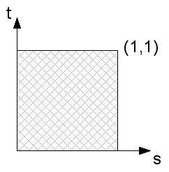
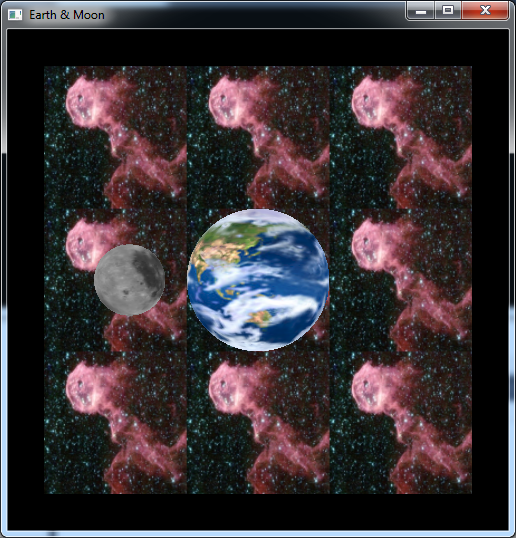

The geometry to render most natural objects is usually quite complicated, e.g. every blade of grass within a field or bricks on a wall. Therefore, most graphics systems provide an incredibly powerful way of *simulating* complex geometry by painting a *texture* onto a geometrically simple surface, e.g. an image of grass on a flat rectangle. This technique is called *texture mapping* (think of wallpapering a surface) and is similar to billboarding but on a *per object* basis. Again we will be using SOIL to load our images from files, but this time we will also create corresponding textures automatically for the images (in this lab an earth and moon). OpenGL has capabilities to handle 1D, 2D, and even 3D textures, however we will only be concerned with 2D textures (images) in this course.

The image is represented as a texture map which has extents (0,0) in the lower left corner and (1,1) in the upper right corner of the image (scaled to the square regardless of the original aspect ratio). Each element of the texture map is known as a *texel*. To apply a texture to a surface, we simply need to associate with each vertex a corresponding texel at which point the graphics system will perform any necessary distortions to place the texture (or part of the texture) onto the rendered surface. Fortunately, we can have OpenGL automatically generate texture coordinates for quadric objects.

0\. Getting Started
===================

Download [CS370\_Lab19.zip](src/CS370_Lab19.zip), saving it into the **labs** directory.

Double-click on **CS370\_Lab19.zip** and extract the contents of the archive into a subdirectory called **CS370\_Lab19**

Navigate into the **CS370\_Lab19** directory and double-click on **CS370\_Lab19.sln** (the file with the little Visual Studio icon with the 12 on it).

If the source file is not already open in the main window, open the source file by expanding the *Source Files* item in the *Solution Explorer* window and double-clicking **earthMoon.cpp**.

If the shader files are not already open in the main window, open the shader files by expanding the *Resource Files* item in the *Solution Explorer* window and double-clicking **texturevert.vs** and **texturefrag.fs**.

1\. Loading Textures using SOIL
===============================

We have already used SOIL to import images into memory for billboarding, but the library also provides a command to directly create textures from images. These textures are stored on the graphics card (using a reference id) and are applied in the *fragment processor*. In order to create a texture from an image, use the command:

```cpp
tex_id = SOIL_load_OGL_texture(filename, force_channels, reuse_id, flags);
```

where *tex\_id* is a texture identifier, *filename* is a string containing the name of the image file, *force\_channels* is a flag telling SOIL the color type of the image (usually set to **SOIL\_LOAD\_AUTO**), *reuse\_id* is a flag telling SOIL whether or not to create a new texture id for the texture, and *flags* contains additional property flags (for example auto mipmapping, etc.)

Textures can also be created manually from images stored in memory, usually if greater control is needed, using the functions **glTexImage2d( )**, **glCopyTexImage2D( )**, etc. - see section 8.7 of *OpenGL: A Primer*.

**Tasks**

-   Add code to **load\_textures( )** within the loop to load texture **texture\_file[i]** and store the returned texture identifier into **tex\_ids[i]**. Use **SOIL\_LOAD\_AUTO** for the *force\_channels* flag, **SOIL\_CREATE\_NEW\_ID** for the *reuse\_id* flag, and **SOIL\_FLAG\_MIPMAPS** (discussed in the next section) and **SOIL\_FLAG\_INVERT\_Y** (since again, like billboarding, the images will be loaded upside-down) for the property *flags*. NOTE: To apply multiple flags, simply combine them with the bitwise *or* operator \|.

2\. Setting Texture Map Properties
==================================

Texture maps, unlike billboarding images, are stored on the graphics card, thus the need for individual texture id's to identify which texture will be used. All textures, regardless of resolution, are mapped to a grid of *texture coordinates* (*texels*) known as the *s-t* plane with the *s*-axis representing the horizontal direction and the *t*-axis representing the vertical direction as shown below:

> 

The texture coordinates thus are in the range [0,1] for both axes. They are then applied to the objects in the fragment processor through a mapping of vertices to texture coordinates. Additionally, several properties must be set for each texture to determine

> -   How textures that are *smaller* than the object they are being placed on are *upscaled*
> -   How textures that are *larger* than the object they are being placed on are *downscaled* (or *subsampled*)
> -   How textures are wrapped for objects larger than the texture map (texture coordinates outside the [0,1] range)

Texture Scaling
---------------

Since textures are applied in the fragment processor, they are placed on the *rendered* surfaces of objects. Many times the rendered resolution will not match the resolution of the texture map, so OpenGL needs to know how to account for this difference. Two cases can occur - either the rendered surface is higher resolution (requiring the texture to be *magnified*) or lower resolution (requiring the texture to be *minified*) - and corresponding modes must be set for both cases. In the case of maginification, the system must upscale the image using either the *nearest* corresponding texel or *linear* extrapolation from surrounding texels. Often times if scaling is severe, the texture will appear pixelated in which case an additional higher resolution texture should be created by the programmer and loaded into the application. Small magnifications, however, can be handled by setting

```cpp
glTexParameteri(GL_TEXTURE_2D, GL_TEXTURE_MAG_FILTER, mode);
```

where *mode* is either **GL\_NEAREST** or **GL\_LINEAR**.

Minification, when the texture is larger than the rendered surface, typically occurs more frequently, e.g. high-res textures for small (in pixels) objects. One possibility is to simply use a reduction filter similar to magnification (**GL\_NEAREST** or **GL\_LINEAR**) to produce reduced resolution images, however repeatedly performing this resizing for numerous objects is inefficient. OpenGL provides an alternative mechanism known as *mipmapping* which precomputes reduced resolution textures (also storing them on the graphics card) and then applies the one that most closely matches the rendered object's resolution. OpenGL also provides for loading different resolution images (or even different images) into the various mipmap levels for the same texture - which is particularly useful for better controlling the appearance at very small resolutions. Mipmaps work best when the original image dimensions are powers of 2 (but they are not required to be). The mipmaps create reduced resolution textures by repeatedly dividing each dimension in half either a prespecified number of times or until one of the dimensions becomes 1. If the SOIL parameter **SOIL\_FLAG\_MIPMAPS** is used as a flag when loading a texture from a file, mipmaps will automatically be generated for the texture. The minification and mipmap mode are then set to either *nearest* or *linear* similar to the magnification mode by:

```cpp
glTexParameteri(GL_TEXTURE_2D, GL_TEXTURE_MIN_FILTER, mode);
```

where *mode* is either **GL\_NEAREST\_MIPMAP\_NEAREST**, **GL\_LINEAR\_MIPMAP\_NEAREST**, **GL\_NEAREST\_MIPMAP\_LINEAR**, or **GL\_LINEAR\_MIPMAP\_LINEAR**.

**BE CAREFUL**: mipmaps can use a substantial amount of graphics memory so it is best to try to load textures that are roughly the necessary size for the objects being rendered, i.e. avoid loading high resolution textures for low resolution objects.

Texture Wrapping
----------------

Lastly, we need to specify how textures will wrap, i.e. repeat, when applied to objects whose *geometry* is larger than the texture map extents. Two alternatives are to *repeat* the entire texture map (i.e. *tile* the surface) or to simply *clamp* (i.e. *extend*) the coloring of the edge. Each of these options can be set separately for the *s* and *t* directions (see the next section regarding texture coordinates) using:

```cpp
glTexParameteri(GL_TEXTURE_2D, axis, mode);
```

where *axis* is either **GL\_TEXTURE\_WRAP\_S** or **GL\_TEXTURE\_WRAP\_T** and *mode* is either **GL\_REPEAT** or **GL\_CLAMP**.

**Tasks**

-   Add code to **load\_textures( )** if the texture is loaded successfully to set the scaling filters to

    > -   **GL\_LINEAR** for the magnification filter, i.e. linear interpolation
    > -   **GL\_LINEAR\_MIPMAP\_NEAREST** for the minification filter, i.e. linear interpolation using the closest resolution mipmap

-   Add code to **load\_textures( )** if the texture is loaded successfully to set the wrapping modes to

    > -   **GL\_REPEAT** for *s*, i.e. tile in the horizontal direction
    > -   **GL\_REPEAT** for *t*, i.e. tile in the vertical direction

3\. Using Texture Maps
======================

Once we have loaded a texture map and set its properties, we must then tell OpenGL *which* texture to apply to the surface (usually in the **render\_scene( )** function just prior to rendering the object). This is done using the command:

```cpp
glBindTexture(GL_TEXTURE_2D, tex_id);
```

where *tex\_id* is the appropriate texture identifier (obtained when the texture was created by SOIL) for the desired texture.

The textures are then applied to the object on a *per vertex* basis (similar to normals for lighting) by assigning a *texture coordinate* to each vertex. Texture coordinates outside the range [0,1] are mapped to points on the *extended* texture map determined by the wrapping properties discussed in the previous section. Once each vertex in the object is assigned a corresponding texture coordinate, OpenGL will copy the appropriate portion of the texture map (or mipmap) onto the rendered surface (see figure 8.2 in *OpenGL: A Primer*), interpolating or extrapolating as needed based on the scaling properties discussed in the previous section. The assignment of texture coordinates is done (similar to setting the normal) just prior to a vertex call using:

```cpp
glTexCoord2f(s,t);
```

where *s* and *t* are the desired texel coordinates.

For quadric objects we can have OpenGL automatically generate texture coordinates (typically when the quadric is created) using:

```cpp
gluQuadricTexture(quadric, GL_TRUE);
```

where *quadric* is the the quadric object pointer.

**Tasks**

-   Add code to **main( )** to generate texture coordinates for the two quadrics.
-   Add code to **render\_scene( )** to select the **SPACE** texture identifier just *prior* to rendering the space quad. NOTE: The identifiers is stored in a global array named **tex\_ids[ ]**, so be sure to select the appropriate *element* from this array using the symbolic constants defined at the top of the code (which match the order of the loaded files).
-   Add code to **render\_scene( )** to apply the following texture coordinates to the quad vertices - (-1,-1),(2,-1),(2,2),(-1,2). NOTE: These texture coordinates are outside the range [0,0] -\> [1,1], so what do you think the applied texture will look like?
-   Add code to **render\_scene( )** to select the **EARTH** texture identifier just *prior* to rendering the earth quadric.
-   Add code to **render\_scene( )** to select the **MOON** texture identifier just *prior* to rendering the moon quadric.

While we could have applied the space background as a billboard, using a texture mapped quad gives us much more flexibility in its final appearance, e.g. tiling. Also note that since this is a *background*, the depth mask is not updated for this object. Since the texture coordinates are set on a *per vertex* basis, any transformations applied to the objects will automatically adjust the texture accordingly (for example if the camera moves in the scene).

3\. Textures in Shaders
=======================

Finally we need to add the appropriate shader code to extract the colors at the corresponding texture coordinates and place them on the fragment. This is done by creating a *sampler* variable in the fragment shader which then *samples* the texture map using the texture coordinates passed through the vertex shader. The sampler (like other shader variables) needs to be associated in the application and then set to a specific *texture unit*. Later we will see how to use several texture units to apply *multi-texturing* to our objects (combining several textures together for a single object).

Texture Application
-------------------

There are many ways to combine the sampled texture color with the underlying color of the vertex (either through directly setting the color or by using a material with lighting). Several common ones where *texture* is the sampled texture color and *color* is the underlying objects fragment color:

There are many ways to combine the sampled texture color with the underlying color of the vertex (either through directly setting the color or by using a material with lighting). Several common ones where *texture* is the sampled texture color and *color* is the underlying objects fragment color:

**REPLACE** - simply set the fragment color to the texture

```cpp
color = texture;
```

**MODULATE** - multiply the fragment color with the texture, useful in conjunction with lighting

```cpp
color *= texture;
```

**DECAL** - **mix( )** the fragment color with the texture using the *texture's* alpha channel (for translucent textures), but maintain the original *fragment* color alpha (for further blending)

```cpp
color = vec4(mix(color.rgb,texture.rgb,texture.a),color.a);
```

**BLEND** - **mix( )** the fragment color with the texture *environment* color using the texture color, and set the alpha to the *product* of the fragment color alpha with the texture alpha

```cpp
color = vec4(mix(color.rgb,gl_TextureEnvColor[0].rgb,texture.rgb), color.a*texture.a);
```

**Tasks**

-   Add code to **texturevert.vs** in **main( )** to pass the texture coordinate set in the application (stored in the built-in shader variable **gl\_MultiTexCoord0**) to the fragment shader through **gl\_TexCoord[0]**.

	```cpp
    gl_TexCoord[0] = gl_MultiTexCoord0;
    ```

-   In **texturefrag.fs** add a global *uniform 2D sampler* variable **texMap**.

	```cpp
    uniform sampler2D texMap;
	```

-   Add code to **texturefrag.fs** in **main( )** to sample the texture using the *s* and *t* fields of **gl\_TexCoord[0]** storing the color in a **vec4** variable **texColor**.

	```cpp
    vec4 texColor = texture2D(texMap, gl_TexCoord[0].st);
    ```

-   Add code to **texturefrag.fs** in **main( )** to set the fragment color to the sampled texture color (i.e. replacement).

	```cpp
    gl_FragColor = texColor;
    ```
    
Compiling and running the program
=================================

Once you have completed typing in the code, you can build and run the program in one of two ways:

> -   Click the small green arrow in the middle of the top toolbar
> -   Hit **F5** (or **Ctrl-F5**)

(On Linux/OSX: In a terminal window, navigate to the directory containing the source file and simply type **make**. To run the program type **./earthMoon.exe**)

The output should look similar to below

> 

To quit the program simply close the window.

Texture mapping is an incredibly powerful tool to dramatically enhance the appearance of a scene, especially when compbined with lighting - see Section 8.6 of *OpenGL: A Primer*.

While textures are most commonly used to represent surface geometry variations, they can also be used for other effects such as *mirrors* using a technique known as *environment mapping*. In this technique the scene is first rendered from the point of view of the "reflective object", the framebuffer of the rendered scene is then *captured* into a texture, and finally the scene is rerendered to include the *mirror* using the stored texture to simulate the "reflective" surface.

