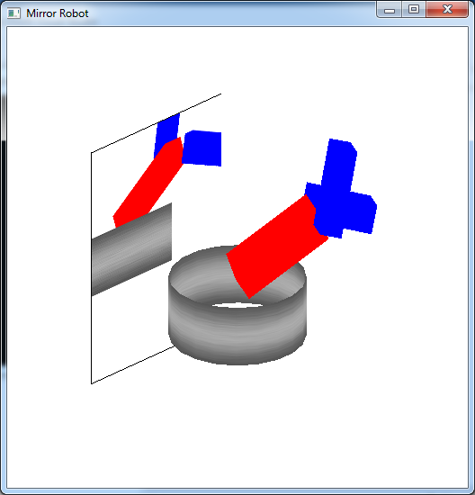

Often times we wish to have *reflective* surfaces, i.e. mirrors, within a scene. Unfortunately, similar to shadow mapping, one of the major shortcomings of the graphics pipeline is the lack of global information which would be needed for reflections (the reflective surface would need to know about the other objects in the scene). Again, one way to circumvent this problem (as usual with a performance penalty) is using *multipass rendering*, i.e. rendering the objects multiple times prior to displaying the final scene. This technique can be applied with texture mapping to produce an effect known as *environment mapping* to create reflections. Essentially an environment map is a *texture map* of the scene *rendered from the point of view of a reflective object*, which is then placed on the object within the scene thereby giving the appearance of reflection.

0\. Getting Started
===================

Download [CS370\_Lab20.zip](src/CS370_Lab20.zip), saving it into the **labs** directory.

Double-click on **CS370\_Lab20.zip** and extract the contents of the archive into a subdirectory called **CS370\_Lab20**

Navigate into the **CS370\_Lab20** directory and double-click on **CS370\_Lab20.sln** (the file with the little Visual Studio icon with the 12 on it).

If the source file is not already open in the main window, open the source file by expanding the *Source Files* item in the *Solution Explorer* window and double-clicking **envRobot.cpp**.

1\. Pass 1 - Texture Mapping the Framebuffer
============================================

We will create the effect of reflection by rendering the scene from the *point of view of the reflective object*, store that image into a texture, and then re-render the scene from the *point of view of the camera* with the texture map applied to the reflective surface. Therefore, the first thing we must do in the **display( )** callback is set an appropriate projection matrix using either **glOrtho( )** or **glFrustum( )**. The key here is to select extents that are representative of the reflective surface, i.e. usually with the near clipping plane at (or very near) 0.0 which will be the object's surface, the far clipping plane set to capture the objects of interest, and the other extents to match the geometry of the object itself. Next we need to position the camera at the *center of the object* and point it *away from* the reflective surface *towards the viewer*. Depending on the desired effect, this direction can be either perpendicular to the surface or (more realistically) at an equal angle from the viewer (recall angle of incidence equals angle of reflection). Once the projection matrix and camera position are set appropriately, we simply render the scene *without* the reflective surface. This will create the "picture" of the scene from the point of view of the reflective surface in the framebuffer. However instead of using **glutSwapBuffers( )** to display it on the screen, we will place the image *into a texture* using

```cpp
glCopyTexImage2D(GL_TEXTURE_2D, level, format, x, y, w, h, border);
```

where *level* indicates the mipmap level to store the image into (if mipmaps are enabled), *format* is the format to store the image in (usually **GL\_RGB**), *x* and *y* are the initial lower-left *raster coordinates* of the framebuffer, *w* and *h* are the width and height of the image to capture, and *border* specifies a border width for the image.

NOTE: **glCopyTexImage2D( )** copies the framebuffer into the *currently selected* texture map, so be careful to avoid overwritting a pre-existing object texture. One method to handle this situation is to create a blank image the size of the desired texture (usually the window size) to be used as the environment map texture.

Also since the environment takes the image from the framebuffer, any effects used in rendering the scene, e.g. lighting and texture mapping, will appear in the reflection. However it is usually advisable to disable these effects when rendering the *reflective surface* in the final scene to preserve the reflection texture map.

**Tasks**

-   Add code to **create\_Mirror( )** to set an orthographic projection with extents (-6,2,-3,5,0,15). These are the extents of the mirror - [-6 -\> 2] in *x* and [-3 -\> 5] in *y* - rendering 15 units in front of the mirror.
-   Add code to **create\_Mirror( )** to set the camera at (-7,0,0) looking at (0,0,0) with an up vector of (0,1,0) - the mirror will be perpendicular to the camera axis positioned 7 units to the left of the origin.
-   Add code in **create\_Mirror( )** to render the scene which will create an image of the world from the point of view of the mirror.
-   Add code to **create\_Mirror( )** to copy the framebuffer into the **ENVIRONMENT** texture at level 0 (since we are *not* using mipmaps). NOTE: Do not forget bind the appropriate texture using the texture identifier, and copy a texture the same size as the framebuffer (and also blank texture).
-   Add code to **load\_textures( )** for the blank environment texture to set both scaling modes to **GL\_LINEAR** and both wrapping modes to **GL\_CLAMP**.
-   Add code to **display( )** to create the mirror texture.

NOTE: Notice that a blank texture was included that is the same size as the window and loaded in the same manner as other textures only with slightly different properties, in particular we *do not* generate mipmaps (consider why?). This will allow for other objects in the scene to also use textures normally (i.e. using mipmaps) without conflicts with the environment map.

2\. Pass 2 - Rendering the Actual Scene
=======================================

Once the "reflected" scene is stored in a texture map, we can simply redraw the scene (hence the *multipass* nature of the technique) and include the reflective surface. Just as in the last lab, we will use our stored texture map on the reflective surface to produce the "reflection" effect. However since we will not be using a quadric, we will need to manually specify the texture coordinates for each vertex of the reflective surface. Also note that since we are using a scene graph, we need to set the texture symbolic constants for the nodes that are to be rendered with textures.

**Tasks**

-   Add code to **build\_scene\_graph( )** to set the **texture** field of the **base** to **tex_ids[METAL]** (thus using the **METAL** texture for the base).
-   Add code to **draw\_base( )** to bind the texture using the **texture** field for the base. Also *prior* to binding the texture, make sure to add

	```cpp
    glUniform1i(texSampler,0);
    ```
    
> to set the proper texture unit for the shader to use.

-   Add code to **render\_Mirror( )** to draw a rectangular mirror with corners at (-7,-3,-6), (-7,5,-6), (-7,5,2), and (-7,-3,2). NOTE: Observe the correspondance between the mirror coordinates and the orthographic projection extents/camera position from the previous section.
-   Add code to **render\_Mirror( )** to set appropriate texture coordinates for the mirror vertices using **glTexCoord2f( )**. NOTE: Remember that texture coordinates range from (0,0) to (1,1) so be sure to match the corners correctly. Be sure to bind the **ENVIRONMENT** texture for the mirror. Note that prior to drawing the mirror we need to activate the texture shader as well as setting the uniform texture sampler variable to the appropriate texture unit.
-   Add code to **display( )** to render the mirror.

NOTE: Other than the additional mirror code, the scene rendering code is *similar* to the robot scene graph lab code except that the base is now textured. Hence a mirror can often be *added* once the rest of the scene is working.

Compiling and running the program
=================================

Once you have completed typing in the code, you can build and run the program in one of two ways:

> -   Click the small green arrow in the middle of the top toolbar
> -   Hit **F5** (or **Ctrl-F5**)

(On Linux/OSX: In a terminal window, navigate to the directory containing the source file and simply type **make**. To run the program type **./envRobot.exe**)

The output should look similar to below

> 

To quit the program simply close the window.

While this technique is useful to create basic reflections, particularly on *flat* surfaces, two more advanced types of environment mapping that can be done with the programmable shaders are cube maps and sphere maps.

