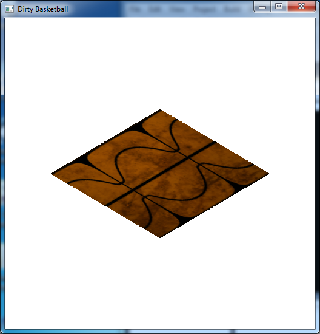

While texture mapping is a nice way of simulating surface textures without additional geometry, we can further embellish the appearance by blending *multiple textures* together on the same surface using *multi-texturing*. In this lab we will see how to apply multi-texturing through programmable shaders.

0\. Getting Started
===================

Download [CS370\_Lab21.zip](src/CS370_Lab21.zip), saving it into the **labs** directory.

Double-click on **CS370\_Lab21.zip** and extract the contents of the archive into a subdirectory called **CS370\_Lab21**

Navigate into the **CS370\_Lab21** directory and double-click on **CS370\_Lab21.sln** (the file with the little Visual Studio icon with the 12 on it).

If the source file is not already open in the main window, open the source files by expanding the *Source Files* item in the *Solution Explorer* window and double-clicking **dirtBall.cpp**, **dirtvert.vs**, and **dirtfrag.fs**.

1\. Associating Texture Maps in Shaders
=======================================

Since we are using several textures, we will need to have several sampler shader variables. We do this similar to other global variables by declaring a **uniform sampler2D** variable in the *fragment shader*. As before, we then *associate* the sampler with an application identifier using

```cpp
param = glGetUniformLocation(progObj,"var");
```

where *param* is an application **GLuint** identifier, *progObj* is the shader program object and *var* is the name of the *shader global variable* (again enclosed in double quotes).

**Tasks**

-   Add code to **dirtfrag.fs** to add two global **uniform sampler2D** variables named **texMap** and **dirtMap**.
-   Add code to *the application* **main()** to *associate* **texMap** with **texSampler[BALL\_UNIT]** (use **glGetUniformLocation()**).
-   Add code to *the application* **main()** to *associate* **dirtMap** with **texSampler[DIRT\_UNIT]** (use **glGetUniformLocation()**).

2\. Multi-Texturing
===================

First we will need to set the corresponding *texture unit number* (0 for a single texture) in the application for the textures units we are using via

```cpp
glUniform1i(param, num);
```

where *param* is the associated **texSampler[]** identifier from above and *num* is the number of the texture unit to attach, e.g. 0, 1, etc (often stored in a symbolic constant for easier readability).

Applying *several* textures to a polygon is then accomplished through a process known as *multi-texturing*. The first texture will be applied in the standard fashion as we have done so far. The additional textures, however, will then be *blended* with the first to produce an enhanced effect, e.g. battle damage. After the textures are loaded (identically as before using SOIL), the mult-texturing process is accomplished by first *activating* several *texture units* (one per texture) via the command:

```cpp
glActiveTexture(texture_unit);
```

where *texture\_unit* is the *texture unit* identifier, e.g. **GL\_TEXTURE0**, **GL\_TEXTURE1**, etc. Once a texture unit is activated, we can then bind the desired texture to the texture unit using **glBindTexture( )**.

Then we assign texture coordinates for *each* texture unit (per vertex), i.e. *multi-texture* coordinates, using the command:

```cpp
glMultiTexCoord2f(texture, s, t);
```

where *texture* is the *texture unit* identifier (described above) and *s*, *t* are the desired texture coordinates to be assigned to the vertex.

**Tasks**

-   Add code to **render\_Scene( )** to use the **dirtProg** shader program.
-   Add code to **render\_Scene( )** to associate texture unit 0 (identified by **BALL\_UNIT**) with the corresponding **texSampler[ ]** value.
-   Add code to **render\_Scene( )** to make **GL\_TEXTURE0** active.
-   Add code to **render\_Scene( )** to bind the **BALL** texture into texture unit 0.
-   Add code to **render\_Scene( )** to associate texture unit 1 (identified by **DIRT\_UNIT**) with the corresponding **texSampler[ ]** value.
-   Add code to **render\_Scene( )** to make **GL\_TEXTURE1** active.
-   Add code to **render\_Scene( )** to bind the **DIRT** texture into texture unit 1 if the **use\_dirt** flag is set or the **BLANK** texture otherwise.
-   Add code to **render\_Scene( )** to set texture coordinates for *both* texture units (you'll need one call to **glMultiTexCoord2f( )** for *each* texture unit) to [0,0], [1,0], [1,1], [0,1].

3\. Using Texture Maps in Shaders
=================================

Like other built-in shader variables, GLSL provides a (**varying vec4**) array for texture coordinates assigned to vertices in the application called **gl\_TexCoord[ ]** (where the index represents a corresponding *texture unit*) which is then (modified and/or) passed from the vertex shader to the fragment shader. It also has built in variables for multi-texture coordinates in the variables **gl\_MultiTexCoord{0,1,...}** for each texture unit number.

Finally in the fragment shader, we obtain the color from the sampler using the command

```cpp
texColor = texture2D(sampler, gl_TexCoord[i].st);
```

where *texColor* is a local **vec4** shader variable, *sampler* is the global sampler variable (associated with the desired texture map in section 2 above), *i* is the desired texture coordinate passed from the vertex shader (note we only use the **.st** components since we are only using 2D textures). At this point we are free to manipulate the color as desired and finally assign the result to **gl\_FragColor**.

**Tasks**

-   Add code to **dirtvert.vs** in **main( )** to set **gl\_TexCoord[0]** to **gl\_MultiTexCoord0**.
-   Add code to **dirtvert.vs** in **main( )** to set **gl\_TexCoord[1]** to **gl\_MultiTexCoord1**.
-   Add code to **dirtfrag.fs** in **main( )** to create a **vec4** variable named **texColor** and set it from **texMap** using **gl\_TexCoord[0]** (using **texture2D()**).
-   Add code to **dirtfrag.fs** in **main( )** to create a **vec4** variable named **dirtColor** and set it from **dirtMap** using **gl\_TexCoord[1]** (using **texture2D()**).
-   Add code to **dirtfrag.fs** in **main( )** to create a **vec4** variable named **color** and set it to the *product* of **baseColor**, **texColor**, and **dirtColor**. Note that we have also blended in a base color that was passed to the application using the **gl\_Color** shader variable in the vertex shader and then sent to the fragment shader using a **varying** variable named **baseColor**. In this lab we simply set the underlying color to be white, but could have computed it in the vertex shader based on lighting, etc.
-   Add code to **dirtfrag.fs** in **main()** to set **gl\_FragColor** to **color**.

Compiling and running the program
=================================

Once you have completed typing in the code, you can build and run the program in one of two ways:

> -   Click the small green arrow in the middle of the top toolbar
> -   Hit **F5** (or **Ctrl-F5**)

(On Linux/OSX: In a terminal window, navigate to the directory containing the source file and simply type **make**. To run the program type **./dirtBall.exe**)

The output should look similar to below

> 

To quit the program simply close the window.

The multi-texturing process when used with shaders can use the textures to represent *surface geometry variations* that interact with lighting to produce one final effect we will investigate next known as *bump mapping*. In this effect we apply *per pixel* lighting rather than *per vertex* lighting to give a much more convincing surface appearance.

