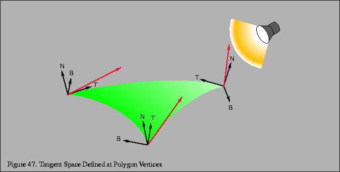
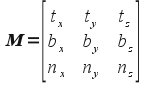
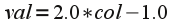
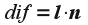
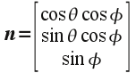
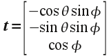
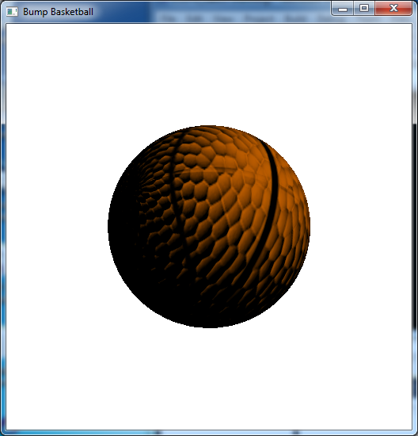

Multi-texturing is a nice way to further enhance the appearance of surfaces in our scene without adding additional geometry. Unfortunately, the surface still *appears* flat, particularly with respect to lighting. One technique (that is based on multi-texturing) to create an even more realistic appearance of a rough surface is to adjust the *normals* to produce a *self-shadowing* effect known as *bump mapping*. Since normals are applied *per vertex* and then *interpolated* across the surface (per fragment) in the default pipeline, this would require using extremely complex geometries (similar to recursive subdivision) to capture sufficient surface detail. However we can simulate this effect through *self-shadowing* which gives the appearance of a slightly varying, i.e. rough, surface based on a *normal map* which is stored in a texture. This normal map (which being a texture is applied on a *per pixel* basis) can then be used in the fragment shader to define the varying normals *per pixel* in order to produce a changing lighting effect across each fragment, i.e. bump mapping. This will be done *in addition* to the application of a surface texture using the multi-texturing procedure from the last lab. However in order to perform the appropriate lighting calculation, we first need to transform the light vectors at each pixel into *tangent space*, i.e. such that the normal becomes the *z*-axis and two *tangent* vectors become the corresponding *x* and *y* axes. We then apply the modified normals according to the *normal map texture* and manually compute a new lighting color *per pixel*.

0\. Getting Started
===================

Download [CS370\_Lab22.zip](src/CS370_Lab22.zip), saving it into the **labs** directory.

Double-click on **CS370\_Lab22.zip** and extract the contents of the archive into a subdirectory called **CS370\_Lab22**

Navigate into the **CS370\_Lab22** directory and double-click on **CS370\_Lab22.sln** (the file with the little Visual Studio icon with the 12 on it).

If the source file is not already open in the main window, open the source files by expanding the *Source Files* item in the *Solution Explorer* window and double-clicking **bumpBall.cpp**, **bumpvert.vs**, **bumpfrag.fs**, and **sphere.h**.

1\. Tangent Space
=================

In order to apply bump mapping, we need to tranform the various lighting vectors into *tangent space*, i.e. the plane that is *tangent* to the surface with the vertex becoming the origin of the new coordinate system. This transformation makes the surface normal at the vertex the new *z*-axis (which simplifies the application of the bump map texture). Two additional perpendicular vectors, known as the *tangent* and *binormal*, will then define the tangent plane (i.e. become the *x* and *y* axes) - see the following [figure](http://www.opengl.org/resources/code/samples/sig99/advanced99/notes/node140.html).

> 

Fortunately, we already have the normal (from the application) so we only need to define a tangent and then compute the vector *cross product* (see [lab14](lab14.html)) to give the binormal as:

> 

The transformation matrix for the lighting vectors (assuming **n**, **t**, and **b** are unit vectors) is then given by

> 

Multiplying this matrix by the corresponding light vectors (which transforms them to tangent space) can then easily be computed via three *dot products* with **n**, **t**, and **b**. The transformed light vectors can then be passed to the fragment shader to perform any desired per pixel lighting computation, e.g. the Phong model.

**Tasks**

-   Add code to **bumpvert.vs** to define a global **attribute vec3** variable named **tangento**. NOTE: This is an *attribute* variable since it will be set *per vertex* in the application.
-   Add code to **bumpvert.vs** to define two global **varying vec3** variables called **lightv** and **viewv**. These will be the transformed tangent space light vectors passed to the fragment shader.
-   Add code to **bumpvert.vs** in **main( )** to define a local **vec3** variable named **n** and set it equal to the product of the *normal matrix* (i.e. **gl\_NormalMatrix**) and the *normal vector* (i.e. **gl\_Normal**). Normalize this vector using the *built-in* **normalize( )** shader function. This will create the tangent space *normal* by applying any global transformations to the application defined normal.
-   Add code to **bumpvert.vs** in **main( )** to define a local **vec3** variable named **t** and set it equal to the product of the normal matrix (i.e. **gl\_NormalMatrix**) and the *attribute vector* **tangento**. Normalize this vector using the built-in **normalize( )** shader function. This will create the tangent space *tangent* by applying any global transformations to the application defined tangent.
-   Add code to **bumpvert.vs** in **main( )** to define a local **vec3** variable named **b** and set it equal to the *cross product* (using the built-in **cross()** shader function) of **n** and **t**. Since **n** and **t** are already unit vectors, the cross product will automatically also be a unit vector. This will create the tangent space *binormal*.
-   Add code to **bumpvert.vs** in **main( )** to define a local **vec3** variable named **viewe** and set it equal to the **vec3** product of the modelview matrix (i.e. **gl\_ModelViewMatrix**) and the vertex vector (i.e. **gl\_Vertex**). This will apply any global transformations to the application vertex to create the *viewer* vector.
-   Add code to **bumpvert.vs** in **main( )** to compute **viewv.x** as the *dot product* (using the built-in **dot( )** shader function) between **t** and **lighte**. This will transform the first component of the light vector into tangent space.
-   Add code to **bumpvert.vs** in **main( )** to compute **viewv.y** as the *dot product* (using the built-in **dot( )** shader function) between **b** and **lighte**. This will transform the second component of the light vector into tangent space.
-   Add code to **bumpvert.vs** in **main()** to compute **viewv.z** as the *dot product* (using the built-in **dot( )** shader function) between **n** and **lighte**. This will transform the third component of the light vector into tangent space.
-   Add code to **bumpvert.vs** in **main( )** to define a local **vec3** variable named **lighte** and set it equal to the **vec3 gl\_LightSource[0].position** minus **viewe**. Normalize this vector using the built-in **normalize( )** shader function. This will create the *light* vector.
-   Add code to **bumpvert.vs** in **main( )** to compute the three components of **lightv** as the *dot products* (using the built-in **dot( )** shader function) between **t**, **b**, and **n** similar to above. This will transform the light vector into tangent space.
-   Add code to **bumpvert.vs** in **main()** to normalize **lightv** and **viewv**.

2\. Normal Map Lighting
=======================

Once we have the light vectors (including the viewer vector) transformed to tangent space (which now has a normal given by (0,0,1)) for each fragment of the surface, we now wish to perturb the tangent space normal *per pixel* and *compute* a modified lighting effect to produce self-shadowing. To accomplish this effect, we will store the perturbed surface normals into a *normal map* which is essentially an "image" of the surface where the geometric variations are stored as *colors* (again utilizing the correspondence in the pipeline between 3D coordinates and RGB colors). This map is loaded into a texture and applied in addition to the surface texture using multi-texturing in the fragment shader. Since we are only slightly perturbing the *direction* of the normal, i.e. we primarily maintain the *z*-axis which is the *blue* channel, normal maps appear as a mainly blue image. Because we are unable to store negative values in color channels, we instead scale the values such that those between [0,0.5] represent negative values and those between [0.5,1] represent positive values. We can then obtain the original component values via the simple formula

> 

The new lighting components are then computed (via the Phong model) using the converted colors in the normal map and the transformed lighting vectors.

In particular, recall that the Phong diffuse factor is given by Lambert's law as

> 

**Tasks**

-   Add code in **bumpfrag.fs** to define two global **varying vec3** variables named **lightv** and **viewv**. These are the tangent space light and viewer vectors computed in the vertex shader.
-   Add code in **bumpfrag.fs** in **main( )** to define a **vec3** variable named **Light** and set it equal to a normalized **lightv** (since it may have been interpolated across the fragment during rasterization).
-   Add code in **bumpfrag.fs** in **main( )** to define a **vec3** variable named **normal** and set it equal to a *scaled* version of **bump.rgb** (using the formula above) and normalize the result. This generates the new perturbed surface normal from the normal map color. (NOTE: This computation can be done in a single step as the operations will be performed component-wise.)
-   Add code in **bumpfrag.fs** in **main( )** to define a **float** variable named **diffuse** and set it equal to the *maximum* (using the built-in **max()** shader function) of the dot product between **Light** and **normal** and 0.0 (to clamp the resulting color).
-   Add code to **bumpfrag.fs** in **main( )** to compute **gl\_FragColor** as the product of **diffuse** and **texColor**, i.e. blend the lighting color with the underlying texture.

3\. Defining Tangent Vectors for Spheres
========================================

The final piece we need to do is define the tangent vector for our surface in the application and pass it to the vertex shader. Ideally we would like the tangent vector to point along what would be the *s* axis of the texture map when it is applied to the surface. If this is excessively cumbersome (or the normal map is sufficiently random), any vector perpendicular to the surface normal will work. Since the radius of a unit sphere is perpendicular to the surface, the normal vector at a point (x,y,z) is given in spherical coordinates as (which is identical to the original coordinates)

> 

It is relatively straightforward to compute a perpendicular to this vector (see [here](http://inside.mines.edu/~gmurray/ArbitraryAxisRotation/ArbitraryAxisRotation.html) for more details) as

> 

which can easily be verified via the dot product. We will assume that for the vertex (1,0,0) that the tangent is *parallel* to the *z*-axis giving the binormal as *parallel* to the *y*-axis. We will then rotate these vectors about the *z*-axis by an angle θ and then about the *rotated* *y*-axis by an angle φ (essentially obtaining the spherical coordinate transformation for the initial vertex). This procedure will provide well defined tangent vectors across the entire sphere.

In order to pass the tangent vector to the shaders, we first need to *associate* an *attribute* identifier (since it is *per vertex*) using the command

```cpp
param = glGetAttribLocation(progObj, "var");
```

where *param* is a **GLint** that identifies the shader variable, *progObj* is the shader program object, and *var* is the *name* of the variable *in the shader source* we wish to associate (again enclosed in double quotes).

Whenever we wish to assign a value to the associated shader attribute variable (within a **glBegin()/glEnd()** construct) we simply call

```cpp
glVertexAttrib3fv(param, *val);
```

where *param* is the asociated identifier from above and *val* is the pointer to a 3D array of values to be assigned to the associated shader variable. Note as with many of the OpenGL functions, there are many alternative forms of **glVertexAttrib*( )** depending on the number and type of values being passed.

**Tasks**

-   Add an application global tangent identifier variable in **bumpBall.cpp** - **GLint** called **tangParam**.
-   Add code to **main( )** in the application to associate **tangParam** with the **attribute** shader variable **tangento**.
-   Add code to **mysphere2( )** in **sphere.h** (in two locations when the **use\_bump** flag is set) to set the **tangParam** associated shader variable to **tangent[ ]**.

NOTE: The **mysphere2( )** routine is based on the **gluSphere( )** source found in the Mesa3D distribution - an open source implementation of OpenGL at [www.mesa3d.org](http://www.mesa3d.org/) - included in the function **mysphere( )**.

Compiling and running the program
=================================

Once you have completed typing in the code, you can build and run the program in one of two ways:

> -   Click the small green arrow in the middle of the top toolbar
> -   Hit **F5** (or **Ctrl-F5**)

(On Linux/OSX: In a terminal window, navigate to the directory containing the source file and simply type **make**. To run the program type **./bumpBall.exe**)

The output should look similar to below

> 

To quit the program simply close the window.

Bump mapping is one of the simplest programmable shader effects, yet demonstrates many general concepts including passing of auxilary information per vertex, computing alternative coordinate system transformations, representing information as texture images that are applied via multi-texturing, and finally modifying colors based on the auxilary information and transformations. Many of these advanced techniques have a significant mathematical foundation (usually linear algebra and linear vector spaces) and a major challenge is often determining the appropriate way to compute the additional information even for regular geometries (not to mention complex geometries). Since current graphics API's rely on programmable shaders for all effects, understanding the mathematical concepts becomes increasingly more important within this field.

